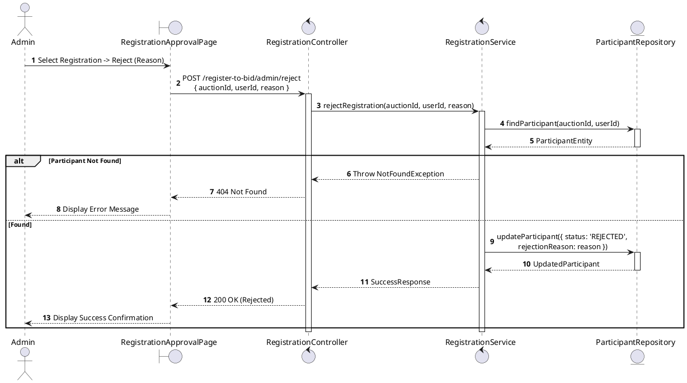
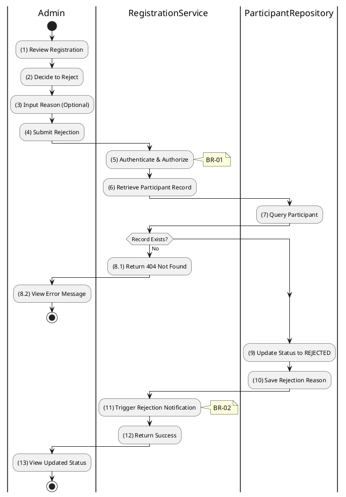

# 3.4.10 Reject Registration

## 1. Use Case Description

| Field              | Description                                                                                                             |
| ------------------ | ----------------------------------------------------------------------------------------------------------------------- |
| **Name**           | Reject Registration                                                                                                     |
| **Description**    | This use case allows the Admin to update existing Registration information in the system.                               |
| **Actor**          | Admin                                                                                                                   |
| **Trigger**        | When the Admin clicks on the 'Reject' button on the RegistrationApprovalPage.                                           |
| **Pre-condition**  | • Admin's device must be connected to the internet. • Admin is signed in with their account.                         |
| **Post-condition** | The Registration information will be updated in the system and display new record on RegistrationApprovalPage datagrid. |

## 2. Sequence Flow (MVC)

## 3. Activities Flow (Swimlanes)

## 4. Business Rules

| Activity      | BR Code   | Description                                                                                                                                                                                                                                                                                                                                                                                                                                                                                                                                                                                                                                                                                                                                                                                                                                      |
| :------------ | :-------- | :-------------------------------------------------------------------------------------------------------------------------------------------------------------------------------------------------------------------------------------------------------------------------------------------------------------------------------------------------------------------------------------------------------------------------------------------------------------------------------------------------------------------------------------------------------------------------------------------------------------------------------------------------------------------------------------------------------------------------------------------------------------------------------------------------------------------------------------------------------------- |
| **(1)**       | **BR-01** | **Displaying Rules:** ❖ The system renders a “RegistrationApprovalPage” screen via `Display_View(participant)`. (Refer to “RegistrationApprovalPage” view in “View Description” file). ❖ The screen displays participant and auction details, along with a [Reject] button and a [Reason] input text area.                                                                                                                                                                                                                                                                                                                                                                                                                                                                                                                                                        |
| **(2)**       | **BR-02** | **Validation Rules (Front-end):** ❖ As the Admin enters the rejection reason, the system uses the `ValidateInput(reason)` method. ❖ If the input is not valid: ⮚ If the [reason] is empty, the system disables the [Submit] button and displays **MSG 1** (Mandatory Field).                                                                                                                                                                                                                                                                                                                                                                                                                                                                                                                                                                               |
| **(5)**       | **BR-03** | **Authorization Rules (Back-end):** ❖ The system checks the authenticated user's role via `RegistrationService.rejectRegistration()` to ensure they have the necessary permissions. ❖ If the input is not valid: ⮚ If the user’s role is not 'admin' or 'auctioneer', the system returns a 403 Forbidden status.                                                                                                                                                                                                                                                                                                                                                                                                                                                                                                                                         |
| **(7)**       | **BR-04** | **Validation Rules (Back-end):** ❖ The system attempts to retrieve the participant record from the “AUCTION_PARTICIPANT” table via `ParticipantRepository.findParticipant()` using the [auctionId] and [userId]. ❖ If the input is not valid: ⮚ If the participant record is not found, the system returns a 404 Not Found error and displays **MSG 20** (Registration not found).                                                                                                                                                                                                                                                                                                                                                                     |
| **(9)**       | **BR-05** | **Storing Rules (Back-end):** ❖ Upon successful validation, the system updates the record in the “AUCTION_PARTICIPANT” table by setting the [status] to 'REJECTED'. ❖ It also records the [rejectionReason] and the `rejectedAt` timestamp to the current time. ❖ The system triggers a notification email to the bidder. ❖ System moves to step (13) and displays successful notification (Refer to **MSG 7**).                                                                                                                                                                                                                                                                                                                                                      |
