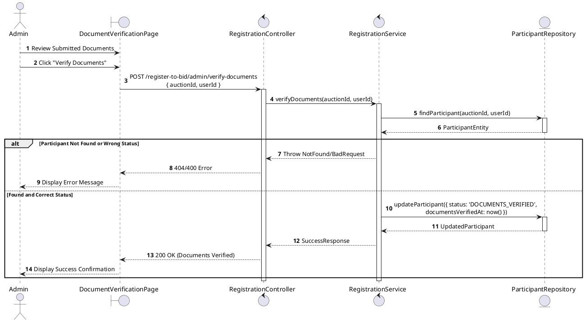
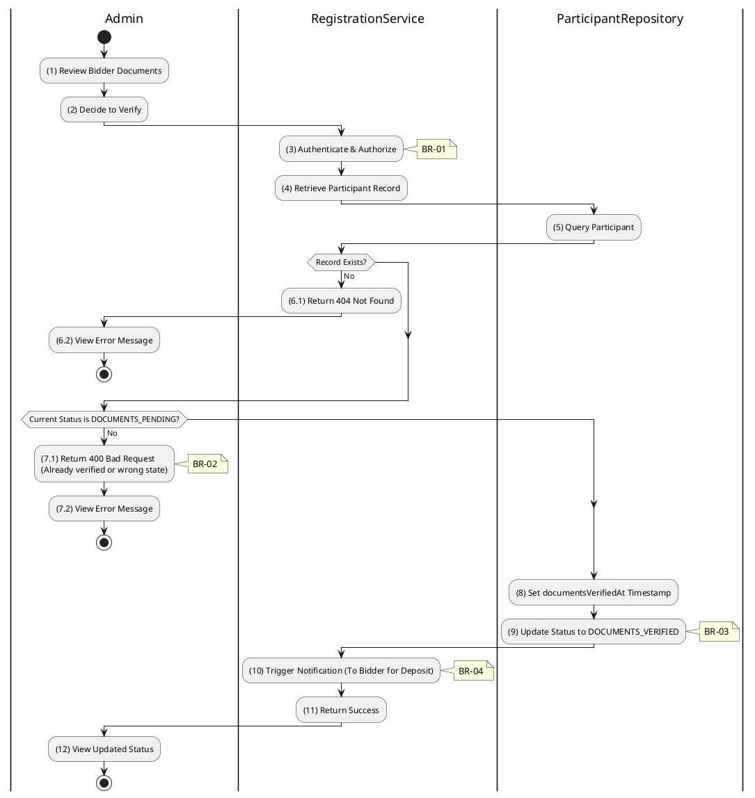

# 3.4.11 Verify Documents (Tier 1)

## 1. Use Case Description

| Field              | Description                                                                                                                      |
| ------------------ | -------------------------------------------------------------------------------------------------------------------------------- |
| **Name**           | Verify Documents (Tier 1)                                                                                                        |
| **Description**    | This use case allows the Admin to update existing Registration Document information in the system.                               |
| **Actor**          | Admin                                                                                                                            |
| **Trigger**        | When the Admin clicks on the 'Verify Documents' button on the DocumentVerificationPage.                                          |
| **Pre-condition**  | • Admin's device must be connected to the internet. • Admin is signed in with their account.                                  |
| **Post-condition** | The Registration Document information will be updated in the system and display new record on DocumentVerificationPage datagrid. |

## 2. Sequence Flow (MVC)

## 3. Activities Flow (Swimlanes)

## 4. Business Rules

| Activity      | BR Code   | Description                                                                                                                                                                                                                                                                                                                                                                                                                                                                                                                                                                                                                                                                                                                                                                                                                                      |
| :------------ | :-------- | :-------------------------------------------------------------------------------------------------------------------------------------------------------------------------------------------------------------------------------------------------------------------------------------------------------------------------------------------------------------------------------------------------------------------------------------------------------------------------------------------------------------------------------------------------------------------------------------------------------------------------------------------------------------------------------------------------------------------------------------------------------------------------------------------------------------------------------------------------------------- |
| **(1)**       | **BR-01** | **Displaying Rules:** ❖ The system renders a “DocumentVerificationPage” screen via `Display_View(participant)`. (Refer to “DocumentVerificationPage” view in “View Description” file). ❖ The screen displays the bidder's submitted documents (e.g., identity, tax forms), along with [Verify Documents] and [Reject Documents] buttons.                                                                                                                                                                                                                                                                                                                                                                                                                                                                                                                 |
| **(2)**       | **BR-02** | **Validation Rules (Front-end):** ❖ When the Admin clicks the “Verify Documents” button, the system displays a confirmation modal, `Display_Modal('ConfirmationBox')`. ❖ It presents **MSG 11** ("Confirm document verification?"), awaiting the Admin's explicit confirmation.                                                                                                                                                                                                                                                                                                                                                                                                                                                                                                                                             |
| **(3)**       | **BR-03** | **Authorization Rules (Back-end):** ❖ The system checks the authenticated user's role via `RegistrationService.verifyDocuments()` to ensure they have the necessary permissions. ❖ If the input is not valid: ⮚ If the user's role is not 'admin' or 'auctioneer', the system returns a 403 Forbidden status.                                                                                                                                                                                                                                                                                                                                                                                                                                                                                                          |
| **(7.1)**     | **BR-04** | **State Locking Rules (Back-end):** ❖ The system verifies the current status of the participant record. ❖ If the input is not valid: ⮚ If the [status] is not 'DOCUMENTS_PENDING', the system returns a 400 Bad Request. ⮚ The system displays **MSG 16** (Invalid status for this operation) to the user.                                                                                                                                                                                                                                                                                                                                                                                                                                                                                                     |
| **(8)**       | **BR-05** | **Storing Rules (Back-end):** ❖ Upon successful validation, the system updates the record in the “AUCTION_PARTICIPANT” table by setting the [status] to 'DOCUMENTS_VERIFIED'. ❖ The `documentsVerifiedAt` timestamp is recorded to the current time. ❖ The system triggers a notification to the bidder to proceed with the deposit payment (Tier 2). ❖ System moves to step (12) and displays successful notification (Refer to **MSG 7**).                                                                                                                                                                                                                                                                                                                                                      |
