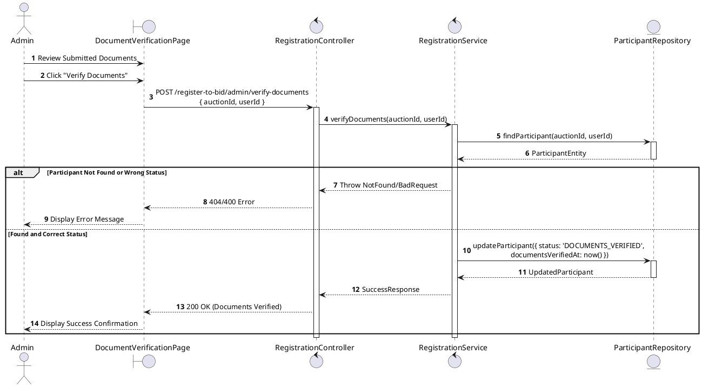
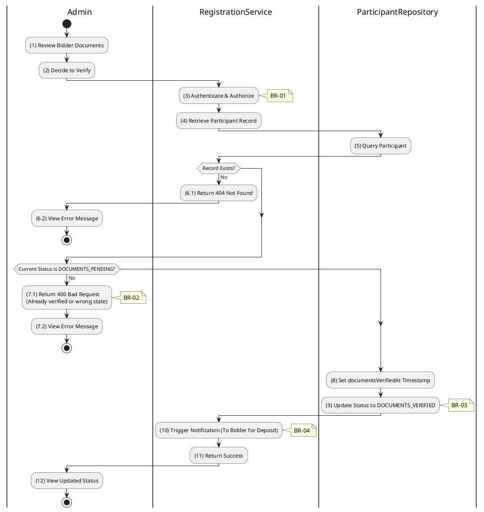

# 3.4.11 Verify Documents (Tier 1)

## 1. Use Case Description

| Field              | Description                                                                                                                      |
| ------------------ | -------------------------------------------------------------------------------------------------------------------------------- |
| **Name**           | Verify Documents (Tier 1)                                                                                                        |
| **Description**    | This use case allows the Admin to update existing Registration Document information in the system.                               |
| **Actor**          | Admin                                                                                                                            |
| **Trigger**        | When the Admin clicks on the 'Verify Documents' button on the DocumentVerificationPage.                                          |
| **Pre-condition**  | • Admin's device must be connected to the internet. • Admin is signed in with their account.                                  |
| **Post-condition** | The Registration Document information will be updated in the system and display new record on DocumentVerificationPage datagrid. |

## 2. Sequence Flow (MVC)

## 3. Activities Flow (Swimlanes)

## 4. Business Rules

| Activity      | BR Code   | Description                                                                                                                                                                                                                                                                                                                             |
| :------------ | :-------- | :-------------------------------------------------------------------------------------------------------------------------------------------------------------------------------------------------------------------------------------------------------------------------------------------------------------------------------------- |
| **(1)**       | **BR-01** | **Displaying Rule (Document Verification Page):** When Admin reviews submitted documents, system displays `DocumentVerificationPage`. System displays bidder info, uploaded document previews, and verification status. System displays "Verify Documents" button.                                                             |
| **(2)**       | **BR-02** | **Validation Rule (Confirmation - Front-end):** When Admin clicks "Verify Documents" button, system displays MSG 11 ("Confirm document verification?"). System waits for confirmation before proceeding.                                                                                                                          |
| **(3)**       | **BR-03** | **Validation Rule (Authorization - Back-end):** System checks if requestor role is `admin` or `auctioneer` in `USERS` table. If unauthorized: $\rightarrow$ System displays MSG 5 ("Forbidden") on the View.                                                                                                                   |
| **(5)-(6.1)** | **BR-04** | **Validation Rule (Record Existence - Back-end):** System retrieves data from the 'AUCTION_PARTICIPANT' table in the database (Refer to 'AUCTION_PARTICIPANT' table in 'DB Sheet' file) based on the auction ID and user ID. If record not found: $\rightarrow$ System displays MSG 20 ("Registration not found") on the View. |
| **(7.1)**     | **BR-05** | **Validation Rule (Status Pre-requisite - Back-end):** System checks current `status` of participant record. If status is NOT `DOCUMENTS_PENDING`: $\rightarrow$ System displays MSG 16 ("Invalid status for this operation") on the View.                                                                                     |
| **(8)-(9)**   | **BR-06** | **Storing Rule:** System saves to `AUCTION_PARTICIPANT` table: - `documentsVerifiedAt = now()` - `status = 'DOCUMENTS_VERIFIED'`                                                                                                                                                                                               |
| **(10)**      | **BR-07** | **Processing Rule (Notification):** System triggers notification to bidder informing Tier 1 is complete. Notification instructs bidder to proceed with deposit payment (Tier 2).                                                                                                                                                  |
| **(12)**      | **BR-08** | **Displaying Rule (Success Confirmation):** System displays MSG 7 ("Documents verified successfully") on the View. System updates registration status display to `DOCUMENTS_VERIFIED`.                                                                                                                                            |
