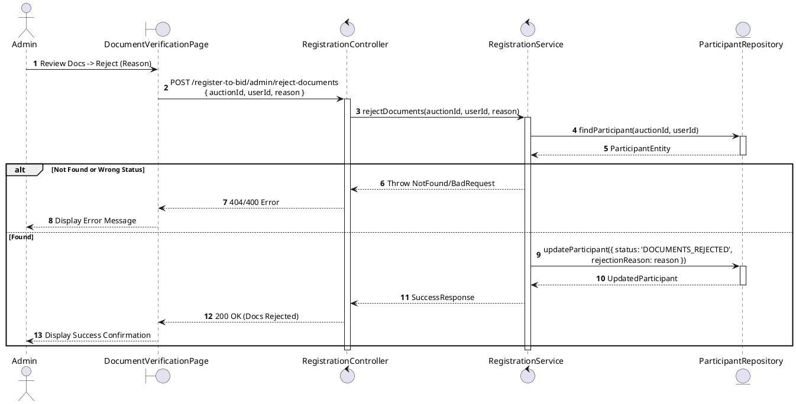
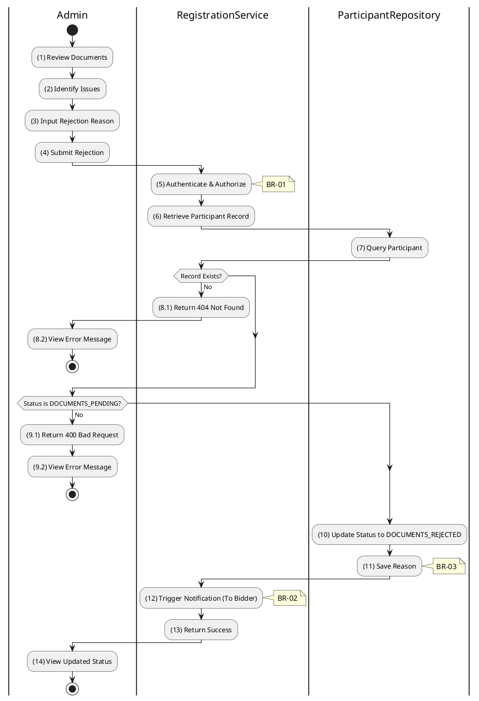

# 3.4.12 Reject Documents

## 1. Use Case Description

| Field              | Description                                                                                                                      |
| ------------------ | -------------------------------------------------------------------------------------------------------------------------------- |
| **Name**           | Reject Documents                                                                                                                 |
| **Description**    | This use case allows the Admin to update existing Registration Document information in the system.                               |
| **Actor**          | Admin                                                                                                                            |
| **Trigger**        | When the Admin clicks on the 'Reject Documents' button on the DocumentVerificationPage.                                          |
| **Pre-condition**  | • Admin's device must be connected to the internet. • Admin is signed in with their account.                                  |
| **Post-condition** | The Registration Document information will be updated in the system and display new record on DocumentVerificationPage datagrid. |

## 2. Sequence Flow (MVC)

## 3. Activities Flow (Swimlanes)

## 4. Business Rules

| Activity      | BR Code   | Description                                                                                                                                                                                                                                                                                                                                                                                                                                                                                                                                                                                                                                                                                                                                                                                                                                      |
| :------------ | :-------- | :-------------------------------------------------------------------------------------------------------------------------------------------------------------------------------------------------------------------------------------------------------------------------------------------------------------------------------------------------------------------------------------------------------------------------------------------------------------------------------------------------------------------------------------------------------------------------------------------------------------------------------------------------------------------------------------------------------------------------------------------------------------------------------------------------------------------------------------------------------------- |
| **(1)**       | **BR-01** | **Displaying Rules:** ❖ The system displays a “DocumentVerificationPage” screen. (Refer to “DocumentVerificationPage” view in “View Description” file). ❖ The screen renders the [Reject Documents] button and an input text area for the [Reason] for rejection.                                                                                                                                                                                                                                                                                                                                                                                                                                                                                                                                                                                       |
| **(2)**       | **BR-02** | **Validation Rules (Front-end):** ❖ When the Admin enters the rejection reason, the system uses the `ValidateInput(reason)` method. ❖ If the input is not valid: ⮚ If the [reason] field is empty, the system displays **MSG 1** (Mandatory Field).                                                                                                                                                                                                                                                                                                                                                                                                                                                                                                                                                                                                              |
| **(5)**       | **BR-03** | **Authorization Rules (Back-end):** ❖ The system checks the authenticated user's role via `RegistrationService.rejectDocuments()` to ensure they have the necessary permissions. ❖ If the input is not valid: ⮚ If the user’s role is not 'admin' or 'auctioneer', the system returns a 403 Forbidden status.                                                                                                                                                                                                                                                                                                                                                                                                                                                                                                                                         |
| **(9.1)**     | **BR-04** | **State Locking Rules (Back-end):** ❖ The system verifies the current status of the participant record. ❖ If the input is not valid: ⮚ If the [status] is not 'DOCUMENTS_PENDING', the system returns a 400 Bad Request. ⮚ The system displays **MSG 16** (Invalid status for this operation) to the user.                                                                                                                                                                                                                                                                                                                                                                                                                                                                                                                                    |
| **(10)**      | **BR-05** | **Storing Rules (Back-end):** ❖ Upon successful validation, the system updates the record in the “AUCTION_PARTICIPANT” table by setting the [status] to 'DOCUMENTS_REJECTED'. ❖ It also records the [rejectionReason] in the database. ❖ The system triggers a notification email to the bidder, explaining the document rejection and allowing them to resubmit after fixing issues. ❖ System moves to step (14) and displays successful notification (Refer to **MSG 7**).                                                                                                                                                                                                                                                                                                                                                                                     |
