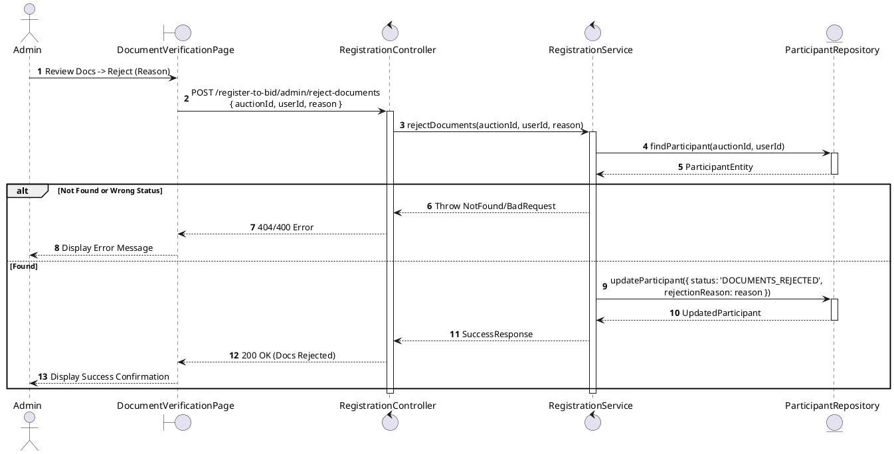
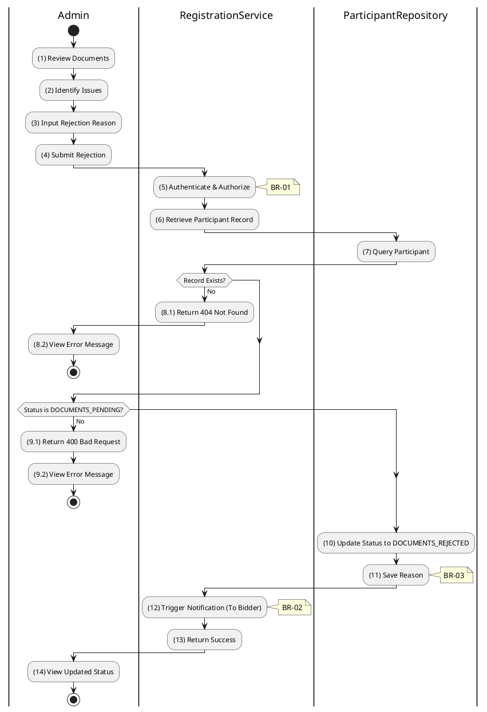

# 3.4.12 Reject Documents

## 1. Use Case Description

| Field              | Description                                                                                                                      |
| ------------------ | -------------------------------------------------------------------------------------------------------------------------------- |
| **Name**           | Reject Documents                                                                                                                 |
| **Description**    | This use case allows the Admin to update existing Registration Document information in the system.                               |
| **Actor**          | Admin                                                                                                                            |
| **Trigger**        | When the Admin clicks on the 'Reject Documents' button on the DocumentVerificationPage.                                          |
| **Pre-condition**  | • Admin's device must be connected to the internet. • Admin is signed in with their account.                                  |
| **Post-condition** | The Registration Document information will be updated in the system and display new record on DocumentVerificationPage datagrid. |

## 2. Sequence Flow (MVC)

## 3. Activities Flow (Swimlanes)

## 4. Business Rules

| Activity      | BR Code   | Description                                                                                                                                                                                                                                                                                                                             |
| :------------ | :-------- | :-------------------------------------------------------------------------------------------------------------------------------------------------------------------------------------------------------------------------------------------------------------------------------------------------------------------------------------- |
| **(1)-(2)**   | **BR-01** | **Displaying Rule (Document Verification Page):** When Admin reviews documents and identifies issues, system displays `DocumentVerificationPage`. System displays document previews and "Reject Documents" button. System displays rejection reason text input field.                                                          |
| **(3)-(4)**   | **BR-02** | **Validation Rule (Input - Front-end):** When Admin enters rejection reason, system uses `Text_change()` method. If `isEmpty(rejectionReason)`: $\rightarrow$ System displays MSG 1 ("Rejection reason is mandatory"). On submit, system displays MSG 11 ("Confirm document rejection?").                                   |
| **(5)**       | **BR-03** | **Validation Rule (Authorization - Back-end):** System checks if requestor role is `admin` or `auctioneer` in `USERS` table. If unauthorized: $\rightarrow$ System displays MSG 5 ("Forbidden") on the View.                                                                                                                   |
| **(7)-(8.1)** | **BR-04** | **Validation Rule (Record Existence - Back-end):** System retrieves data from the 'AUCTION_PARTICIPANT' table in the database (Refer to 'AUCTION_PARTICIPANT' table in 'DB Sheet' file) based on the auction ID and user ID. If record not found: $\rightarrow$ System displays MSG 20 ("Registration not found") on the View. |
| **(9.1)**     | **BR-05** | **Validation Rule (Status Pre-requisite - Back-end):** System checks current `status` of participant record. If status is NOT `DOCUMENTS_PENDING`: $\rightarrow$ System displays MSG 16 ("Invalid status for this operation") on the View.                                                                                     |
| **(10)-(11)** | **BR-06** | **Storing Rule:** System saves to `AUCTION_PARTICIPANT` table: - `status = 'DOCUMENTS_REJECTED'` - `rejectionReason = [input reason]` User can resubmit documents after fixing issues.                                                                                                                                      |
| **(12)**      | **BR-07** | **Processing Rule (Notification):** System sends notification to bidder explaining document rejection. Notification includes admin's reason so bidder knows what to fix.                                                                                                                                                          |
| **(14)**      | **BR-08** | **Displaying Rule (Success Confirmation):** System displays MSG 7 ("Documents rejected - awaiting resubmission") on the View. System updates status display to `DOCUMENTS_REJECTED`.                                                                                                                                              |
