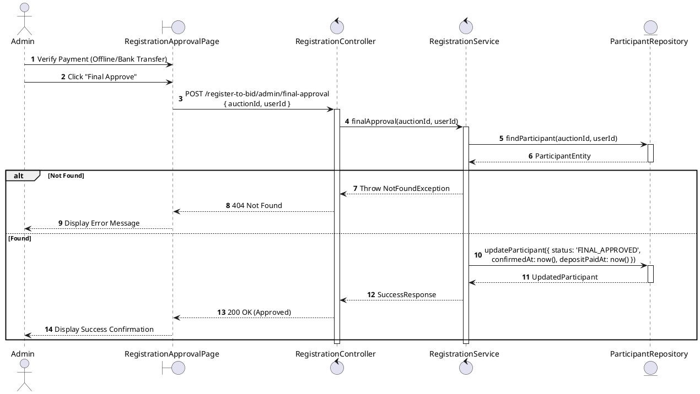
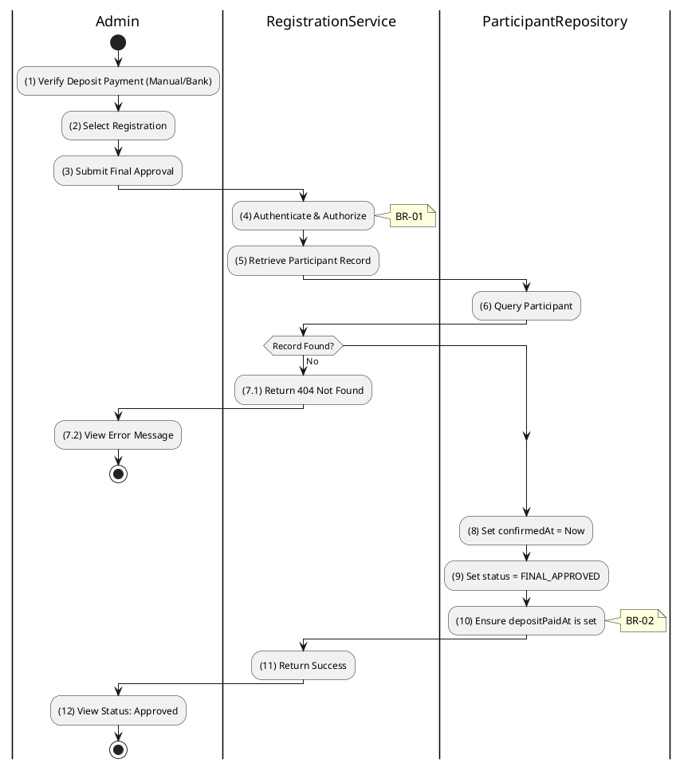

# 3.4.13 Final Approval (Tier 2)

## 1. Use Case Description

| Field              | Description                                                                                                             |
| ------------------ | ----------------------------------------------------------------------------------------------------------------------- |
| **Name**           | Final Approval (Tier 2)                                                                                                 |
| **Description**    | This use case allows the Admin to update existing Registration information in the system.                               |
| **Actor**          | Admin                                                                                                                   |
| **Trigger**        | When the Admin clicks on the 'Final Approve' button on the RegistrationApprovalPage.                                    |
| **Pre-condition**  | • Admin's device must be connected to the internet. • Admin is signed in with their account.                         |
| **Post-condition** | The Registration information will be updated in the system and display new record on RegistrationApprovalPage datagrid. |

## 2. Sequence Flow (MVC)

## 3. Activities Flow (Swimlanes)

## 4. Business Rules

| Activity      | BR Code   | Description                                                                                                                                                                                                                                                                                                                             |
| :------------ | :-------- | :-------------------------------------------------------------------------------------------------------------------------------------------------------------------------------------------------------------------------------------------------------------------------------------------------------------------------------------- |
| **(1)-(2)**   | **BR-01** | **Displaying Rule (Registration Approval Page):** When Admin verifies offline/bank payment, system displays `RegistrationApprovalPage`. System displays current registration status (typically `DOCUMENTS_VERIFIED`). System displays "Final Approve" button.                                                                  |
| **(3)**       | **BR-02** | **Validation Rule (Confirmation - Front-end):** When Admin clicks "Final Approve" button, system displays MSG 11 ("Confirm final approval? This will mark deposit as paid."). System waits for confirmation before proceeding.                                                                                                    |
| **(4)**       | **BR-03** | **Validation Rule (Authorization - Back-end):** System checks if requestor role is `admin` or `auctioneer` in `USERS` table. If unauthorized: $\rightarrow$ System displays MSG 5 ("Forbidden") on the View.                                                                                                                   |
| **(6)-(7.1)** | **BR-04** | **Validation Rule (Record Existence - Back-end):** System retrieves data from the 'AUCTION_PARTICIPANT' table in the database (Refer to 'AUCTION_PARTICIPANT' table in 'DB Sheet' file) based on the auction ID and user ID. If record not found: $\rightarrow$ System displays MSG 20 ("Registration not found") on the View. |
| **(7.1)**     | **BR-05** | **Validation Rule (Idempotency - Back-end):** If participant status is already `FINAL_APPROVED`: $\rightarrow$ System returns success without re-processing (idempotent behavior).                                                                                                                                                |
| **(8)-(10)**  | **BR-06** | **Storing Rule:** System saves to `AUCTION_PARTICIPANT` table: - `confirmedAt = now()` - `depositPaidAt = now()` (if not already set) - `status = 'FINAL_APPROVED'` Bidder is now eligible to check in for auction.                                                                                                      |
| **(12)**      | **BR-07** | **Displaying Rule (Success Confirmation):** System displays MSG 7 ("Registration fully approved") on the View. System refreshes registration status showing `FINAL_APPROVED`.                                                                                                                                                     |
