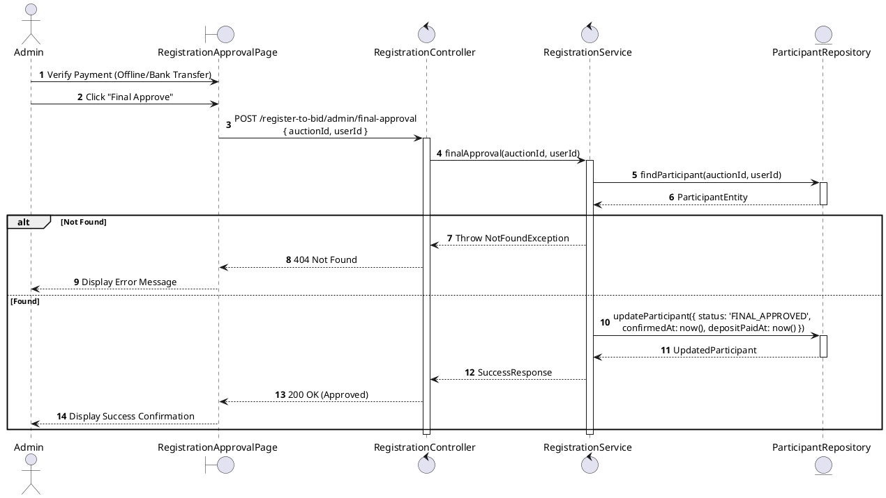
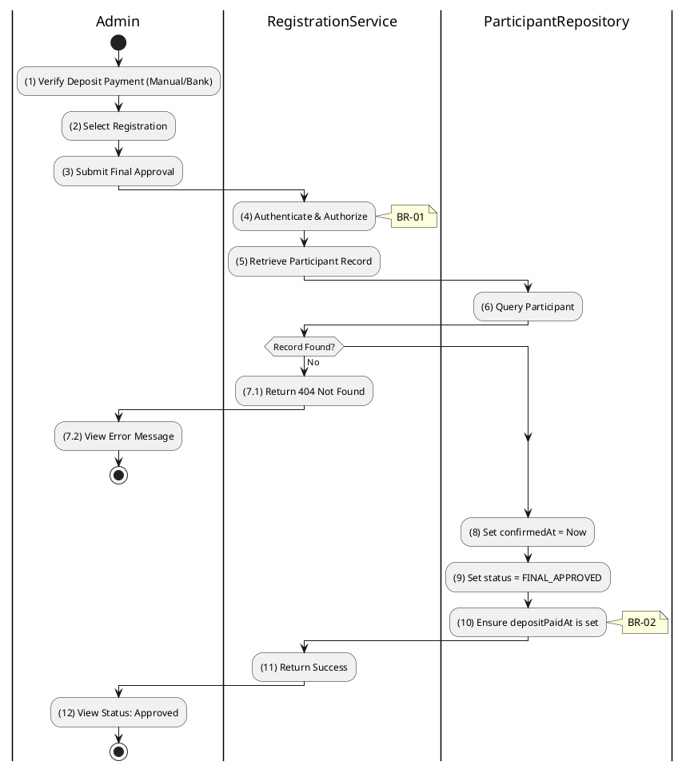

# 3.4.13 Final Approval (Tier 2)

## 1. Use Case Description

| Field              | Description                                                                                                             |
| ------------------ | ----------------------------------------------------------------------------------------------------------------------- |
| **Name**           | Final Approval (Tier 2)                                                                                                 |
| **Description**    | This use case allows the Admin to update existing Registration information in the system.                               |
| **Actor**          | Admin                                                                                                                   |
| **Trigger**        | When the Admin clicks on the 'Final Approve' button on the RegistrationApprovalPage.                                    |
| **Pre-condition**  | • Admin's device must be connected to the internet. • Admin is signed in with their account.                         |
| **Post-condition** | The Registration information will be updated in the system and display new record on RegistrationApprovalPage datagrid. |

## 2. Sequence Flow (MVC)

## 3. Activities Flow (Swimlanes)

## 4. Business Rules

| Activity      | BR Code   | Description                                                                                                                                                                                                                                                                                                                                                                                                                                                                                                                                                                                                                                                                                                                                                                                                                                                                                                                                                                                                 |
| :------------ | :-------- | :---------------------------------------------------------------------------------------------------------------------------------------------------------------------------------------------------------------------------------------------------------------------------------------------------------------------------------------------------------------------------------------------------------------------------------------------------------------------------------------------------------------------------------------------------------------------------------------------------------------------------------------------------------------------------------------------------------------------------------------------------------------------------------------------------------------------------------------------------------------------------------------------------------------------------------------------------------------------------------------------------------- |
| **(1)-(2)**   | **BR-01** | **Displaying Rules:** ❖ The system displays a “RegistrationApprovalPage” screen via `Display_View()`. ❖ The screen renders the details of the Participant and the associated Auction. ❖ The [Final Approve] button is enabled only if the registration [status] is 'DOCUMENTS_VERIFIED' and the deposit has been confirmed (e.g., paid manually).                                                                                                                                                                                                                                                                                                                                                                                                                                                                                                                                                                                   |
| **(3)**       | **BR-02** | **Validation Rules (Front-end):** ❖ When the Admin clicks “Final Approve”, the system triggers a confirmation modal via `Display_Modal('ConfirmationBox')`. ❖ It presents **MSG 11** ("Confirm final approval? This will mark deposit as paid."), awaiting explicit confirmation from the Admin.                                                                                                                                                                                                                                                                                                                                                                                                                                                                                                                                                                                                                                        |
| **(4)**       | **BR-03** | **Authorization Rules (Back-end):** ❖ The system checks the authenticated user's role via `RegistrationService.finalApproval()` to ensure they have the necessary permissions. ❖ If the input is not valid: ⮚ If the user's role is not 'admin' or 'auctioneer', the system returns a 403 Forbidden status.                                                                                                                                                                                                                                                                                                                                                                                                                                                                                                                                                                                                                          |
| **(6)**       | **BR-04** | **State Locking Rules (Back-end):** ❖ The system retrieves the participant record via `ParticipantRepository.findParticipant()` and checks its current [status]. ❖ If the input is not valid: ⮚ If the [status] is not 'DOCUMENTS_VERIFIED', the system returns a 400 Bad Request. ⮚ The system displays **MSG 16** (Invalid status for this operation) to the user.                                                                                                                                                                                                                                                                                                                                                                                                                                                                                                                                                                                            |
| **(8)-(10)**  | **BR-05** | **Storing Rules (Back-end):** ❖ Upon successful validation, the system updates the record in the “AUCTION_PARTICIPANT” table. ❖ It sets the [status] to 'FINAL_APPROVED'. ❖ It records the `confirmedAt` and `depositPaidAt` timestamps to the current time. ❖ System moves to step (12) and displays successful notification (Refer to **MSG 7**).                                                                                                                                                                                                                                                                                                                                                                                                                                                                                                                                                                                                              |
