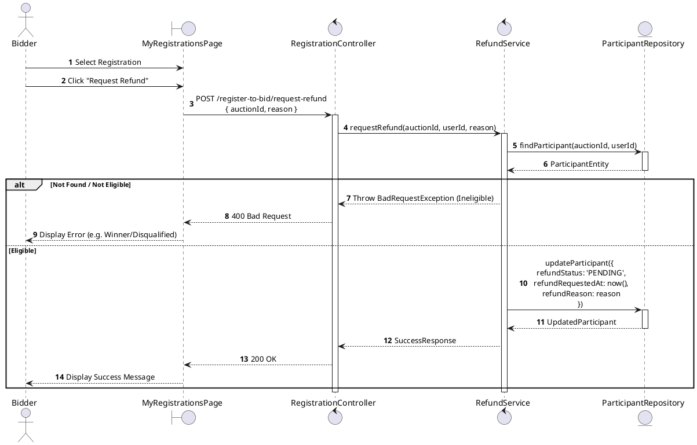
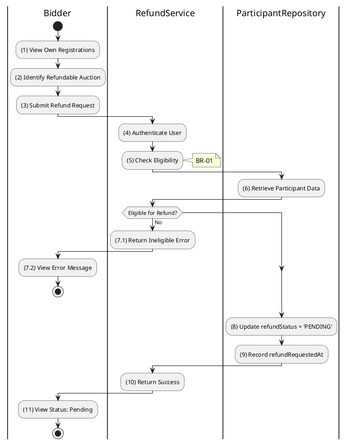

# 3.4.14 Request Refund

## 1. Use Case Description

| Field              | Description                                                                                                           |
| ------------------ | --------------------------------------------------------------------------------------------------------------------- |
| **Name**           | Request Refund                                                                                                        |
| **Description**    | This use case allows the Bidder to manually request a refund for their deposit.                                       |
| **Actor**          | Bidder                                                                                                                |
| **Trigger**        | When the Bidder clicks on the 'Request Refund' button on the MyRegistrationsPage.                                     |
| **Pre-condition**  | • Bidder's device must be connected to the internet. • Bidder is signed in. • Participant has paid the deposit. |
| **Post-condition** | The Refund Request is recorded, status set to 'PENDING', and Admin is notified for processing.                        |

## 2. Sequence Flow (MVC)

## 3. Activities Flow (Swimlanes)

## 4. Business Rules

| Activity     | BR Code   | Description                                                                                                                                                                                                                                                                                                                                       |
| :----------- | :-------- | :------------------------------------------------------------------------------------------------------------------------------------------------------------------------------------------------------------------------------------------------------------------------------------------------------------------------------------------------ |
| **(1)-(2)**  | **BR-01** | **Displaying Rules:** ❖ The system displays "MyRegistrationsPage" via `Display_View()`. ❖ The [Request Refund] button is enabled only if the registration [status] is 'FINAL_APPROVED' and the auction has ended, OR if the user 'WITHDREW' before the sale end time. ❖ Winners of the auction will not see the [Request Refund] button. |
| **(3)**      | **BR-02** | **Validation Rules (Front-end):** ❖ When clicking "Request Refund", the system prompts for a reason (optional). ❖ It displays a warning: "Application Fee is non-refundable. Only the Deposit amount will be returned."                                                                                                                     |
| **(5)**      | **BR-03** | **Eligibility Rules (Back-end):** ❖ The system verifies that the participant is NOT the winner. ❖ The system verifies that the participant is NOT disqualified (e.g., status is not 'BANNED' or 'FORFEITED'). ❖ If disqualified, the deposit is forfeited (See Section 5 for forfeiture cases).                                          |
| **(8)-(9)**  | **BR-04** | **Storing Rules (Back-end):** ❖ Upon validation, the system updates the `AUCTION_PARTICIPANT` table. ❖ Sets `refundStatus` to 'PENDING'. ❖ Records the timestamp in `refundRequestedAt`.                                                                                                                                                 |
| **(System)** | **BR-05** | **Auto-Refund System:** ❖ A background job runs daily to automatically process refunds for all non-winners 3 business days after auction finalization if they haven't requested manually. ❖ Auto-processed refunds are marked as `auto_processed`.                                                                                          |

## 5. Deposit Forfeiture Cases (BR-03 Detail)

| Code                  | Description                                    |
| :-------------------- | :--------------------------------------------- |
| `NO_SHOW`             | Didn't attend auction                          |
| `FALSE_INFORMATION`   | False registration info                        |
| `FORGED_DOCUMENTS`    | Forged documents                               |
| `PRICE_RIGGING`       | Price manipulation/collusion                   |
| `AUCTION_OBSTRUCTION` | Obstructed auction                             |
| `BID_WITHDRAWAL`      | Withdrew placed bid                            |
| `REFUSED_TO_SIGN`     | Refused to sign minutes (2 days deadline)      |
| `REFUSED_RESULT`      | Refused winning result                         |
| `PAYMENT_DEFAULT`     | Winner payment default (3 days after contract) |
| `CONTRACT_DEFAULT`    | Failed to sign contract (7 days)               |
| `CHECK_IN_FAILURE`    | Failed check-in before auction ends            |
| `LATE_WITHDRAWAL`     | Withdrew after `saleEndAt`                     |
