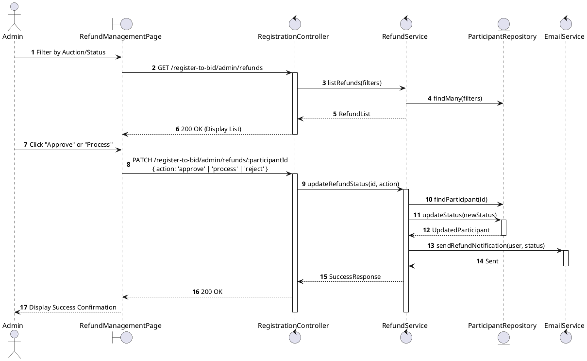
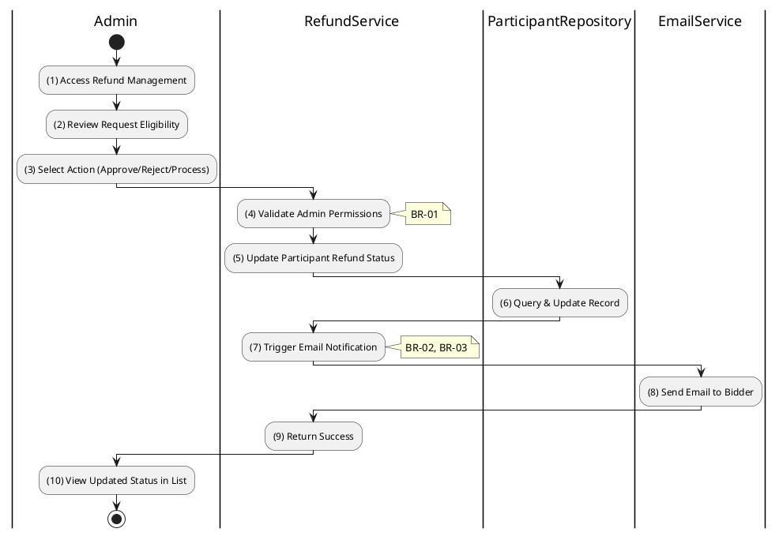

# 3.4.15 Manage Refunds (Admin)

## 1. Use Case Description

| Field              | Description                                                                                                                |
| ------------------ | -------------------------------------------------------------------------------------------------------------------------- |
| **Name**           | Manage Refunds (Admin)                                                                                                     |
| **Description**    | This use case allows the Admin to review, approve, reject, and process refund requests for bidding deposits.               |
| **Actor**          | Admin, Auctioneer                                                                                                          |
| **Trigger**        | When the Admin navigates to the RefundManagementPage.                                                                      |
| **Pre-condition**  | • Admin is signed in with 'admin' or 'auctioneer' role. • Refund requests exist in the system (Pending or Automatable). |
| **Post-condition** | Refund status updated, user notified, and financial record updated.                                                        |

## 2. Sequence Flow (MVC)

## 3. Activities Flow (Swimlanes)

## 4. Business Rules

| Activity    | BR Code   | Description                                                                                                                                                                                                                                                                     |
| :---------- | :-------- | :------------------------------------------------------------------------------------------------------------------------------------------------------------------------------------------------------------------------------------------------------------------------------ |
| **(1)-(2)** | **BR-01** | **Authorization Rules:** ❖ Only users with roles 'admin', 'auctioneer', or 'super_admin' can access this module. ❖ Any attempt by regular Bidders to access admin refund endpoints returns 403 Forbidden.                                                                 |
| **(3)**     | **BR-02** | **Validation Rules (Status Change):** ❖ **Approve**: Can only be performed on 'PENDING' requests. ❖ **Process**: Can only be performed on 'APPROVED' requests (indicates financial transaction completed). ❖ **Reject**: Requires a mandatory `reason` to be provided. |
| **(5)-(6)** | **BR-03** | **Eligibility Auto-Check:** ❖ The system highlights records that are disqualified (BANNED/FORFEITED) to prevent accidental approval. ❖ Winners are automatically excluded from the refund list or marked as 'Ineligible'.                                                 |
| **(7)-(8)** | **BR-04** | **Notification Rules:** ❖ Upon status change, an email is sent to the Bidder informing them of the outcome (Approved/Rejected/Processed). ❖ Rejection emails must include the `reason` provided by the Admin.                                                             |
| **(Batch)** | **BR-05** | **Batch Processing:** ❖ Admin can use "Batch Process" for an auction to move all 'APPROVED' refunds to 'PROCESSED' at once. ❖ It can also be used to move non-winners (who haven't requested) to 'APPROVED' status 3 business days after finalization.                    |

## 5. Disqualification Reasons (Reference)

| Reason Code         | Description                              |
| :------------------ | :--------------------------------------- |
| FALSE_INFORMATION   | Providing false information              |
| FORGED_DOCUMENTS    | Using forged documents                   |
| PRICE_RIGGING       | Collusion to rig prices                  |
| AUCTION_OBSTRUCTION | Obstructing the auction                  |
| BID_WITHDRAWAL      | Withdrawing a placed bid                 |
| REFUSED_TO_SIGN     | Refusing to sign auction minutes         |
| REFUSED_RESULT      | Refusing the winning result              |
| PAYMENT_DEFAULT     | Failing to pay within deadline           |
| CONTRACT_DEFAULT    | Failing to sign contract within deadline |
| CHECK_IN_FAILURE    | Failed to check-in before auction ended  |
