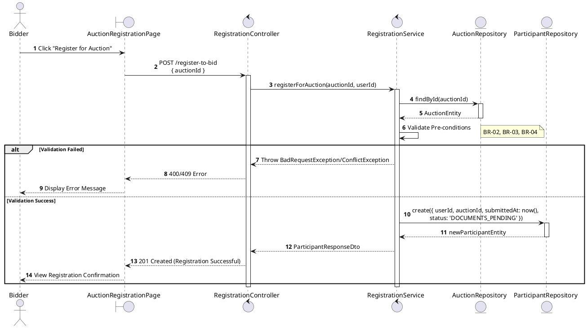
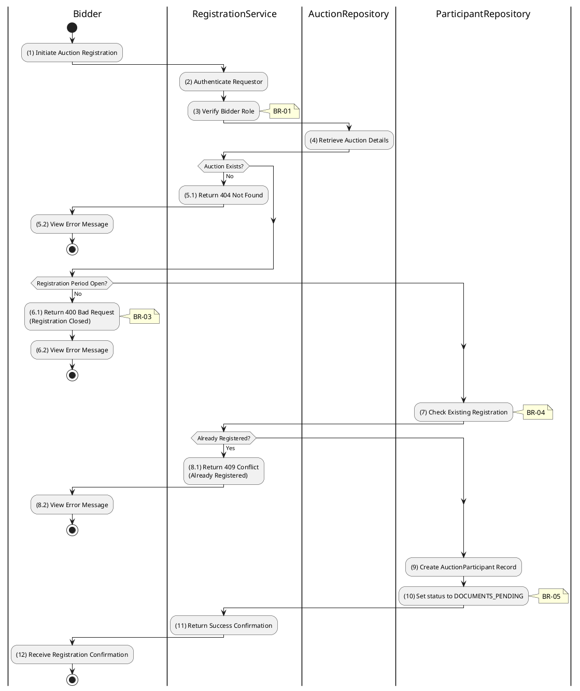

# 3.4.1 Register for Auction (Bidder)

## 1. Use Case Description

| Field              | Description                                                                                                                  |
| ------------------ | ---------------------------------------------------------------------------------------------------------------------------- |
| **Name**           | Register for Auction (Bidder)                                                                                                |
| **Description**    | This use case allows the Bidder to create a new Auction Registration information in the system.                              |
| **Actor**          | Bidder                                                                                                                       |
| **Trigger**        | When the Bidder clicks on the 'Register for Auction' button on the AuctionRegistrationPage.                                  |
| **Pre-condition**  | • Bidder's device must be connected to the internet. • Bidder is signed in with their account.                            |
| **Post-condition** | The Auction Registration information will be stored into the system and display new record on RegistrationListPage datagrid. |

## 2. Sequence Flow (MVC)

## 3. Activities Flow (Swimlanes)

## 4. Business Rules

| Activity | BR Code   | Description                                                                                                                                                                                                                                                                                                                                                                                                                                                                                                                                                                                                                                                                                                                                                                                                                                                                     |

| :------- | :-------- | :------------------------------------------------------------------------------------------------------------------------------------------------------------------------------------------------------------------------------------------------------------------------------------------------------------------------------------------------------------------------------------------------------------------------------------------------------------------------------------------------------------------------------------------------------------------------------------------------------------------------------------------------------------------------------------------------------------------------------------------------------------------------------------------------------------------------------------------------------------------------------ |

| **(1)**  | **BR-01** | **Displaying Rules:** ❖ The system displays an “AuctionRegistrationPage” screen. (Refer to “AuctionRegistrationPage” view in “View Description” file). ❖ The screen renders detailed auction information. ❖ It includes a “Register” button and, if applicable, a file upload component for required documents.                                                                                                                                                                                                                                                                                                                                                                                                                                                                                                                                                   |

| **(1)**  | **BR-02** | **Validation Rules (Front-end):** ❖ The system checks the user's authentication and role via `AuthService.checkRole('bidder')`. ❖ If the input is not valid: ⮚ If the user is not authenticated, the system redirects to the LoginPage. ⮚ If the user’s role is not 'bidder', the system displays **MSG 5** (Forbidden).                                                                                                                                                                                                                                                                                                                                                                                                                                                                                                                                       |

| **(1)**  | **BR-03** | **Validation Rules (Back-end):** ❖ When the user clicks the “Register” button, the system calls `RegistrationService.registerForAuction()` to process the request. ❖ The system checks the “AUCTION” table for eligibility: ⮚ If the [status] is not 'scheduled', the system returns a 400 Bad Request (Auction not scheduled). ⮚ If the current time is past [depositEndAt], the system returns a 400 Bad Request (Registration Closed).                                                                                                                                                                                                                                                                                                                                                                                                                        |

| **(10)** | **BR-04** | **Storing Rules (Back-end):** ❖ The system first checks the “AUCTION_PARTICIPANT” table for an existing registration. ❖ If an existing registration is found, the system returns a 409 Conflict and displays a message indicating that the user is **MSG 12** (Already Registered). ❖ Otherwise, a new record is inserted into the “AUCTION_PARTICIPANT” table, setting the [status] to 'DOCUMENTS_PENDING' and recording the `submittedAt` timestamp. ❖ System moves to step (12) and displays successful notification (Refer to **MSG 7**).                                                                                                                                                                                                                                                                                         |
