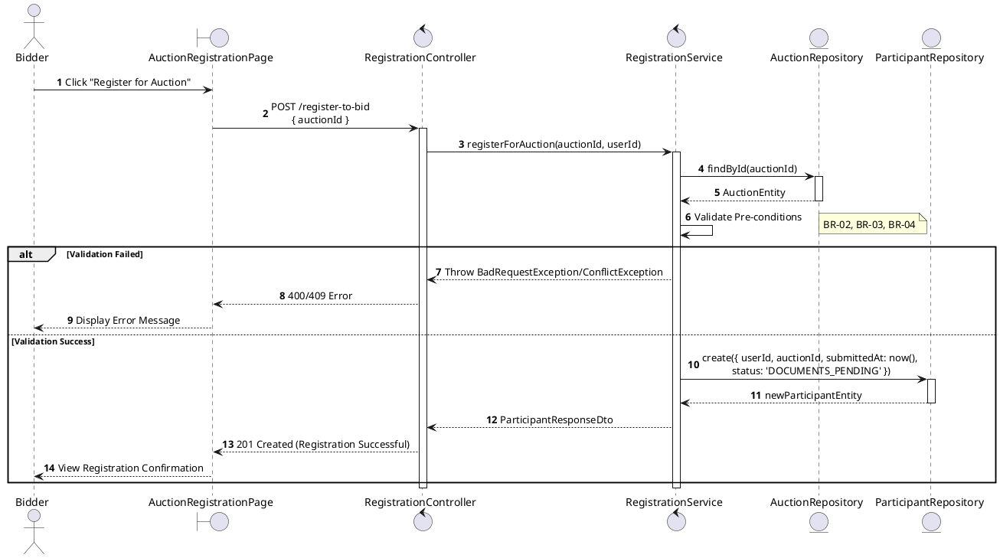
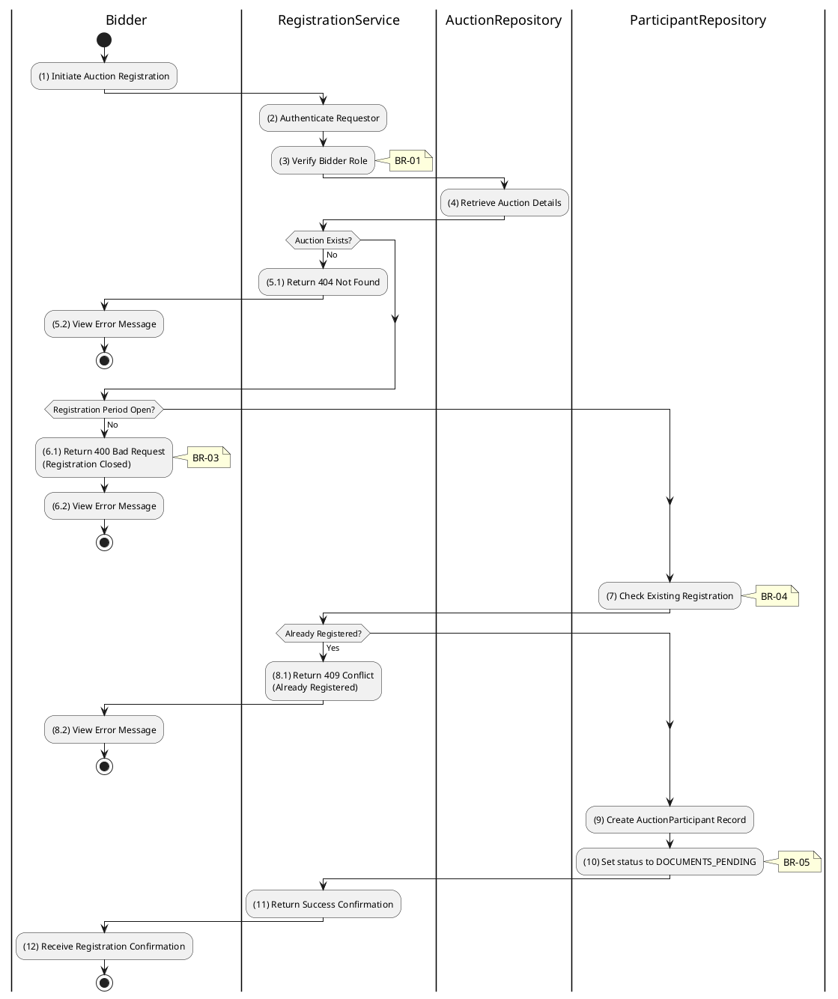

# 3.4.1 Register for Auction (Bidder)

## 1. Use Case Description

| Field              | Description                                                                                                                  |
| ------------------ | ---------------------------------------------------------------------------------------------------------------------------- |
| **Name**           | Register for Auction (Bidder)                                                                                                |
| **Description**    | This use case allows the Bidder to create a new Auction Registration information in the system.                              |
| **Actor**          | Bidder                                                                                                                       |
| **Trigger**        | When the Bidder clicks on the 'Register for Auction' button on the AuctionRegistrationPage.                                  |
| **Pre-condition**  | • Bidder's device must be connected to the internet. • Bidder is signed in with their account.                            |
| **Post-condition** | The Auction Registration information will be stored into the system and display new record on RegistrationListPage datagrid. |

## 2. Sequence Flow (MVC)

## 3. Activities Flow (Swimlanes)

## 4. Business Rules

| Activity | BR Code   | Description                                                                                                                                                                                                                                                                                                                                                                                                                                                                            |
| :------- | :-------- | :------------------------------------------------------------------------------------------------------------------------------------------------------------------------------------------------------------------------------------------------------------------------------------------------------------------------------------------------------------------------------------------------------------------------------------------------------------------------------------- |
| **(1)**  | **BR-01** | **Displaying Rule:** The system displays a 'AuctionRegistrationPage' screen. (Refer to 'AuctionRegistrationPage' view in 'View Description' file). The screen shows auction details and a 'Register for Auction' button.                                                                                                                                                                                                                                                         |
| **(1)**  | **BR-02** | **Validation Rule (Front-end):** System checks user authentication and role via `checkAuthentication()` method. If not authenticated → redirect to LoginPage. If role is not 'bidder' → display **MSG 5** (Forbidden).                                                                                                                                                                                                                                                        |
| **(1)**  | **BR-03** | **Validation Rule (Back-end/Save):** When user clicks 'Register for Auction' button, send data to database via function `registerForAuction(auctionId, userId)`. Check table `AUCTION` for eligibility (status = 'scheduled', current date < depositEndAt). If not eligible → show **MSG 14** (Registration closed), return 400. Check table `AUCTION_PARTICIPANT` for existing registration. If already registered → show **MSG 12** (Already registered), return 409. |
| **(10)** | **BR-04** | **Storing Rule:** The input data will be checked by table `AUCTION_PARTICIPANT` in the database (Refer to 'AUCTION_PARTICIPANT' table in 'DB Sheet' file) to check if there are any constraints. Else data of the Auction Registration will be stored as a new record in table `AUCTION_PARTICIPANT`. Set status = 'DOCUMENTS_PENDING'. Show **MSG 7** (Success), update view with registration confirmation.                                                                 |
