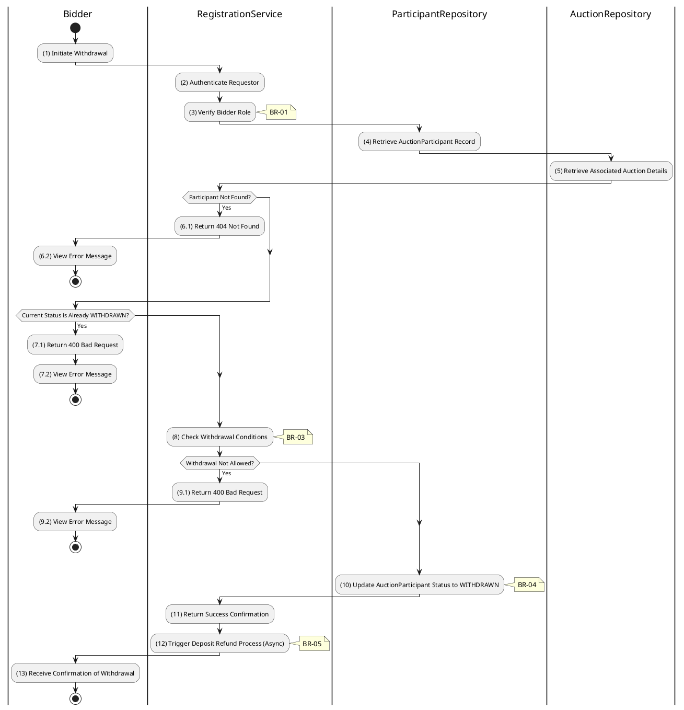

# 3.4.2 Withdraw Registration

## 1. Use Case Description

| Field              | Description                                                                                                                    |
| ------------------ | ------------------------------------------------------------------------------------------------------------------------------ |
| **Name**           | Withdraw Registration                                                                                                          |
| **Description**    | This use case allows the Bidder to delete a Auction Registration information in the system.                                    |
| **Actor**          | Bidder                                                                                                                         |
| **Trigger**        | When the Bidder clicks on the [Icon Delete] button on the right of each item on the RegistrationWithdrawalPage datagrid.       |
| **Pre-condition**  | • Bidder's device must be connected to the internet.<br>• Bidder is signed in with their account.                              |
| **Post-condition** | The Auction Registration information will be removed from the system and display data change on RegistrationListPage datagrid. |

## 2. Sequence Flow (MVC)

```plantuml
@startuml
autonumber
skinparam sequenceMessageAlign center

actor "Bidder" as User
boundary "RegistrationWithdrawalPage" as View
control "RegistrationController" as Controller
control "RegistrationService" as Service
database "ParticipantRepository" as ParticipantRepo
database "AuctionRepository" as AuctionRepo

User -> View: Click "Withdraw Registration"
View -> Controller: POST /register-to-bid/withdraw\n{ auctionId }
activate Controller

Controller -> Service: withdrawRegistration(auctionId, userId)
activate Service

Service -> ParticipantRepo: findParticipantAndAuction(auctionId, userId)
activate ParticipantRepo
ParticipantRepo --> Service: ParticipantEntity, AuctionEntity
deactivate ParticipantRepo

alt Participant Not Found or Already Withdrawn
    Service --> Controller: Throw NotFoundException/BadRequestException
    Controller --> View: 404/400 Error
    View --> User: Display Error Message
else Participant Found
    Service -> Service: Validate Withdrawal Conditions
    note right: BR-03

    alt Withdrawal Not Allowed
        Service --> Controller: Throw BadRequestException\n("Cannot withdraw at this stage")
        Controller --> View: 400 Bad Request
        View --> User: Display Error Message
    else Withdrawal Allowed
        Service -> ParticipantRepo: updateStatus(
  { userId, auctionId }, 'WITHDRAWN')
        activate ParticipantRepo
        ParticipantRepo --> Service: UpdatedParticipantEntity
        deactivate ParticipantRepo

        Service --> Controller: SuccessResponse
        Controller --> View: 200 OK (Registration Withdrawn)
        View --> User: Receive Confirmation of Withdrawal
    end
end

deactivate Service
deactivate Controller
@enduml
```

## 3. Activities Flow (Swimlanes)



## 4. Business Rules

| Activity | BR Code   | Description                                                                                                                                                                                                                                                                                                                                                                                                                                                                                                                                                                                                                                                                                                                                                                                                                                                                     |
| :       | :-------- | :------------------------------------------------------------------------------------------------------------------------------------------------------------------------------------------------------------------------------------------------------------------------------------------------------------------------------------------------------------------------------------------------------------------------------------------------------------------------------------------------------------------------------------------------------------------------------------------------------------------------------------------------------------------------------------------------------------------------------------------------------------------------------------------------------------------------------------------------------------------------------ |
| **(1)**  | **BR-01** | **Displaying Rules (Confirmation):**<br>❖ The system triggers a confirmation modal by calling `Display_Modal('ConfirmationBox')`.<br>❖ It displays the message **MSG 11** ("Confirm withdrawal? Deposit refund may apply.").<br>❖ The system provides [Confirm Withdrawal] and [Cancel] buttons for the user.                                                                                                                                                                                                                                                                                                                                                                                                                                                                                                                                                   |
| **(3)**  | **BR-02** | **Authorization Rules (Back-end):**<br>❖ The system calls `RegistrationService.withdrawRegistration()` and verifies the requestor's identity.<br>❖ If the input is not valid:<br>⮚ If the authenticated user's role is not 'bidder', the system returns a 403 Forbidden status.                                                                                                                                                                                                                                                                                                                                                                                                                                                                                                                                                                                   |
| **(8)**  | **BR-03** | **State Locking Rules (Back-end):**<br>❖ The system checks the status of the auction and the participant via `RegistrationService.withdrawRegistration()`.<br>❖ If the input is not valid:<br>⮚ If the auction's [status] is not 'scheduled', the system prevents withdrawal.<br>⮚ The system returns a 400 Bad Request error with a message indicating that withdrawal is not permitted for active or ended auctions.                                                                                                                                                                                                                                                                                                                                                                                                                                                  |
| **(10)** | **BR-04** | **Storing Rules (Back-end):**<br>❖ Upon successful validation, the system updates the record in the “AUCTION_PARTICIPANT” table.<br>❖ It sets the [status] to 'WITHDRAWN' and records the `withdrawnAt` timestamp.<br>❖ The system triggers an asynchronous process to handle any applicable deposit refunds.<br>❖ System moves to step (13) and displays successful notification (Refer to **MSG 7**).                                                                                                                                                                                                                                                                                                                                                                                                                                                                 |