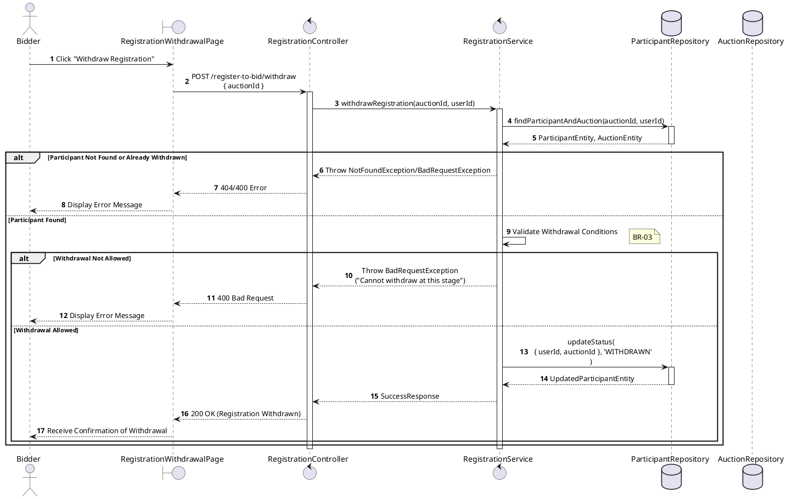
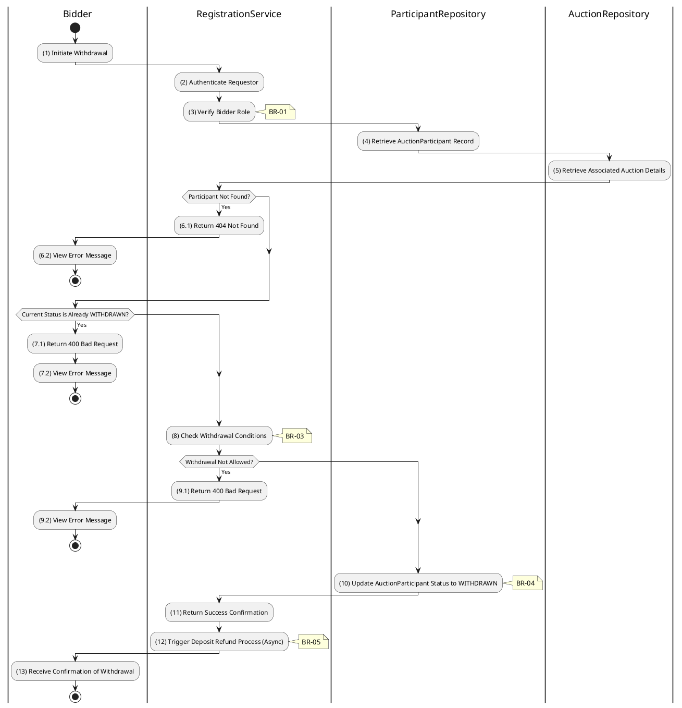

# 3.4.2 Withdraw Registration

## 1. Use Case Description

| Field              | Description                                                                                                                    |
| ------------------ | ------------------------------------------------------------------------------------------------------------------------------ |
| **Name**           | Withdraw Registration                                                                                                          |
| **Description**    | This use case allows the Bidder to delete a Auction Registration information in the system.                                    |
| **Actor**          | Bidder                                                                                                                         |
| **Trigger**        | When the Bidder clicks on the [Icon Delete] button on the right of each item on the RegistrationWithdrawalPage datagrid.       |
| **Pre-condition**  | • Bidder's device must be connected to the internet. • Bidder is signed in with their account.                              |
| **Post-condition** | The Auction Registration information will be removed from the system and display data change on RegistrationListPage datagrid. |

## 2. Sequence Flow (MVC)

## 3. Activities Flow (Swimlanes)

## 4. Business Rules

| Activity | BR Code   | Description                                                                                                                                                                                                                                                                                                                                    |
| :------- | :-------- | :--------------------------------------------------------------------------------------------------------------------------------------------------------------------------------------------------------------------------------------------------------------------------------------------------------------------------------------------- |
| **(1)**  | **BR-01** | **Querying Rule:** System queries data in the table 'AUCTION_PARTICIPANT' in the database (Refer to 'AUCTION_PARTICIPANT' table in 'DB Sheet' file) based on the auction ID and user ID. Call method `displayRegistrationDetails(registration)` to show current status.                                                                  |
| **(1)**  | **BR-02** | **Displaying Rule:** The system displays a 'Confirmation message box' screen. (Refer to View Description) with **MSG 11** (Confirm withdrawal?). Shows current registration status and 'Cancel' / 'Confirm Withdrawal' buttons.                                                                                                          |
| **(1)**  | **BR-03** | **Selecting Rule:** User selects button. If 'Cancel', use `Close()` to end. If 'Confirm Withdrawal', call method `withdrawRegistration(auctionId, userId)`.                                                                                                                                                                              |
| **(8)**  | **BR-04** | **Validation Rule (Withdrawal Window):** System checks withdrawal conditions: auctionStartAt must be in future, bidder must not have checkedInAt. If either fails → display **MSG 18** (Cannot withdraw at this stage), return 400.                                                                                                      |
| **(10)** | **BR-05** | **Validation Rule (Back-end/Save):** The Registration information will be updated in table 'AUCTION_PARTICIPANT' in the database (Refer to 'AUCTION_PARTICIPANT' table in 'DB Sheet' file) to set the status as 'WITHDRAWN'. Trigger async deposit refund process. Show **MSG 7** (Success), use `Close()`, update registration list. |
