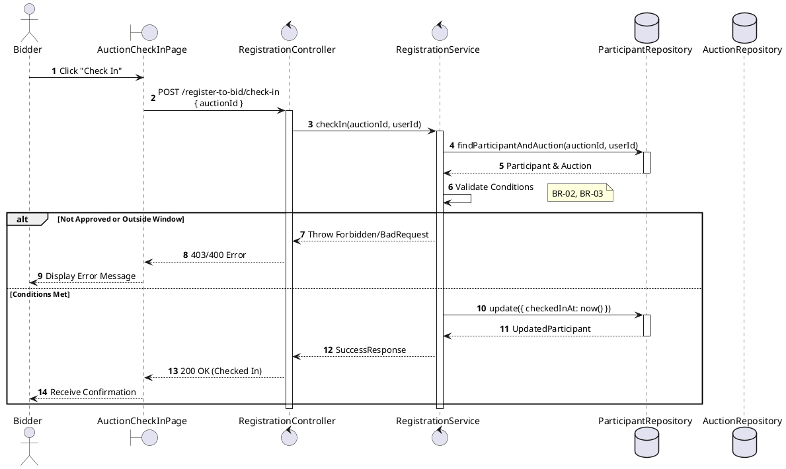
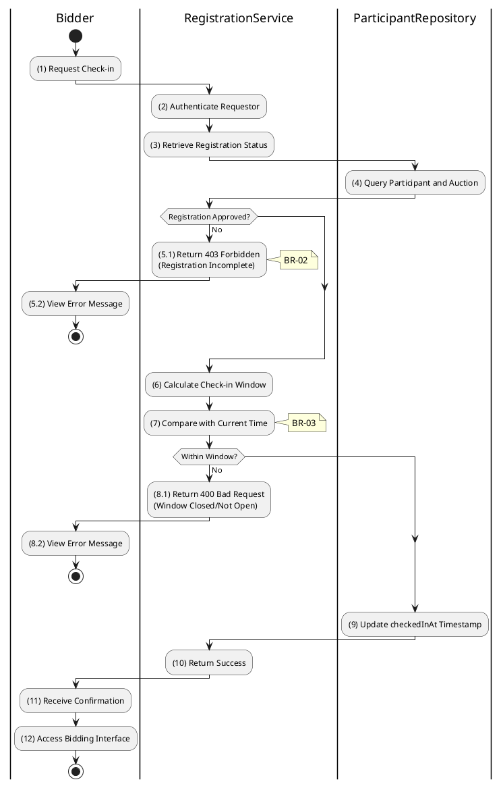

# 3.4.3 Check-in for Auction

## 1. Use Case Description

| Field              | Description                                                                                                                      |
| ------------------ | -------------------------------------------------------------------------------------------------------------------------------- |
| **Name**           | Check-in for Auction                                                                                                             |
| **Description**    | This use case allows the Bidder to update existing Auction Registration information in the system.                               |
| **Actor**          | Bidder                                                                                                                           |
| **Trigger**        | When the Bidder clicks on the 'Check In' button on the AuctionCheckInPage.                                                       |
| **Pre-condition**  | • Bidder's device must be connected to the internet. • Bidder is signed in with their account.                                |
| **Post-condition** | The Auction Registration information will be updated in the system and display checked-in status on AuctionCheckInPage datagrid. |

## 2. Sequence Flow (MVC)

## 3. Activities Flow (Swimlanes)

## 4. Business Rules

| Activity  | BR Code   | Description                                                                                                                                                                                                                                                                                                                                                                                                                                                     |
| :-------- | :-------- | :-------------------------------------------------------------------------------------------------------------------------------------------------------------------------------------------------------------------------------------------------------------------------------------------------------------------------------------------------------------------------------------------------------------------------------------------------------------- |
| **(1)**   | **BR-01** | **Querying Rule:** System queries data in the table 'AUCTION_PARTICIPANT' in the database (Refer to 'AUCTION_PARTICIPANT' table in 'DB Sheet' file) based on the auction ID and user ID. Call method `displayRegistrationStatus(registration)` to show approval status.                                                                                                                                                                                   |
| **(1)**   | **BR-02** | **Displaying Rule:** The system displays a 'AuctionCheckInPage' screen. (Refer to 'AuctionCheckInPage' view in 'View Description' file). Screen shows registration status, auction time, and 'Check In' button (enabled only if approved).                                                                                                                                                                                                                |
| **(5.1)** | **BR-03** | **Validation Rule (Front-end):** System checks registration status before enabling Check In button. If status != 'FINAL_APPROVED' → disable button, display **MSG 19** (Registration incomplete).                                                                                                                                                                                                                                                         |
| **(7)**   | **BR-04** | **Validation Rule (Time Window):** System calculates check-in window (e.g., 30 mins before to 15 mins after auctionStartAt). If current time outside window → display **MSG 20** (Check-in window closed/not open).                                                                                                                                                                                                                                       |
| **(9)**   | **BR-05** | **Validation Rule (Back-end/Save):** When user clicks 'Check In' button, send data via function `checkIn(auctionId, userId)`. The Participant information will be updated in table 'AUCTION_PARTICIPANT' in the database (Refer to 'AUCTION_PARTICIPANT' table in 'DB Sheet' file) to set the check-in timestamp. If already checked in → gracefully handle (no duplicate update). Else, show **MSG 7** (Success), enable bidding interface access. |
