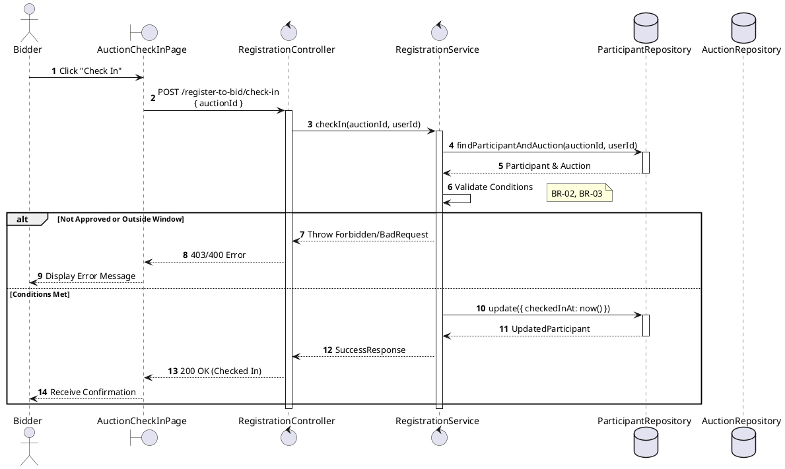
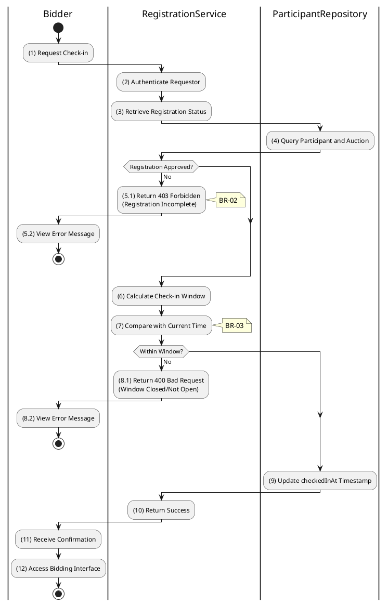

# 3.4.3 Check-in for Auction

## 1. Use Case Description

| Field              | Description                                                                                                                      |
| ------------------ | -------------------------------------------------------------------------------------------------------------------------------- |
| **Name**           | Check-in for Auction                                                                                                             |
| **Description**    | This use case allows the Bidder to update existing Auction Registration information in the system.                               |
| **Actor**          | Bidder                                                                                                                           |
| **Trigger**        | When the Bidder clicks on the 'Check In' button on the AuctionCheckInPage.                                                       |
| **Pre-condition**  | • Bidder's device must be connected to the internet. • Bidder is signed in with their account.                                |
| **Post-condition** | The Auction Registration information will be updated in the system and display checked-in status on AuctionCheckInPage datagrid. |

## 2. Sequence Flow (MVC)

## 3. Activities Flow (Swimlanes)

## 4. Business Rules

| Activity  | BR Code   | Description                                                                                                                                                                                                                                                                                                                                                                                                                                                                                                                                                                                                                                                                                                                                                                                                                                                                     |
| :-------- | :-------- | :------------------------------------------------------------------------------------------------------------------------------------------------------------------------------------------------------------------------------------------------------------------------------------------------------------------------------------------------------------------------------------------------------------------------------------------------------------------------------------------------------------------------------------------------------------------------------------------------------------------------------------------------------------------------------------------------------------------------------------------------------------------------------------------------------------------------------------------------------------------------------ |
| **(1)**   | **BR-01** | **Displaying Rules:** ❖ The system displays an “AuctionCheckInPage” screen via `Display_View(participant)`. (Refer to “AuctionCheckInPage” view in “View Description” file). ❖ The screen renders details about the auction and the current registration status. ❖ The [Check In] button is displayed, but its enabled state depends on the registration status and the current time window.                                                                                                                                                                                                                                                                                                                                                                                                                                                                   |
| **(5.1)** | **BR-02** | **State Locking Rules (Back-end):** ❖ The system calls `RegistrationService.checkIn()` and verifies the participant's status in the “AUCTION_PARTICIPANT” table. ❖ If the input is not valid: ⮚ If the [status] is not 'FINAL_APPROVED', the system prevents check-in. ⮚ It returns a 403 Forbidden status and displays **MSG 19** (Registration incomplete).                                                                                                                                                                                                                                                                                                                                                                                                                                                                                               |
| **(7)**   | **BR-03** | **Time Window Rules (Back-end):** ❖ The system calculates the valid check-in window using `AuctionService.getCheckInWindow(auctionId)`. ❖ It retrieves `auctionStartAt`, `validCheckInBeforeStartMinutes`, and `validCheckInAfterStartMinutes`. ❖ If the input is not valid: ⮚ If the current time is not within the calculated window, the system returns a 400 Bad Request. ⮚ It displays **MSG 20** (Check-in window closed/not open) to the user.                                                                                                                                                                                                                                                                                                                                                                                                    |
| **(9)**   | **BR-04** | **Storing Rules (Back-end):** ❖ Upon successful validation, the system updates the record in the “AUCTION_PARTICIPANT” table. ❖ It sets the [checkedInAt] field to the current timestamp. ❖ System moves to step (11) and displays successful notification (Refer to **MSG 7**). ❖ The system then enables access to the Bidding Interface for the user.                                                                                                                                                                                                                                                                                                                                                                                                                                                                                                    |