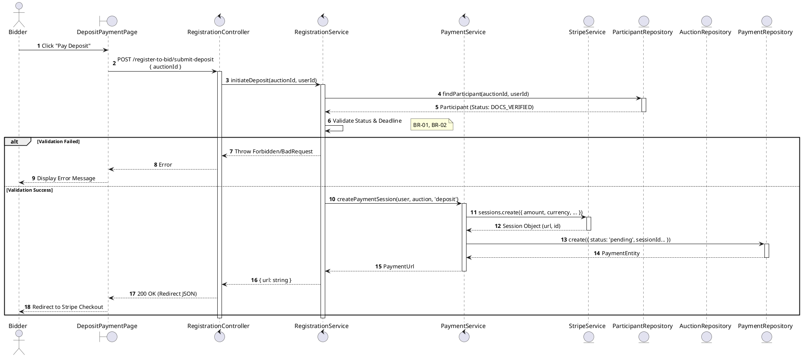
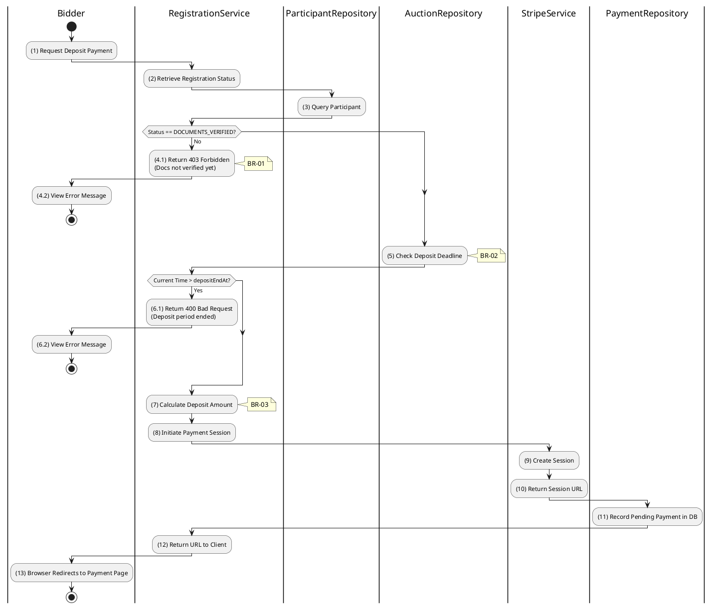

# 3.4.4 Submit Deposit Payment

## 1. Use Case Description

| Field              | Description                                                                                                       |
| ------------------ | ----------------------------------------------------------------------------------------------------------------- |
| **Name**           | Submit Deposit Payment                                                                                            |
| **Description**    | This use case allows the Bidder to create a new Deposit Payment information in the system.                        |
| **Actor**          | Bidder                                                                                                            |
| **Trigger**        | When the Bidder clicks on the 'Pay Deposit' button on the DepositPaymentPage.                                     |
| **Pre-condition**  | • Bidder's device must be connected to the internet. • Bidder is signed in with their account.                 |
| **Post-condition** | The Deposit Payment information will be stored into the system and display payment session on DepositPaymentPage. |

## 2. Sequence Flow (MVC)

## 3. Activities Flow (Swimlanes)

## 4. Business Rules

| Activity | BR Code   | Description                                                                                                                                                                                                                                                                                                                |
| :------- | :-------- | :------------------------------------------------------------------------------------------------------------------------------------------------------------------------------------------------------------------------------------------------------------------------------------------------------------------------- |
| **(1)**  | **BR-01** | **Displaying Rule:** The system displays a 'DepositPaymentPage' screen. (Refer to 'DepositPaymentPage' view in 'View Description' file). Screen shows deposit amount required, payment deadline, and 'Pay Deposit' button.                                                                                           |
| **(1)**  | **BR-02** | **Validation Rule (Front-end):** System checks registration status before enabling payment. If status != 'DOCUMENTS_VERIFIED' → disable button, display **MSG 21** (Documents not verified yet). If current time > depositEndAt → disable button, display **MSG 15** (Deposit period ended).                      |
| **(1)**  | **BR-03** | **Validation Rule (Back-end/Save):** When user clicks 'Pay Deposit' button, send request via function `initiateDeposit(auctionId, userId)`. Check table `PAYMENT` for existing pending payments (prevent duplicates). Create Stripe Checkout Session with exact depositAmountRequired.                            |
| **(11)** | **BR-04** | **Storing Rule:** The input data will be checked by table `PAYMENT` in the database (Refer to 'PAYMENT' table in 'DB Sheet' file) to check if there are any constraints. Else data of the Payment will be stored as a new record in table `PAYMENT`. Set status = 'pending'. Return Stripe Session URL to client. |
| **(13)** | **BR-05** | **Displaying Rule (Redirect):** System redirects user's browser to Stripe Checkout Page using returned session URL. User completes payment on external payment gateway.                                                                                                                                              |
