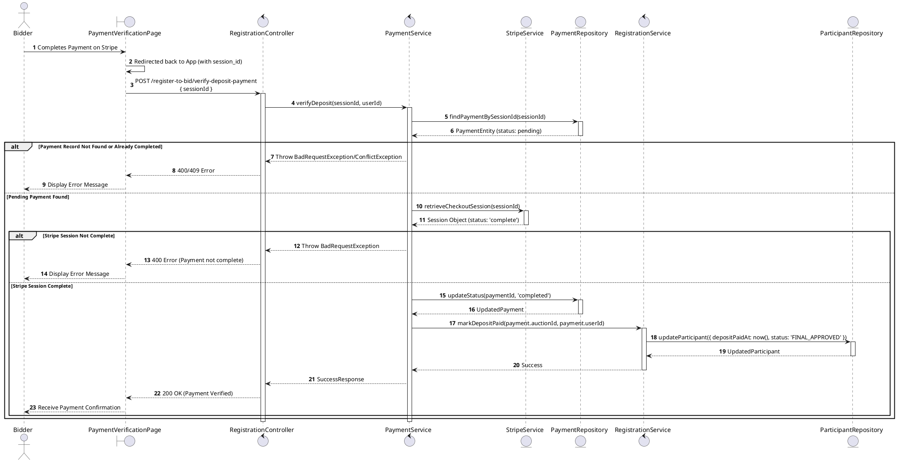
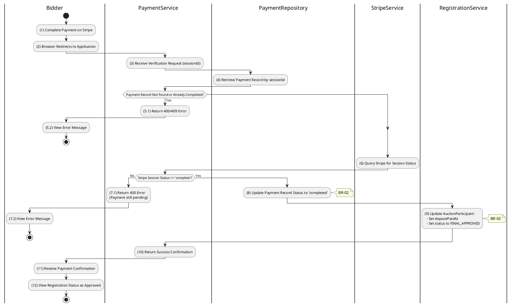

# 3.4.5 Verify Deposit Payment

## 1. Use Case Description

| Field              | Description                                                                                                                    |
| ------------------ | ------------------------------------------------------------------------------------------------------------------------------ |
| **Name**           | Verify Deposit Payment                                                                                                         |
| **Description**    | This use case allows the Bidder to update existing Deposit Payment information in the system.                                  |
| **Actor**          | Bidder                                                                                                                         |
| **Trigger**        | When the Bidder is redirected back from Stripe to the PaymentVerificationPage.                                                 |
| **Pre-condition**  | • Bidder's device must be connected to the internet. • Bidder is signed in with their account.                              |
| **Post-condition** | The Deposit Payment information will be updated in the system and display verified status on PaymentVerificationPage datagrid. |

## 2. Sequence Flow (MVC)

## 3. Activities Flow (Swimlanes)

## 4. Business Rules

| Activity      | BR Code   | Description                                                                                                                                                                                                                                                                                                                                                                                                                                                                                                                                                                                                                                                                                                                                                                                                                                                                     |
| :------------ | :-------- | :------------------------------------------------------------------------------------------------------------------------------------------------------------------------------------------------------------------------------------------------------------------------------------------------------------------------------------------------------------------------------------------------------------------------------------------------------------------------------------------------------------------------------------------------------------------------------------------------------------------------------------------------------------------------------------------------------------------------------------------------------------------------------------------------------------------------------------------------------------------------------ |
| **(2)**       | **BR-01** | **Displaying Rules:** ❖ The system renders a “PaymentVerificationPage” via `Display_View()` upon return from the payment gateway. ❖ It displays a loading indicator and a message: "Verifying your payment...".                                                                                                                                                                                                                                                                                                                                                                                                                                                                                                                                                                                                                                                   |
| **(3)**       | **BR-02** | **Verification Rules (Back-end):** ❖ The system calls `PaymentService.verifyDeposit(sessionId, userId)` to verify the transaction. ❖ It retrieves the `PAYMENT` record using the [sessionId]. ❖ If the input is not valid: ⮚ If the record is not found or the [status] is not 'pending', the system returns a 400 Bad Request. ⮚ It then queries Stripe to confirm the session status. ⮚ If the Stripe status is not 'complete', the system returns a 400 error (Payment not complete).                                                                                                                                                                                                                                                                                                                                                                  |
| **(6)**       | **BR-03** | **Financial Rules (Back-end):** ❖ The system performs a financial check via `PaymentService.verifyDeposit()`. ❖ It compares `Stripe.amount_total` with `Auction.depositAmountRequired`. ❖ If there is a mismatch, the system logs a warning for admin review and returns a 400 Bad Request error.                                                                                                                                                                                                                                                                                                                                                                                                                                                                                                                                                              |
| **(8), (9)**  | **BR-04** | **Storing Rules (Back-end):** ❖ Upon successful verification, the system calls `PaymentService.verifyDeposit()` to update the database. ❖ It updates the `PAYMENT` table, setting the [status] to 'completed'. ❖ It also updates the “AUCTION_PARTICIPANT” table, setting the [depositPaidAt] timestamp to now and the [status] to 'FINAL_APPROVED'.                                                                                                                                                                                                                                                                                                                                                                                                                                                                                                           |
| **(11)-(12)** | **BR-05** | **Displaying Rules (Success):** ❖ The system redirects the user to the Registration Details Page via `Redirect('RegistrationDetailsPage', { success: true })`. ❖ It displays **MSG 7** ("Deposit payment verified successfully.") to the user. ❖ The registration [status] is updated to show 'FINAL_APPROVED'.                                                                                                                                                                                                                                                                                                                                                                                                                                                                                                                                                |
