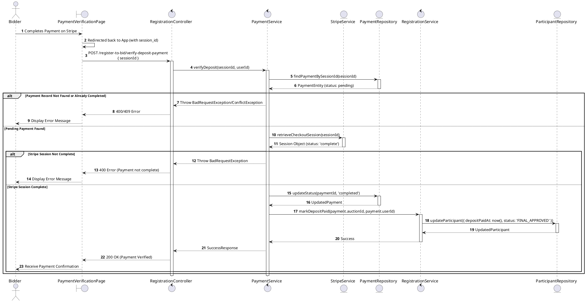
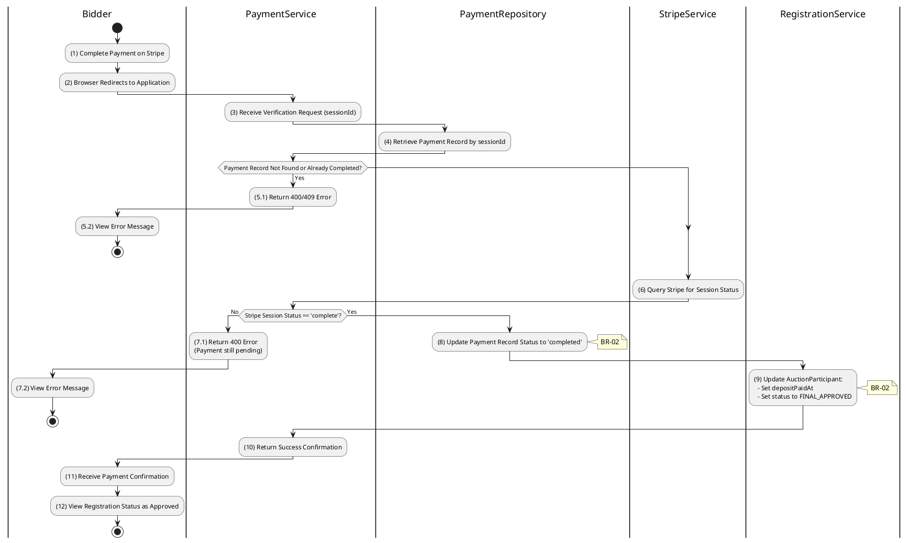

# 3.4.5 Verify Deposit Payment

## 1. Use Case Description

| Field              | Description                                                                                                                    |
| ------------------ | ------------------------------------------------------------------------------------------------------------------------------ |
| **Name**           | Verify Deposit Payment                                                                                                         |
| **Description**    | This use case allows the Bidder to update existing Deposit Payment information in the system.                                  |
| **Actor**          | Bidder                                                                                                                         |
| **Trigger**        | When the Bidder is redirected back from Stripe to the PaymentVerificationPage.                                                 |
| **Pre-condition**  | • Bidder's device must be connected to the internet.<br>• Bidder is signed in with their account.                              |
| **Post-condition** | The Deposit Payment information will be updated in the system and display verified status on PaymentVerificationPage datagrid. |

## 2. Sequence Flow (MVC)



## 3. Activities Flow (Swimlanes)



## 4. Business Rules

| Activity      | BR Code   | Description                                                                                                                                                                                                                                                                                                                                                                                                                                                                                                                 |
| :------------ | :-------- | :-------------------------------------------------------------------------------------------------------------------------------------------------------------------------------------------------------------------------------------------------------------------------------------------------------------------------------------------------------------------------------------------------------------------------------------------------------------------------------------------------------------------------- |
| **(2)**       | **BR-01** | **Displaying Rule (Payment Verification Page):**<br>When user is redirected back from Stripe, system displays `PaymentVerificationPage`.<br>System shows loading indicator while verification is in progress.                                                                                                                                                                                                                                                                                                               |
| **(3)-(6)**   | **BR-02** | **Validation Rule (Back-end Verification):**<br>System retrieves data from the 'PAYMENT' table in the database (Refer to 'PAYMENT' table in 'DB Sheet' file) based on the session ID.<br>If payment record not found or already `completed`:<br>$\rightarrow$ System displays MSG 9 ("Payment verification failed") on the View.<br>System queries Stripe API to confirm payment status is `complete`.<br>If Stripe session not complete:<br>$\rightarrow$ System displays MSG 9 ("Payment not yet confirmed") on the View. |
| **(6)**       | **BR-03** | **Validation Rule (Amount Matching):**<br>System verifies `amount_total` from Stripe matches `depositAmountRequired` in `AUCTION` table.<br>If mismatch:<br>$\rightarrow$ System displays MSG 9 ("Payment amount mismatch") and flags for admin review.                                                                                                                                                                                                                                                                     |
| **(8), (9)**  | **BR-04** | **Storing Rule:**<br>On successful verification, system saves to `PAYMENT` table: `status = 'completed'`.<br>System saves to `AUCTION_PARTICIPANT` table: `depositPaidAt = now()`, `status = 'FINAL_APPROVED'`.                                                                                                                                                                                                                                                                                                             |
| **(10)-(12)** | **BR-05** | **Displaying Rule (Success Confirmation):**<br>System displays MSG 7 ("Deposit payment verified successfully") on the View.<br>System displays updated registration status showing `FINAL_APPROVED`.<br>User can now proceed to auction check-in.                                                                                                                                                                                                                                                                           |

```

```
