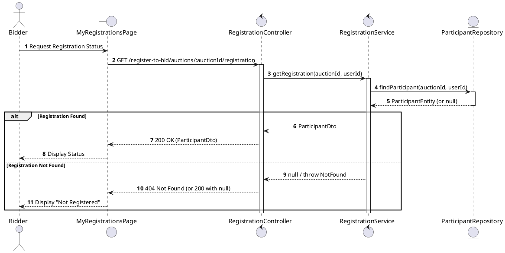
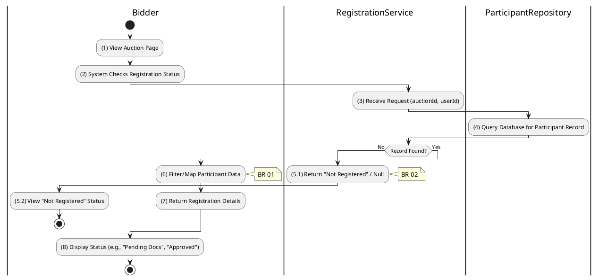

# 3.4.6 View Own Registrations

## 1. Use Case Description

| Field              | Description                                                                                               |
| ------------------ | --------------------------------------------------------------------------------------------------------- |
| **Name**           | View Own Registrations                                                                                    |
| **Description**    | This use case allows the Bidder to search Registration information in the system based on input keywords. |
| **Actor**          | Bidder                                                                                                    |
| **Trigger**        | When Bidder clicks on the 'View Registration' button on the MyRegistrationsPage screen.                   |
| **Pre-condition**  | • Bidder's device must be connected to the internet. • Bidder is signed in with their account.         |
| **Post-condition** | The Registration information will be displayed on the MyRegistrationsPage screen.                         |

## 2. Sequence Flow (MVC)

## 3. Activities Flow (Swimlanes)

## 4. Business Rules

| Activity | BR Code   | Description                                                                                                                                                                                                                                                                                                                                                                                                                                                                                                                                                                                                                                            |
