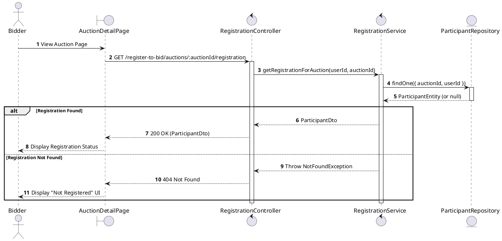
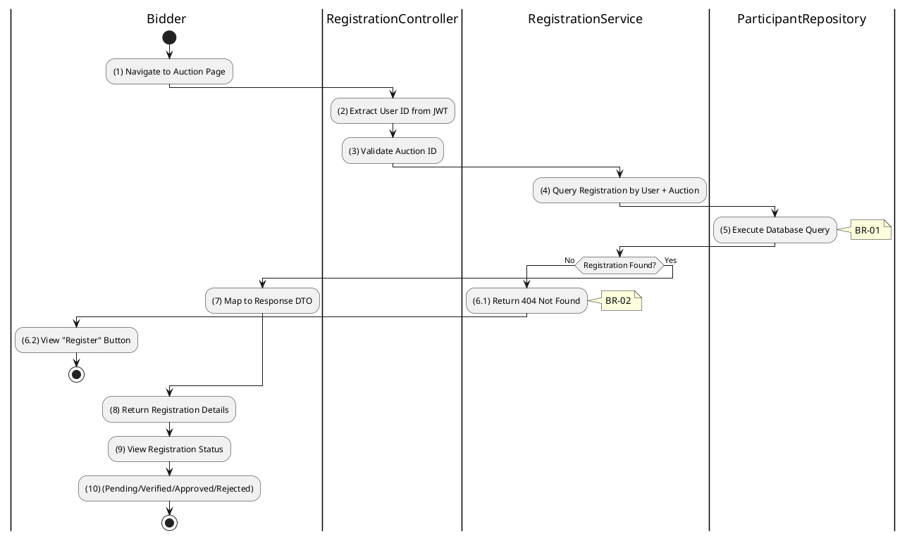

# 3.4.7 Get Registration for Auction

## 1. Use Case Description

| Field              | Description                                                                                                   |
| ------------------ | ------------------------------------------------------------------------------------------------------------- |
| **Name**           | Get Registration for Auction                                                                                  |
| **Description**    | This use case allows the Bidder to view their registration status for a specific auction.                     |
| **Actor**          | Bidder                                                                                                        |
| **Trigger**        | When Bidder navigates to an auction page or requests `GET /register-to-bid/auctions/:auctionId/registration`. |
| **Pre-condition**  | • Bidder's device must be connected to the internet. • Bidder is signed in with their account.             |
| **Post-condition** | The registration status for the specific auction is displayed to the Bidder.                                  |

## 2. Sequence Flow (MVC)

## 3. Activities Flow (Swimlanes)

## 4. Business Rules

| Activity  | BR Code   | Description                                                                                                                                                                                                                                                                                                             |
| :-------- | :-------- | :---------------------------------------------------------------------------------------------------------------------------------------------------------------------------------------------------------------------------------------------------------------------------------------------------------------------- |
| **(1)**   | **BR-01** | **Displaying Rule:**  Function: `Display_View('AuctionDetailPage', auction)`  Logic: Render [Register] button if not registered. Render [RegistrationStatus] badge if registered.                                                                                                                   |
| **(2)**   | **BR-02** | **Processing Rule (User ID):**  Function: `AuthService.getUserIdFromToken()`  Logic: Extract `userId` from validated JWT token. Automatically use this `userId` for query.                                                                                                                           |
| **(5)**   | **BR-03** | **Querying Rule:**  Function: Call `RegistrationService.getRegistrationForAuction(userId, auctionId)`  Logic: Query `AUCTION_PARTICIPANT` table WHERE [userId] AND [auctionId] match. Select: [status], [submittedAt], [documentsVerifiedAt], [depositPaidAt], [confirmedAt], [checkedInAt].        |
| **(6.1)** | **BR-04** | **Not Found Handling Rule:**  Function: `Return_404_NotFound()`  Logic: IF No Record Found THEN   Return HTTP 404.   Frontend renders "Not Registered" state and "Register" button. END IF                                                                                                        |
| **(9)**   | **BR-05** | **Displaying Rule (Status Logic):**  Function: `Display_StatusBadge(participant)`  Logic: IF [participant.status] == 'FINAL_APPROVED' THEN 'Approved' ELSE IF [participant.status] == 'DOCUMENTS_VERIFIED' THEN 'Documents Verified' ELSE IF [participant.status] == 'DOCUMENTS_PENDING' THEN 'Pending Docs' ELSE IF [participant.status] == 'REJECTED' THEN 'Rejected' END IF |
