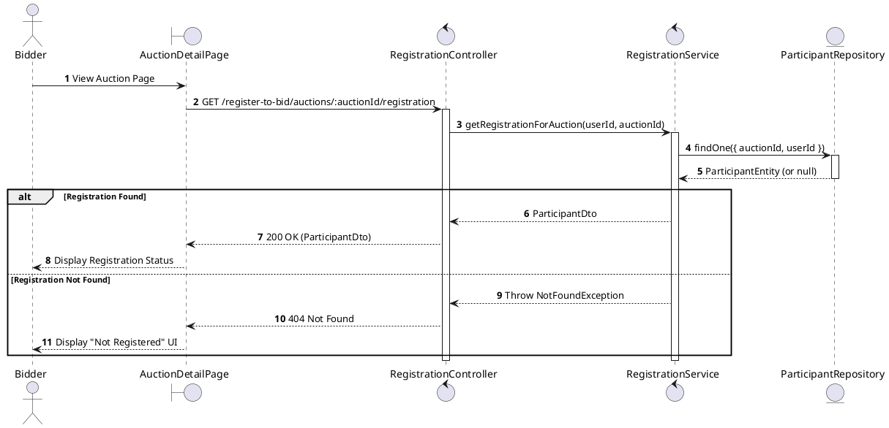
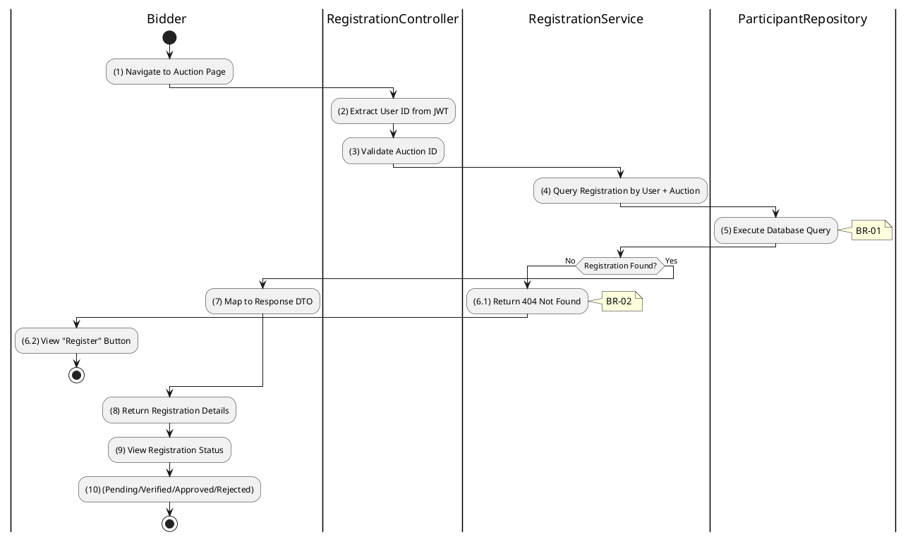

# 3.4.7 Get Registration for Auction

## 1. Use Case Description

| Field              | Description                                                                                                   |
| ------------------ | ------------------------------------------------------------------------------------------------------------- |
| **Name**           | Get Registration for Auction                                                                                  |
| **Description**    | This use case allows the Bidder to view their registration status for a specific auction.                     |
| **Actor**          | Bidder                                                                                                        |
| **Trigger**        | When Bidder navigates to an auction page or requests `GET /register-to-bid/auctions/:auctionId/registration`. |
| **Pre-condition**  | • Bidder's device must be connected to the internet. • Bidder is signed in with their account.             |
| **Post-condition** | The registration status for the specific auction is displayed to the Bidder.                                  |

## 2. Sequence Flow (MVC)

## 3. Activities Flow (Swimlanes)

## 4. Business Rules

| Activity  | BR Code   | Description                                                                                                                                                                                                                                                                                                             |
| :-------- | :-------- | :---------------------------------------------------------------------------------------------------------------------------------------------------------------------------------------------------------------------------------------------------------------------------------------------------------------------- |
| **(1)**   | **BR-01** | **Displaying Rule (Auction Detail Page):** When bidder visits auction page, system checks their registration status automatically. System displays appropriate UI: "Register" button (not registered), status badge (registered).                                                                                 |
| **(2)**   | **BR-02** | **Processing Rule (User Identification):** System extracts user ID from JWT token. User can only view their own registration status. No explicit user ID parameter needed - derived from auth token.                                                                                                           |
| **(5)**   | **BR-03** | **Querying Rule:** System retrieves data from the 'AUCTION_PARTICIPANT' table in the database where `userId` and `auctionId` match. System retrieves all status fields: submittedAt, documentsVerifiedAt, depositPaidAt, confirmedAt, checkedInAt, withdrawnAt.                                                   |
| **(6.1)** | **BR-04** | **Processing Rule (Not Found Handling):** If no registration exists, system returns 404 Not Found. Frontend interprets this as "user has not registered yet". Frontend displays "Register for Auction" button.                                                                                                 |
| **(9)**   | **BR-05** | **Displaying Rule (Status Display):** System displays registration status based on timestamp fields: - `submittedAt` set: "Pending Review" - `documentsVerifiedAt` set: "Documents Verified" - `depositPaidAt` set: "Deposit Paid" - `confirmedAt` set: "Approved" - `checkedInAt` set: "Checked In". |
