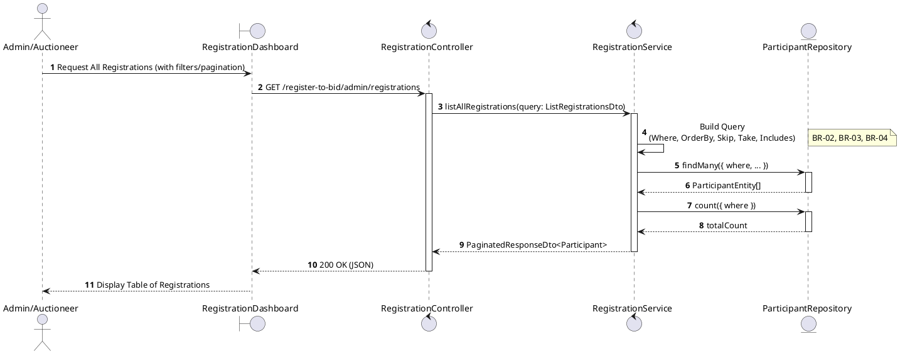
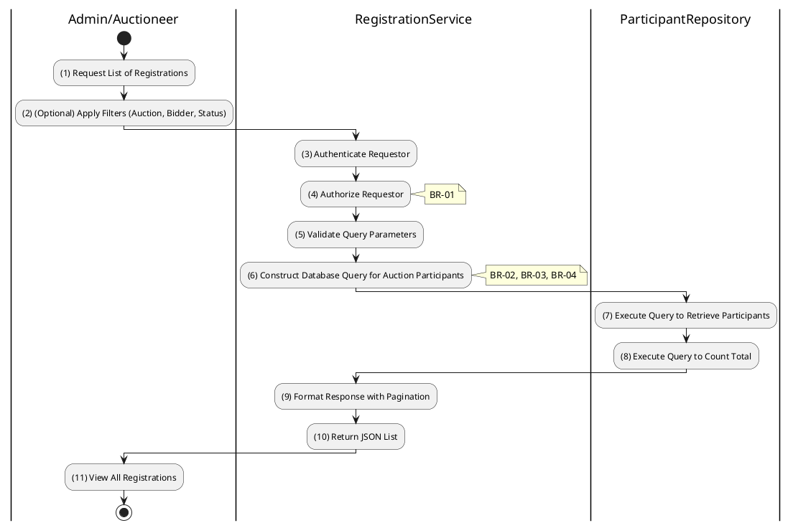

# 3.4.7 List All Registrations (Admin)

## 1. Use Case Description

| Field              | Description                                                                                                              |
| ------------------ | ------------------------------------------------------------------------------------------------------------------------ |
| **Name**           | List All Registrations (Admin)                                                                                           |
| **Description**    | This use case allows the Admin to search Registration information in the system based on input keywords.                 |
| **Actor**          | Admin                                                                                                                    |
| **Trigger**        | When Admin enters searching keywords in the SearchBox on the top left of the RegistrationDashboard screen.               |
| **Pre-condition**  | • Admin's device must be connected to the internet. • Admin is signed in with their account.                          |
| **Post-condition** | The datagrid of Registration information will be filtered by keywords and displayed on the RegistrationDashboard screen. |

## 2. Sequence Flow (MVC)

## 3. Activities Flow (Swimlanes)

## 4. Business Rules

| Activity    | BR Code   | Description                                                                                                                                                                                                                                                                                                                       |
| :---------- | :-------- | :-------------------------------------------------------------------------------------------------------------------------------------------------------------------------------------------------------------------------------------------------------------------------------------------------------------------------------- |
| **(1)-(2)** | **BR-01** | **Displaying Rule (Registration Dashboard):** When Admin/Auctioneer navigates to registration management, system displays `RegistrationDashboard`. System displays filter controls: `Auction`, `Bidder`, `Status` dropdowns. System displays pagination controls: `Page`, `Items per page`.                              |
| **(2)**     | **BR-02** | **Validation Rule (Filter Input - Front-end):** When user selects filter options, system uses `Selection_change()` method. When user enters bidder search text, system uses `Text_change()` method. System validates filter parameters before sending query.                                                             |
| **(3)-(4)** | **BR-03** | **Validation Rule (Authorization - Back-end):** System checks if user role is `admin` or `auctioneer` in `USERS` table. If unauthorized: $\rightarrow$ System displays MSG 5 ("Forbidden") on the View. If `auctioneer`, system automatically scopes query to their managed auctions.                                 |
| **(6)-(8)** | **BR-04** | **Querying Rule:** System retrieves data from the 'AUCTION_PARTICIPANT' table in the database (Refer to 'AUCTION_PARTICIPANT' table in 'DB Sheet' file) based on the applied filters. System retrieves related User and Auction information to enrich data. System applies pagination controls and counts total records. |
| **(11)**    | **BR-05** | **Displaying Rule (Results Table):** System displays results in data table showing: Bidder Name, Auction Code, Status, Registration Date, Actions. System displays pagination info: "Showing X-Y of Z registrations". If no results found, system displays MSG 19 ("No registrations found").                            |
