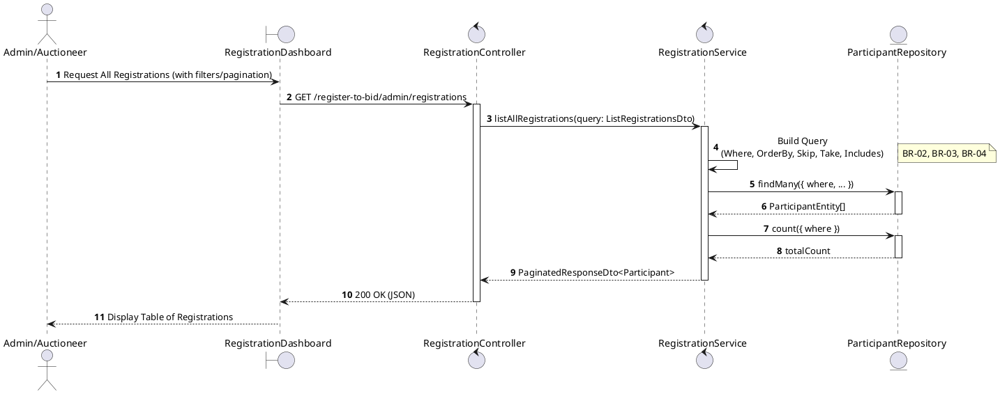
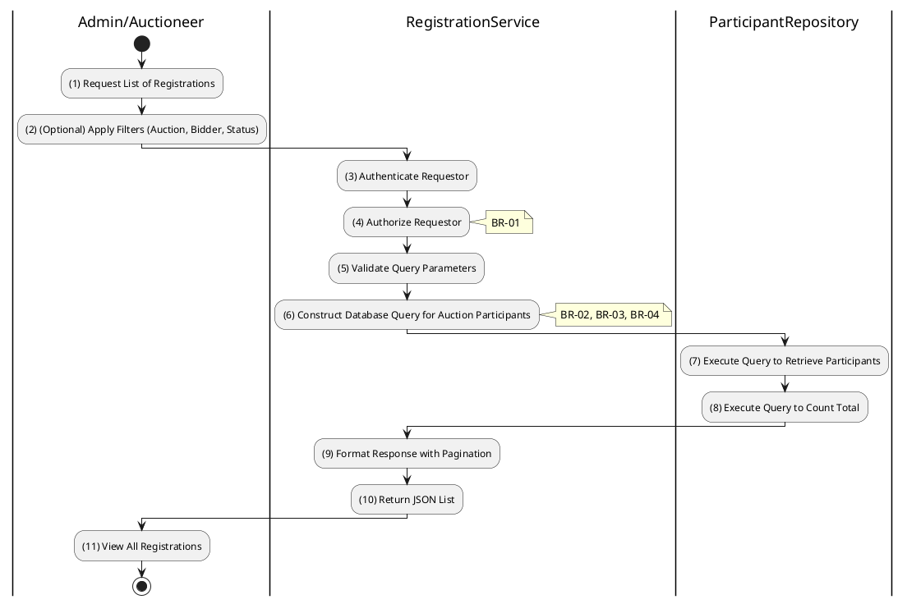

# 3.4.7 List All Registrations (Admin)

## 1. Use Case Description

| Field              | Description                                                                                                              |
| ------------------ | ------------------------------------------------------------------------------------------------------------------------ |
| **Name**           | List All Registrations (Admin)                                                                                           |
| **Description**    | This use case allows the Admin to search Registration information in the system based on input keywords.                 |
| **Actor**          | Admin                                                                                                                    |
| **Trigger**        | When Admin enters searching keywords in the SearchBox on the top left of the RegistrationDashboard screen.               |
| **Pre-condition**  | • Admin's device must be connected to the internet. • Admin is signed in with their account.                          |
| **Post-condition** | The datagrid of Registration information will be filtered by keywords and displayed on the RegistrationDashboard screen. |

## 2. Sequence Flow (MVC)

## 3. Activities Flow (Swimlanes)

## 4. Business Rules

| Activity    | BR Code   | Description                                                                                                                                                                                                                                                                                                                                                                                                                                                                                                                                                                                                                                                                                                                                                                                                                                                                     |
| :---------- | :-------- | :------------------------------------------------------------------------------------------------------------------------------------------------------------------------------------------------------------------------------------------------------------------------------------------------------------------------------------------------------------------------------------------------------------------------------------------------------------------------------------------------------------------------------------------------------------------------------------------------------------------------------------------------------------------------------------------------------------------------------------------------------------------------------------------------------------------------------------------------------------------------------ |
| **(1)-(2)** | **BR-01** | **Displaying Rules:** ❖ The system renders the “RegistrationDashboard” screen via `Display_View()`. ❖ It displays filter controls including [AuctionId] (dropdown), [BidderName] (text input), and [Status] (dropdown). ❖ The system renders a paginated data table with columns: Bidder, Auction, Status, SubmittedAt, and Actions.                                                                                                                                                                                                                                                                                                                                                                                                                                                                                                                           |
| **(2)**     | **BR-02** | **Validation Rules (Front-end):** ❖ The system validates filter inputs using `ValidateFilterInput(filterDto)`. ❖ It ensures that selected filter values are valid (e.g., [AuctionId] must be a valid UUID). ❖ It also verifies that pagination parameters (page, limit) are positive integers.                                                                                                                                                                                                                                                                                                                                                                                                                                                                                                                                                                 |
| **(3)-(4)** | **BR-03** | **Authorization Rules (Back-end):** ❖ The system checks the authenticated user's role via `RegistrationService.listAllRegistrations()`. ❖ If the input is not valid: ⮚ If the user's role is not 'admin' or 'auctioneer', the system returns a 403 Forbidden status. ❖ If the user is an 'auctioneer', the system automatically scopes the query to only show registrations for auctions they own.                                                                                                                                                                                                                                                                                                                                                                                                                                                          |
| **(6)-(8)** | **BR-04** | **Querying Rules:** ❖ The system executes `ParticipantRepository.findMany(query)` to retrieve the data. ❖ It builds a Prisma WHERE clause applying filters for `auction.id`, `user.fullName`, and `status`. ❖ The query includes related `User` and `Auction` entities to populate the table. ❖ Pagination is applied using `skip` and `take`, and results are ordered by `submittedAt` descending.                                                                                                                                                                                                                                                                                                                                                                                                                                                         |
| **(11)**    | **BR-05** | **Displaying Rules (Data Table):** ❖ The system renders the results via `Display_DataTable('Registrations', data, pagination)`. ❖ Each row displays the Bidder's Full Name, Auction Code, a colored Status Badge, and the formatted SubmittedAt date. ❖ An action button ("View Details") is included for each row. ❖ Pagination controls show the current page and total pages.                                                                                                                                                                                                                                                                                                                                                                                                                                                                            |