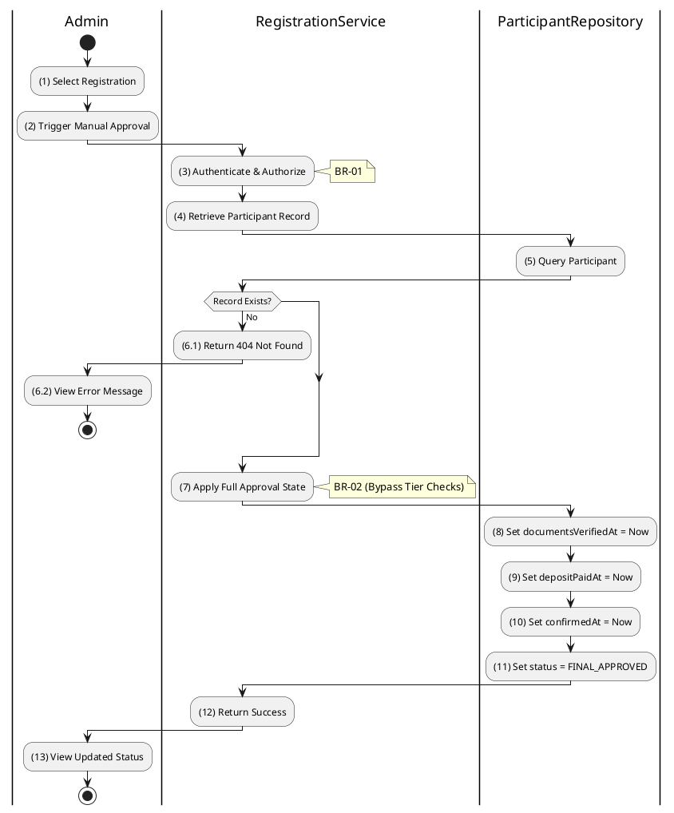

# 3.4.9 Approve Registration (Legacy)

## 1. Use Case Description

| Field              | Description                                                                                                             |
| ------------------ | ----------------------------------------------------------------------------------------------------------------------- |
| **Name**           | Approve Registration (Legacy)                                                                                           |
| **Description**    | This use case allows the Admin to update existing Registration information in the system.                               |
| **Actor**          | Admin                                                                                                                   |
| **Trigger**        | When the Admin clicks on the 'Force Approve' button on the RegistrationApprovalPage.                                    |
| **Pre-condition**  | • Admin's device must be connected to the internet.<br>• Admin is signed in with their account.                         |
| **Post-condition** | The Registration information will be updated in the system and display new record on RegistrationApprovalPage datagrid. |

## 2. Sequence Flow (MVC)

```plantuml
@startuml
autonumber
skinparam sequenceMessageAlign center

actor "Admin" as User
boundary "RegistrationApprovalPage" as View
control "RegistrationController" as Controller
control "RegistrationService" as Service
database "ParticipantRepository" as ParticipantRepo

User -> View: Select Registration -> Force Approve
View -> Controller: POST /register-to-bid/admin/approve\n{ auctionId, userId }
activate Controller

Controller -> Service: approveRegistrationLegacy(auctionId, userId)
activate Service

Service -> ParticipantRepo: findParticipant(auctionId, userId)
activate ParticipantRepo
ParticipantRepo --> Service: ParticipantEntity
deactivate ParticipantRepo

alt Participant Not Found
    Service --> Controller: Throw NotFoundException
    Controller --> View: 404 Not Found
    View --> User: Display Error Message
else Found
    Service -> ParticipantRepo: updateParticipant({\n  status: 'FINAL_APPROVED',
  documentsVerifiedAt: now(),
  depositPaidAt: now(),
  confirmedAt: now()
})
    activate ParticipantRepo
    ParticipantRepo --> Service: UpdatedParticipant
    deactivate ParticipantRepo

    Service --> Controller: SuccessResponse
    Controller --> View: 200 OK (Approved)
    View --> User: Display Success Confirmation
end

deactivate Service
deactivate Controller
@enduml
```

## 3. Activities Flow (Swimlanes)



## 4. Business Rules

| Activity      | BR Code   | Description                                                                                                                                                                                                                                                                                                                             |
| :------------ | :-------- | :-------------------------------------------------------------------------------------------------------------------------------------------------------------------------------------------------------------------------------------------------------------------------------------------------------------------------------------- |
| **(1)**       | **BR-01** | **Displaying Rule (Registration Approval Page):**<br>When Admin selects a registration from list, system displays `RegistrationApprovalPage`.<br>System displays current registration status and bidder information.<br>System displays "Force Approve" button for legacy/manual approval.                                              |
| **(1)-(2)**   | **BR-02** | **Validation Rule (Confirmation - Front-end):**<br>When Admin clicks "Force Approve" button, system displays MSG 11 ("Are you sure you want to force approve this registration?").<br>System waits for Admin confirmation before proceeding.                                                                                            |
| **(3)**       | **BR-03** | **Validation Rule (Authorization - Back-end):**<br>System checks if requestor role is `admin` or `auctioneer` in `USERS` table.<br>If unauthorized:<br>$\rightarrow$ System displays MSG 5 ("Forbidden") on the View.                                                                                                                   |
| **(5)-(6.1)** | **BR-04** | **Validation Rule (Record Existence - Back-end):**<br>System retrieves data from the 'AUCTION_PARTICIPANT' table in the database (Refer to 'AUCTION_PARTICIPANT' table in 'DB Sheet' file) based on the auction ID and user ID.<br>If record not found:<br>$\rightarrow$ System displays MSG 20 ("Registration not found") on the View. |
| **(8)-(11)**  | **BR-05** | **Storing Rule:**<br>System saves to `AUCTION_PARTICIPANT` table:<br>- `documentsVerifiedAt = now()`<br>- `depositPaidAt = now()`<br>- `confirmedAt = now()`<br>- `status = 'FINAL_APPROVED'`<br>System logs this manual override action for audit trail.                                                                               |
| **(13)**      | **BR-06** | **Displaying Rule (Success Confirmation):**<br>System displays MSG 7 ("Registration approved successfully") on the View.<br>System refreshes registration list showing updated status.                                                                                                                                                  |
