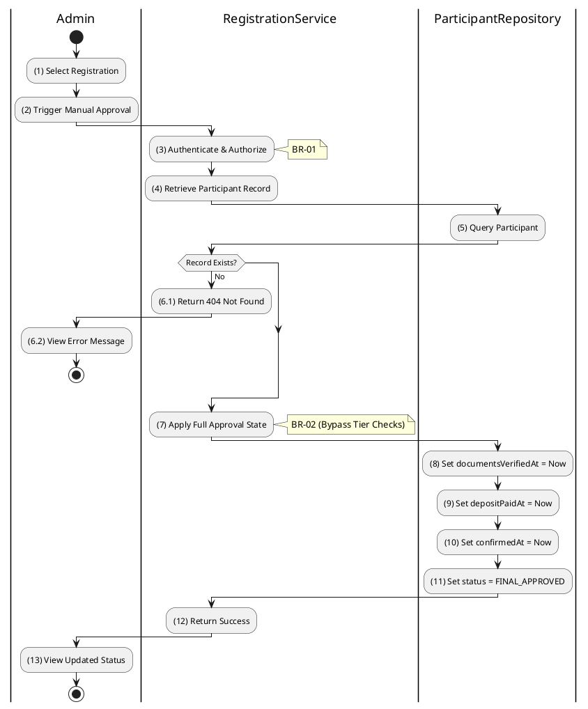

# 3.4.9 Approve Registration (Legacy)

## 1. Use Case Description

| Field              | Description                                                                                                             |
| ------------------ | ----------------------------------------------------------------------------------------------------------------------- |
| **Name**           | Approve Registration (Legacy)                                                                                           |
| **Description**    | This use case allows the Admin to update existing Registration information in the system.                               |
| **Actor**          | Admin                                                                                                                   |
| **Trigger**        | When the Admin clicks on the 'Force Approve' button on the RegistrationApprovalPage.                                    |
| **Pre-condition**  | • Admin's device must be connected to the internet.<br>• Admin is signed in with their account.                         |
| **Post-condition** | The Registration information will be updated in the system and display new record on RegistrationApprovalPage datagrid. |

## 2. Sequence Flow (MVC)

```plantuml
@startuml
autonumber
skinparam sequenceMessageAlign center

actor "Admin" as User
boundary "RegistrationApprovalPage" as View
control "RegistrationController" as Controller
control "RegistrationService" as Service
database "ParticipantRepository" as ParticipantRepo

User -> View: Select Registration -> Force Approve
View -> Controller: POST /register-to-bid/admin/approve\n{ auctionId, userId }
activate Controller

Controller -> Service: approveRegistrationLegacy(auctionId, userId)
activate Service

Service -> ParticipantRepo: findParticipant(auctionId, userId)
activate ParticipantRepo
ParticipantRepo --> Service: ParticipantEntity
deactivate ParticipantRepo

alt Participant Not Found
    Service --> Controller: Throw NotFoundException
    Controller --> View: 404 Not Found
    View --> User: Display Error Message
else Found
    Service -> ParticipantRepo: updateParticipant({\n  status: 'FINAL_APPROVED',
  documentsVerifiedAt: now(),
  depositPaidAt: now(),
  confirmedAt: now()
})
    activate ParticipantRepo
    ParticipantRepo --> Service: UpdatedParticipant
    deactivate ParticipantRepo

    Service --> Controller: SuccessResponse
    Controller --> View: 200 OK (Approved)
    View --> User: Display Success Confirmation
end

deactivate Service
deactivate Controller
@enduml
```

## 3. Activities Flow (Swimlanes)



## 4. Business Rules

| Activity      | BR Code   | Description                                                                                                                                                                                                                                                                                                                                                                                                                                                                                                                                                                                                                                                                                                                                                                                                                                                                     |
| :------------ | :-------- | :------------------------------------------------------------------------------------------------------------------------------------------------------------------------------------------------------------------------------------------------------------------------------------------------------------------------------------------------------------------------------------------------------------------------------------------------------------------------------------------------------------------------------------------------------------------------------------------------------------------------------------------------------------------------------------------------------------------------------------------------------------------------------------------------------------------------------------------------------------------------------ |
| **(1)**       | **BR-01** | **Displaying Rules:**<br>❖ The system renders the “RegistrationApprovalPage” via `Display_View(participant)`.<br>❖ It displays the details of the Bidder and the Auction.<br>❖ The [Force Approve] button is rendered but enabled only if the current [status] is not already 'FINAL_APPROVED'.                                                                                                                                                                                                                                                                                                                                                                                                                                                                                                                                                                                 |
| **(1)-(2)**   | **BR-02** | **Validation Rules (Front-end):**<br>❖ When the Admin clicks “Force Approve”, the system triggers a confirmation modal via `Display_Modal('ConfirmationBox')`.<br>❖ It presents **MSG 11** ("Force approve registration? This bypasses tier checks."), awaiting the Admin's explicit confirmation.                                                                                                                                                                                                                                                                                                                                                                                                                                                                                                                                                                              |
| **(3)**       | **BR-03** | **Authorization Rules (Back-end):**<br>❖ The system checks the authenticated user's role via `RegistrationService.approveRegistrationLegacy()` to ensure they have the necessary permissions.<br>❖ If the input is not valid:<br>⮚ If the user's role is not 'admin' or 'auctioneer', the system returns a 403 Forbidden status.                                                                                                                                                                                                                                                                                                                                                                                                                                                                                                                                                |
| **(5)-(6.1)** | **BR-04** | **Validation Rules (Back-end):**<br>❖ The system attempts to find the participant record using `ParticipantRepository.findParticipant()`.<br>❖ If the input is not valid:<br>⮚ If the participant is not found, the system returns a 404 Not Found error and displays **MSG 20** (Registration not found).                                                                                                                                                                                                                                                                                                                                                                                                                                                                                                                                                                      |
| **(8)-(11)**  | **BR-05** | **Storing Rules (Back-end):**<br>❖ Upon successful validation, the system forces the registration status update by calling `RegistrationService.approveRegistrationLegacy(auctionId, userId)`.<br>❖ It updates the “AUCTION_PARTICIPANT” table, setting `documentsVerifiedAt`, `depositPaidAt`, and `confirmedAt` timestamps to the current time, and the [status] to 'FINAL_APPROVED'.<br>❖ System moves to step (12) and displays successful notification (Refer to **MSG 7**).                                                                                                                                                                                                                                                                                                                                                                                              |
