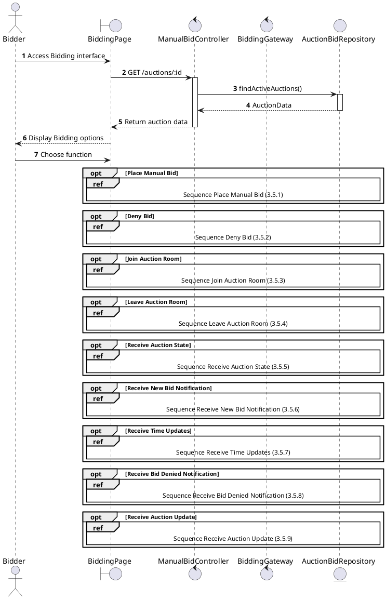
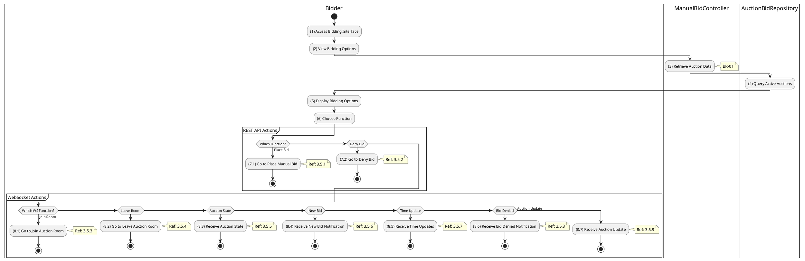

# Use Case 3.5.0: Manage Bidding

## 1. Use Case Description

| Field              | Content                                                                                                                                   |
| :----------------- | :---------------------------------------------------------------------------------------------------------------------------------------- |
| **Name**           | Manage Bidding                                                                                                                            |
| **Description**    | This use case allows the **Bidder** to choose one of the corresponding functions of CRUD to adjust **Bidding** information in the system. |
| **Actor**          | **Bidder**, **Auctioneer**, **Admin**, **System**                                                                                         |
| **Trigger**        | When the **Bidder** clicks on the "**Bidding**" button on the navigation sidebar or joins an active auction room.                         |
| **Pre-condition**  | 1. **Bidder**'s device must be connected to the internet. 2. **Bidder** is signed in with their account.                               |
| **Post-condition** | The **Bidding** information is updated to the corresponding function that the **Bidder** executes.                                        |

---

## 2. Sequence Flow

---

## 3. Activities Flow (Swimlanes)

---

## 4. Business Rules

| Activity | BR Code   | Description                                                                                                                                                                                                                                                                                                                                                                                                                                                                                                                                                                                                                                                                                                                                                                                                                                                                     |
| :------- | :-------- | :------------------------------------------------------------------------------------------------------------------------------------------------------------------------------------------------------------------------------------------------------------------------------------------------------------------------------------------------------------------------------------------------------------------------------------------------------------------------------------------------------------------------------------------------------------------------------------------------------------------------------------------------------------------------------------------------------------------------------------------------------------------------------------------------------------------------------------------------------------------------------ |
| **(5)**  | **BR-01** | **Displaying Rules:** ❖ The system renders the “BiddingPage” screen via `Display_View()`. (Refer to “BiddingPage” view in “View Description” file). ❖ The screen displays the details of the active Auction. ❖ It renders dynamic components: the [Current Bid], the [Next Minimum Bid], and a real-time [Countdown Timer].                                                                                                                                                                                                                                                                                                                                                                                                                                                                                                                                    |
| **(6)**  | **BR-02** | **Choosing Rules:** ❖ The Bidder selects an action from the bidding interface. The system uses `Frontend_Navigation()` to direct the flow. ❖ If “Place Bid” is selected, the system triggers `3.5.1`. ❖ If “Deny Bid” is selected (Admin/Auctioneer only), it redirects to `3.5.2`. ❖ If “Join Room” is selected (automatic on page load), it triggers `3.5.3`. ❖ Only one feature can be selected at a time.                                                                                                                                                                                                                                                                                                                                                                                                                                            |

---

## 5. Related Child Use Cases

### REST API Actions

| Use Case ID | Use Case Name    | Description                             |
| :---------- | :--------------- | :-------------------------------------- |
| 3.5.1       | Place Manual Bid | Submit a manual bid during live auction |
| 3.5.2       | Deny Bid         | Admin/Auctioneer denies a submitted bid |

### WebSocket Real-time Events

| Use Case ID | Use Case Name                   | Description                                   |
| :---------- | :------------------------------ | :-------------------------------------------- |
| 3.5.3       | Join Auction Room               | Connect to auction room for real-time updates |
| 3.5.4       | Leave Auction Room              | Disconnect from auction room                  |
| 3.5.5       | Receive Auction State           | Receive current state of the auction          |
| 3.5.6       | Receive New Bid Notification    | Receive notification when a new bid is placed |
| 3.5.7       | Receive Time Updates            | Receive countdown timer updates               |
| 3.5.8       | Receive Bid Denied Notification | Receive notification when a bid is denied     |
| 3.5.9       | Receive Auction Update          | Receive general auction status updates        |