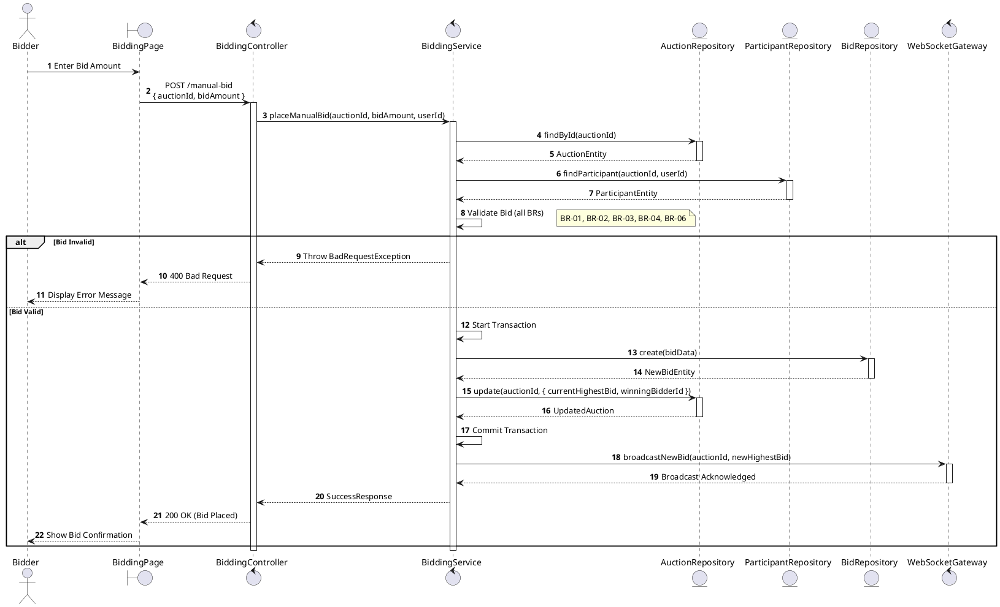
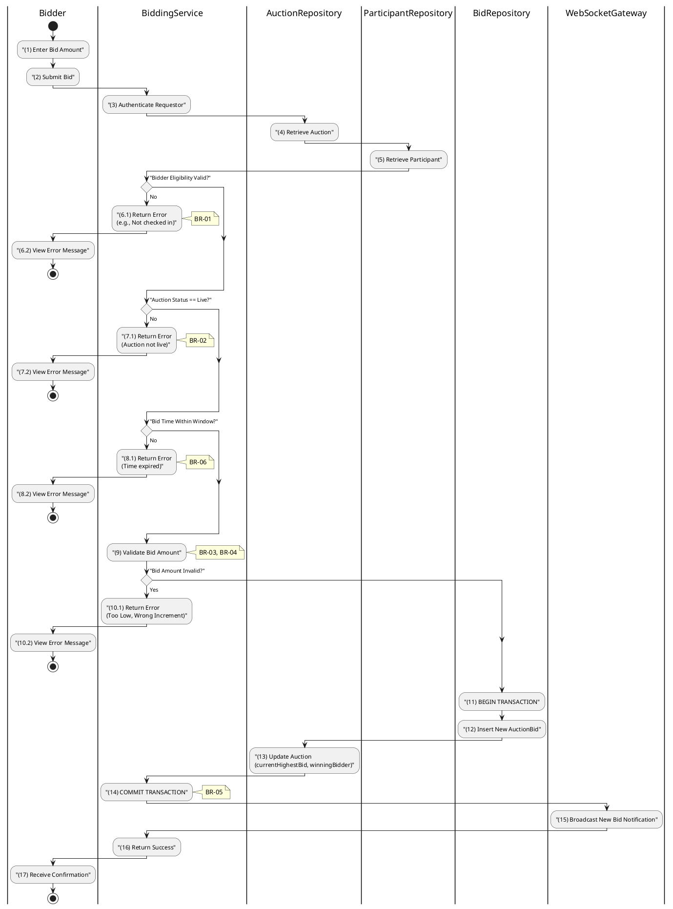

# 3.5.1 Place Manual Bid

## 1. Use Case Description

| Field              | Description                                                                                        |
| ------------------ | -------------------------------------------------------------------------------------------------- |
| **Name**           | Place Manual Bid                                                                                   |
| **Description**    | This use case allows the Bidder to create a new Bid information in the system.                     |
| **Actor**          | Bidder                                                                                             |
| **Trigger**        | When the Bidder clicks on the 'Place Bid' button on the BiddingPage.                               |
| **Pre-condition**  | • Bidder's device must be connected to the internet. • Bidder is signed in with their account.  |
| **Post-condition** | The Bid information will be stored into the system and display new record on BiddingPage datagrid. |

## 2. Sequence Flow (MVC)

## 3. Activities Flow (Swimlanes)

## 4. Business Rules

| Activity  | BR Code   | Description                                                                                                                                                                                                                                                                                                                                                                                                                                                                                                                                                                                                                                                                                                                                                                                                                                                                     |
| :-------- | :-------- | :------------------------------------------------------------------------------------------------------------------------------------------------------------------------------------------------------------------------------------------------------------------------------------------------------------------------------------------------------------------------------------------------------------------------------------------------------------------------------------------------------------------------------------------------------------------------------------------------------------------------------------------------------------------------------------------------------------------------------------------------------------------------------------------------------------------------------------------------------------------------------ |
| **(1)**   | **BR-01** | **Displaying Rules:** ❖ The system displays a “BiddingPage” screen via `Display_View(auctionState)`. ❖ The screen renders the [CurrentBid], [NextMinimumBid], an input field for the [BidInput], and a [PlaceBidButton]. ❖ The [PlaceBidButton] is disabled if the bidder is not eligible or if the auction is not live.                                                                                                                                                                                                                                                                                                                                                                                                                                                                                                                                        |
| **(1)**   | **BR-02** | **Validation Rules (Front-end):** ❖ When the user enters a bid amount, the system performs `ValidateBidInput(amount)` validation. ❖ If the input is not valid: ⮚ If [amount] is empty, the system displays **MSG 1** (Mandatory Field). ⮚ If [amount] is less than [nextMinimumBid], the system displays **MSG 24** (Bid too low). ⮚ If the difference between [amount] and [currentHighestBid] is not a multiple of [bidIncrement], the system displays **MSG 4** (Invalid increment).                                                                                                                                                                                                                                                                                                                                                               |
| **(6.1)** | **BR-03** | **Eligibility Rules (Back-end):** ❖ The system calls `BiddingService.validateBidderEligibility(auctionId, userId)` to check the bidder’s eligibility. ❖ It verifies that the bidder's [status] in the “AUCTION_PARTICIPANT” table is 'FINAL_APPROVED' and that `checkedInAt` is not NULL. ❖ If the input is not valid: ⮚ If the bidder is not eligible, the system returns a 403 Forbidden status and displays **MSG 19** (Not eligible to bid).                                                                                                                                                                                                                                                                                                                                                                                                                    |
| **(7.1)** | **BR-04** | **State Locking Rules (Back-end):** ❖ The system calls `BiddingService.validateAuctionState(auctionId)` to verify the auction’s status. ❖ It checks if the auction’s [status] in the “AUCTION” table is 'live'. ❖ If the input is not valid: ⮚ If the auction is not 'live', the system returns a 400 Bad Request and displays **MSG 22** (Auction not active).                                                                                                                                                                                                                                                                                                                                                                                                                                                                                       |
| **(11)-(14)** | **BR-05** | **Storing Rules (Back-end):** ❖ When the user clicks “Place Bid”, the system calls `BiddingService.placeManualBid(auctionId, bidAmount, userId)` to save the bid. ❖ This operation is executed within a database transaction: ⮚ The new bid is inserted into the “AUCTION_BID” table with the [amount], `bidAt` timestamp (NOW()), [bidType] of 'manual', and [participantId]. ⮚ The “AUCTION” table is updated with the new [currentHighestBid] and [winningBidderId]. ❖ The transaction is then committed. ❖ System moves to step (17) and displays successful notification (Refer to **MSG 7**).                                                                                                                                                                                                                                          |
| **(15)**  | **BR-06** | **Processing Rules (Anti-sniping):** ❖ The system employs an anti-sniping mechanism by calling `AuctionService.extendAuctionTime(auctionId)`. ❖ If a bid is placed within the last 60 seconds before `auctionEndAt`, the system automatically extends `auctionEndAt` by a fixed duration (e.g., another 60 seconds). ❖ This prevents last-second bidding (sniping) and ensures fairness.                                                                                                                                                                                                                                                                                                                                                                                                                                                               |
