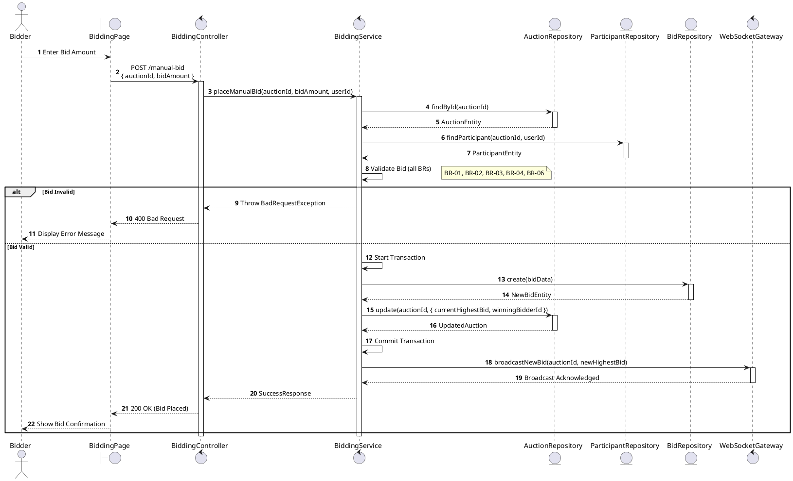
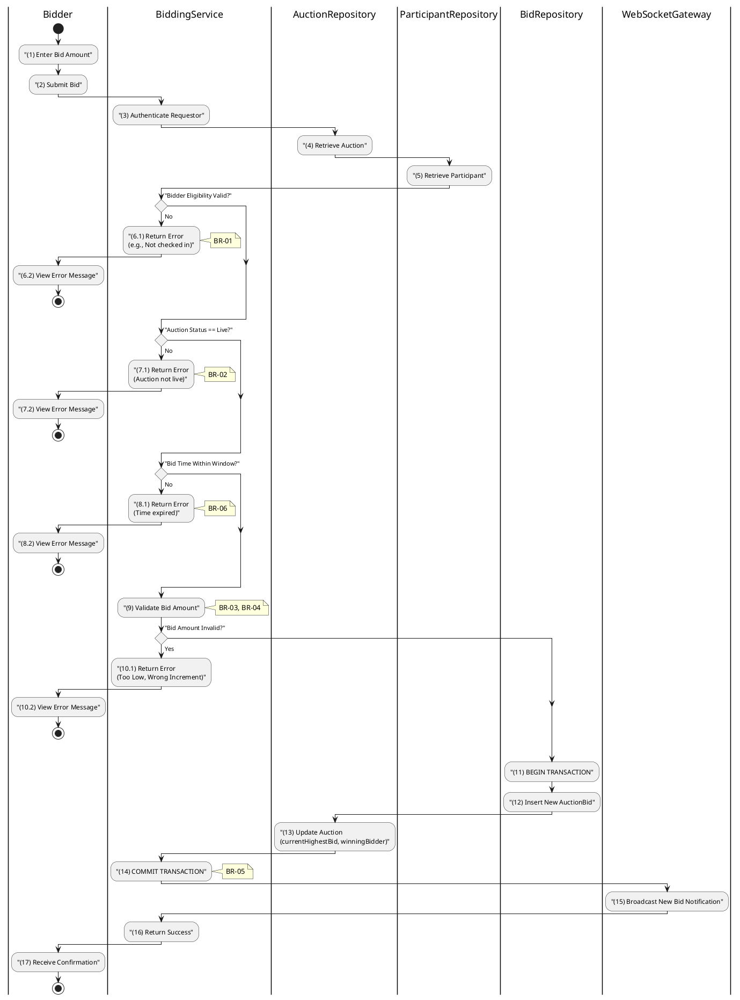

# 3.5.1 Place Manual Bid

## 1. Use Case Description

| Field              | Description                                                                                        |
| ------------------ | -------------------------------------------------------------------------------------------------- |
| **Name**           | Place Manual Bid                                                                                   |
| **Description**    | This use case allows the Bidder to create a new Bid information in the system.                     |
| **Actor**          | Bidder                                                                                             |
| **Trigger**        | When the Bidder clicks on the 'Place Bid' button on the BiddingPage.                               |
| **Pre-condition**  | • Bidder's device must be connected to the internet. • Bidder is signed in with their account.  |
| **Post-condition** | The Bid information will be stored into the system and display new record on BiddingPage datagrid. |

## 2. Sequence Flow (MVC)

## 3. Activities Flow (Swimlanes)

## 4. Business Rules

| Activity  | BR Code   | Description                                                                                                                                                                                                                                                                                                                                                                                                                                                             |
| :-------- | :-------- | :---------------------------------------------------------------------------------------------------------------------------------------------------------------------------------------------------------------------------------------------------------------------------------------------------------------------------------------------------------------------------------------------------------------------------------------------------------------------- |
| **(1)**   | **BR-01** | **Displaying Rule:** The system displays a 'BiddingPage' screen. (Refer to 'BiddingPage' view in 'View Description' file). Screen shows current highest bid, bid increment, input field for bid amount, and 'Place Bid' button.                                                                                                                                                                                                                                   |
| **(1)**   | **BR-02** | **Validation Rule (Front-end):** When user enters bid amount, system uses `Text_change()` method. Checks if input is valid (empty, wrong format). If `isEmpty()` → display **MSG 1** (Mandatory). If amount < startingPrice (first bid) → display **MSG 24** (Bid too low). If amount <= currentHighestBid → display **MSG 24** (Bid must be higher). If (amount - previousBid) not multiple of bidIncrement → display **MSG 4** (Invalid increment). |
| **(6.1)** | **BR-03** | **Validation Rule (Bidder Eligibility):** System checks if bidder is FINAL_APPROVED and has checkedInAt for the auction. If not → display **MSG 19** (Not eligible to bid), return 403.                                                                                                                                                                                                                                                                           |
| **(7.1)** | **BR-04** | **Validation Rule (Auction Status):** System checks if auction status is 'live'. If not live → display **MSG 22** (Auction not active), return 400.                                                                                                                                                                                                                                                                                                               |
| **(2)**   | **BR-05** | **Validation Rule (Back-end/Save):** When user clicks 'Place Bid' button, send data via function `placeManualBid(auctionId, bidAmount, userId)`. Check time is within auctionStartAt and auctionEndAt. Execute in transaction: Insert bid in `AUCTION_BID`, update `AUCTION` with currentHighestBid. Broadcast new bid via WebSocket. Show **MSG 7** (Success).                                                                                          |
| **(15)**  | **BR-06** | **Processing Rule (Anti-sniping):** If bid placed within last 60 seconds before auctionEndAt, system automatically extends auctionEndAt by fixed duration. Prevents sniping, ensures fairness.                                                                                                                                                                                                                                                                    |
