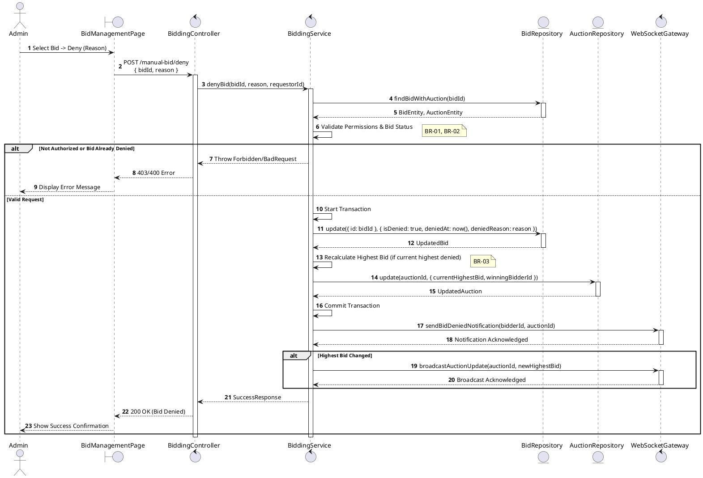
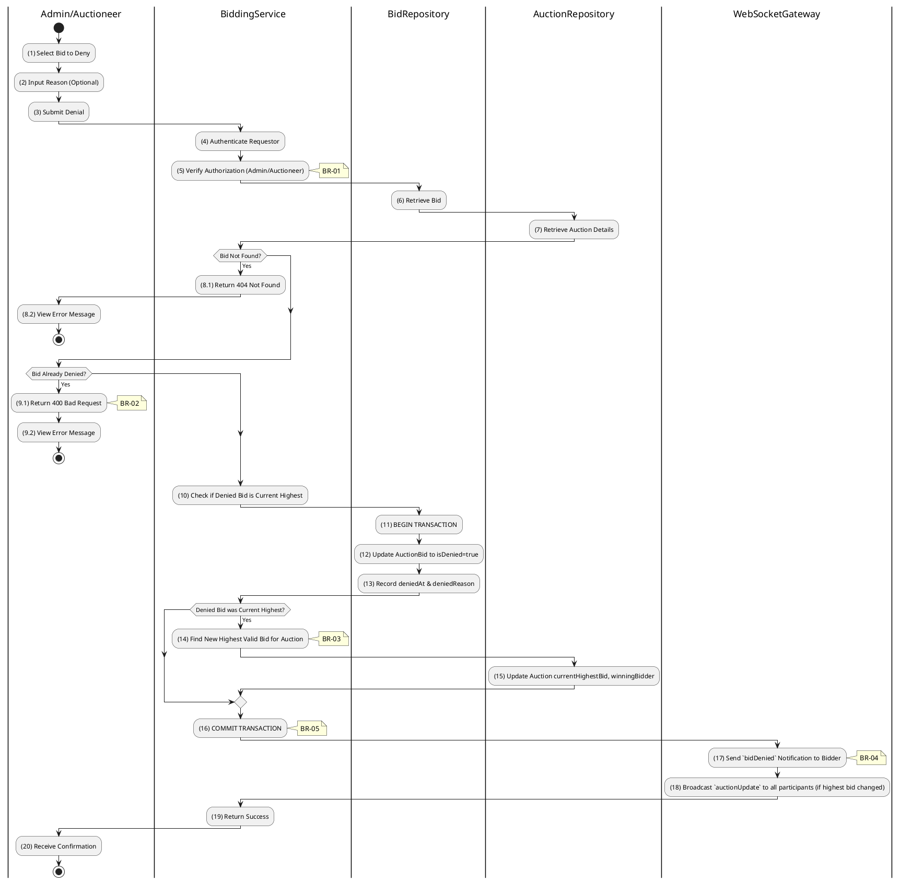

# 3.5.2 Deny Bid

## 1. Use Case Description

| Field              | Description                                                                                             |
| ------------------ | ------------------------------------------------------------------------------------------------------- |
| **Name**           | Deny Bid                                                                                                |
| **Description**    | This use case allows the Admin to update existing Bid information in the system.                        |
| **Actor**          | Admin                                                                                                   |
| **Trigger**        | When the Admin clicks on the 'Deny Bid' button on the BidManagementPage.                                |
| **Pre-condition**  | • Admin's device must be connected to the internet.<br>• Admin is signed in with their account.         |
| **Post-condition** | The Bid information will be updated in the system and display new record on BidManagementPage datagrid. |

## 2. Sequence Flow (MVC)



## 3. Activities Flow (Swimlanes)



## 4. Business Rules

| Activity      | BR Code   | Description                                                                                                                                                                                                                                                                                                                                                                                                                                                                                                                                                                                                                                                                                                                                                                                                                                                                     |
| :------------ | :-------- | :------------------------------------------------------------------------------------------------------------------------------------------------------------------------------------------------------------------------------------------------------------------------------------------------------------------------------------------------------------------------------------------------------------------------------------------------------------------------------------------------------------------------------------------------------------------------------------------------------------------------------------------------------------------------------------------------------------------------------------------------------------------------------------------------------------------------------------------------------------------------------ |
| **(1)**       | **BR-01** | **Displaying Rules:**<br>❖ The system displays a “BidManagementPage” screen via `Display_View()`. (Refer to “BidManagementPage” view in “View Description” file).<br>❖ The screen renders a data table listing bids, including Bidder information, [Amount], and [Time].<br>❖ For each bid, a [Deny Bid] button and an optional [Reason] input field are provided.                                                                                                                                                                                                                                                                                                                                                                                                                                                                                                       |
| **(2)-(3)**   | **BR-02** | **Validation Rules (Front-end):**<br>❖ When the Admin inputs a denial reason, the system performs `ValidateDenyBid(reason)` validation.<br>❖ If the input is not valid:<br>⮚ If the [reason] field is empty, the system displays **MSG 1** (Mandatory Field).<br>❖ Upon clicking “Deny”, the system displays **MSG 11** ("Confirm bid denial?") and awaits confirmation.                                                                                                                                                                                                                                                                                                                                                                                                                                                                                               |
| **(4)-(5)**   | **BR-03** | **Authorization Rules (Back-end):**<br>❖ The system calls `BiddingService.denyBid(bidId, reason, requestorId)` to process the request.<br>❖ It verifies that the requestor's role is 'admin', 'super_admin', or the 'auctioneer' owning the auction.<br>❖ If the input is not valid:<br>⮚ If the user is unauthorized, the system returns a 403 Forbidden status.                                                                                                                                                                                                                                                                                                                                                                                                                                                                                                      |
| **(6)-(8.1)** | **BR-04** | **Validation Rules (Back-end):**<br>❖ The system calls `BidRepository.findBidWithAuction(bidId)` to retrieve the bid record.<br>❖ If the input is not valid:<br>⮚ If the bid is not found, the system returns a 404 Not Found error.                                                                                                                                                                                                                                                                                                                                                                                                                                                                                                                                                                                                                                             |
| **(9.1)**     | **BR-05** | **State Locking Rules (Back-end):**<br>❖ The system calls `BiddingService.denyBid()` and checks the bid's [isDenied] status.<br>❖ If the input is not valid:<br>⮚ If the bid's [isDenied] flag is already `true`, the system returns a 400 Bad Request and displays **MSG 16** (Bid already denied).                                                                                                                                                                                                                                                                                                                                                                                                                                                                                                                                                                |
| **(11)-(13)** | **BR-06** | **Storing Rules (Back-end):**<br>❖ This operation is executed within a database transaction:<br>⮚ The system updates the “AUCTION_BID” table, setting [isDenied] to `true`, and recording the `deniedAt` timestamp (NOW()) and the [deniedReason].<br>⮚ If the denied bid was the current highest, the system recalculates the next highest valid bid for the auction and updates the “AUCTION” table accordingly.<br>❖ The transaction is then committed.                                                                                                                                                                                                                                                                                                                                                                                                                 |
| **(17)-(18)** | **BR-07** | **Processing Rules (WebSockets):**<br>❖ The system calls `WebSocketGateway.sendBidDeniedNotification()` to notify the affected bidder.<br>❖ It emits a `bidDenied` event specifically to the bidder whose bid was denied.<br>❖ If the highest bid changed as a result of the denial, the system also broadcasts an `auctionUpdate` event to all participants in the auction room.                                                                                                                                                                                                                                                                                                                                                                                                                                                                                 |
| **(20)**      | **BR-08** | **Displaying Rules (Success):**<br>❖ The system displays a success notification via `Refresh_DataTable('Bids')`.<br>❖ It displays **MSG 7** (Bid denied successfully) to the Admin.<br>❖ The data table showing the bids is updated to reflect the denied status.                                                                                                                                                                                                                                                                                                                                                                                                                                                                                                                                                                                                        |
```