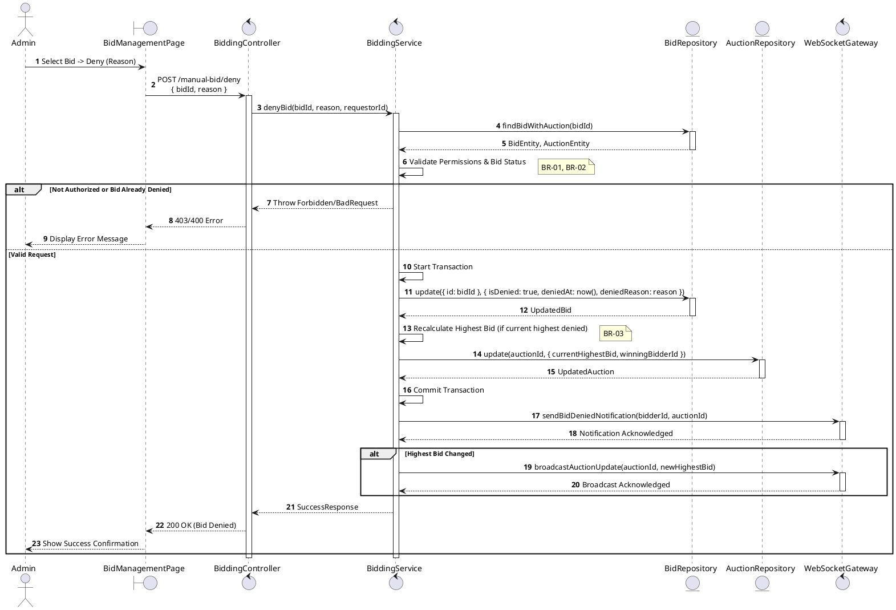
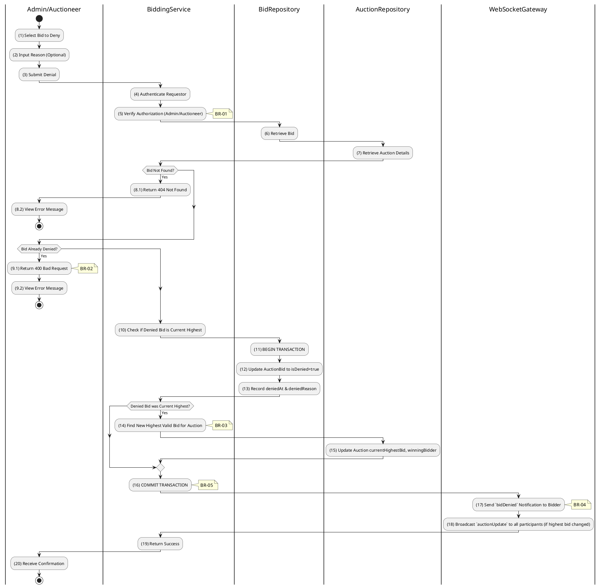

# 3.5.2 Deny Bid

## 1. Use Case Description

| Field              | Description                                                                                             |
| ------------------ | ------------------------------------------------------------------------------------------------------- |
| **Name**           | Deny Bid                                                                                                |
| **Description**    | This use case allows the Admin to update existing Bid information in the system.                        |
| **Actor**          | Admin                                                                                                   |
| **Trigger**        | When the Admin clicks on the 'Deny Bid' button on the BidManagementPage.                                |
| **Pre-condition**  | • Admin's device must be connected to the internet.<br>• Admin is signed in with their account.         |
| **Post-condition** | The Bid information will be updated in the system and display new record on BidManagementPage datagrid. |

## 2. Sequence Flow (MVC)



## 3. Activities Flow (Swimlanes)



## 4. Business Rules

| Activity      | BR Code   | Description                                                                                                                                                                                                                                                                                                                                                              |
| :------------ | :-------- | :----------------------------------------------------------------------------------------------------------------------------------------------------------------------------------------------------------------------------------------------------------------------------------------------------------------------------------------------------------------------- |
| **(1)**       | **BR-01** | **Displaying Rule (Bid Management Page):**<br>When Admin/Auctioneer reviews bids, system displays `BidManagementPage`.<br>System displays list of bids with bidder info, amount, timestamp.<br>System displays "Deny" button and optional reason input for each bid.                                                                                                     |
| **(2)-(3)**   | **BR-02** | **Validation Rule (Input - Front-end):**<br>When Admin enters denial reason, system uses `Text_change()` method.<br>On clicking "Deny", system displays MSG 11 ("Are you sure you want to deny this bid?").<br>System waits for confirmation before proceeding.                                                                                                          |
| **(4)-(5)**   | **BR-03** | **Validation Rule (Authorization - Back-end):**<br>System checks if requestor role is `admin`, `super_admin`, or auction owner in `USERS` table.<br>If unauthorized:<br>$\rightarrow$ System displays MSG 5 ("Forbidden") on the View.                                                                                                                                   |
| **(6)-(8.1)** | **BR-04** | **Validation Rule (Bid Existence - Back-end):**<br>System retrieves data from the 'AUCTION_BID' table in the database (Refer to 'AUCTION_BID' table in 'DB Sheet' file) based on the bid ID.<br>If bid not found:<br>$\rightarrow$ System displays MSG 20 ("Bid not found") on the View.                                                                                 |
| **(9.1)**     | **BR-05** | **Validation Rule (Already Denied - Back-end):**<br>System checks if `isDenied` flag is already `true`.<br>If already denied:<br>$\rightarrow$ System displays MSG 16 ("Bid already denied") on the View.                                                                                                                                                                |
| **(12)-(13)** | **BR-06** | **Storing Rule:**<br>System saves to `AUCTION_BID` table:<br>- `isDenied = true`<br>- `deniedAt = now()`<br>- `deniedReason = [input reason]`                                                                                                                                                                                                                            |
| **(14)-(15)** | **BR-07** | **Processing Rule (Recalculate Highest Bid):**<br>If denied bid was current highest, system retrieves data from the 'AUCTION_BID' table in the database (Refer to 'AUCTION_BID' table in 'DB Sheet' file) to find the next valid highest bid.<br>The Auction information will be updated in table 'AUCTION' in the database with the new highest bid and winning bidder. |
| **(17)-(18)** | **BR-08** | **Processing Rule (WebSocket Notifications):**<br>System sends `bidDenied` notification to the bidder whose bid was denied.<br>If highest bid changed, system broadcasts `auctionUpdate` to all room participants.                                                                                                                                                       |
| **(20)**      | **BR-09** | **Displaying Rule (Success Confirmation):**<br>System displays MSG 7 ("Bid denied successfully") on the View.<br>System refreshes bid list showing denied status.                                                                                                                                                                                                        |

```

```
