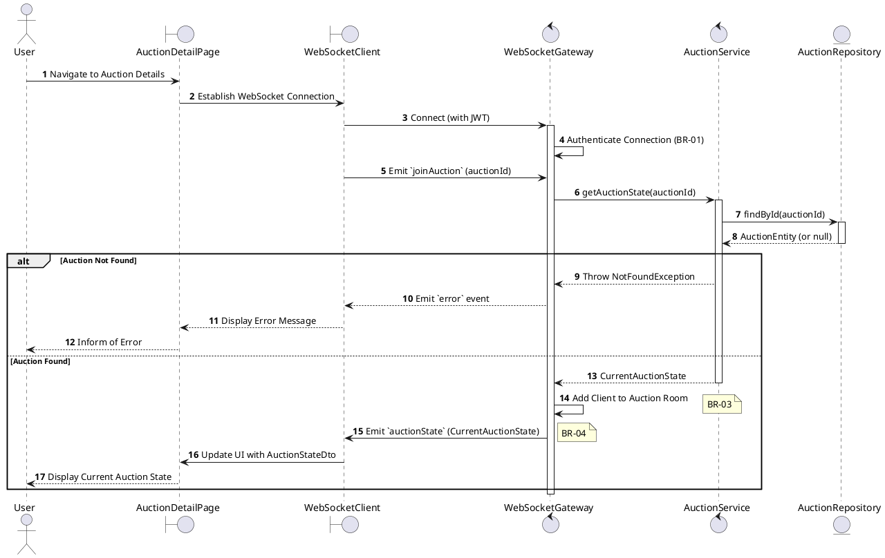
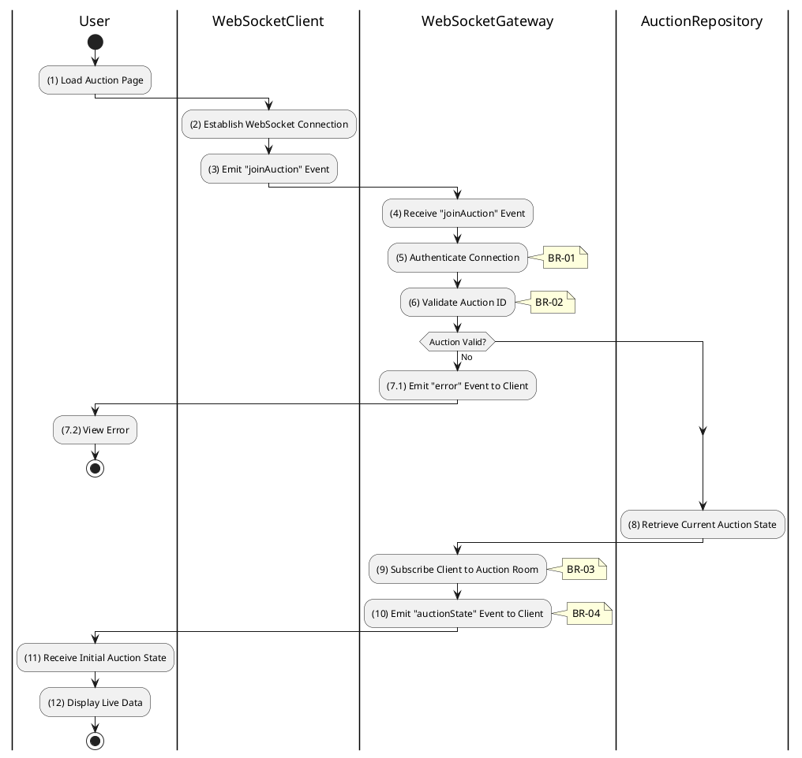

# 3.5.3 Join Auction Room

## 1. Use Case Description

| Field              | Description                                                                                                           |
| ------------------ | --------------------------------------------------------------------------------------------------------------------- |
| **Name**           | Join Auction Room                                                                                                     |
| **Description**    | This use case allows the User to create a new WebSocket Connection information in the system.                         |
| **Actor**          | User                                                                                                                  |
| **Trigger**        | When the User navigates to the AuctionDetailPage screen.                                                              |
| **Pre-condition**  | • User's device must be connected to the internet. • User is signed in with their account.                         |
| **Post-condition** | The WebSocket Connection information will be stored into the system and display auction updates on AuctionDetailPage. |

## 2. Sequence Flow (MVC)

## 3. Activities Flow (Swimlanes)

## 4. Business Rules

| Activity      | BR Code   | Description                                                                                                                                                                                                                                                                                                                                                                                                                                                                                                                                                                                                                                                                                                                                                                                                                                                                     |
| :------------ | :-------- | :------------------------------------------------------------------------------------------------------------------------------------------------------------------------------------------------------------------------------------------------------------------------------------------------------------------------------------------------------------------------------------------------------------------------------------------------------------------------------------------------------------------------------------------------------------------------------------------------------------------------------------------------------------------------------------------------------------------------------------------------------------------------------------------------------------------------------------------------------------------------------ |
| **(1)**       | **BR-01** | **Displaying Rules:** ❖ The system displays the “AuctionDetailPage” screen via `Display_View(auctionId)`. ❖ It shows a loading indicator for real-time data. ❖ A WebSocket connection is implicitly established in the background upon page load.                                                                                                                                                                                                                                                                                                                                                                                                                                                                                                                                                                                                              |
| **(2)-(3)**   | **BR-02** | **Connection Rules (Front-end):** ❖ The system establishes a WebSocket connection using the user’s JWT token for authentication via `WebSocketClient.connect(jwt)`. ❖ Immediately after connection, it emits a `joinAuction` event with the relevant `auctionId`.                                                                                                                                                                                                                                                                                                                                                                                                                                                                                                                                                                                      |
| **(5)**       | **BR-03** | **Authentication Rules (Back-end):** ❖ The system validates the JWT token provided during the WebSocket connection via `WebSocketGateway.onConnect()`. ❖ If the input is not valid: ⮚ If the token is invalid or expired, the system disconnects the client. ⮚ It emits an `error` event to the client with **MSG 14** (Authentication Failed).                                                                                                                                                                                                                                                                                                                                                                                                                                                                                                     |
| **(6)-(7.1)** | **BR-04** | **Validation Rules (Back-end):** ❖ The system handles the `joinAuction` event via `WebSocketGateway.handleJoinAuction(auctionId)`. ❖ It queries the “AUCTION” table by `auctionId` to verify the auction's existence. ❖ If the input is not valid: ⮚ If the auction is not found, the system emits an `error` event to the client with **MSG 20** (Auction not found).                                                                                                                                                                                                                                                                                                                                                                                                                                                                                  |
| **(9)**       | **BR-05** | **Processing Rules (Subscription):** ❖ The system calls `WebSocketGateway.joinRoom(socket, auctionId)` to add the client socket to a dynamic room. ❖ This room is named after the `auctionId`, ensuring all future broadcasts for this specific auction are targeted correctly.                                                                                                                                                                                                                                                                                                                                                                                                                                                                                                                                                                       |
| **(10)**      | **BR-06** | **Notification Rules (Initial State):** ❖ The system sends the current auction state to the joining client by emitting an `auctionState` event via `WebSocketGateway.emitAuctionState(socket, auctionStateDto)`. ❖ The client updates its UI with the latest bid, timer, and other relevant information.                                                                                                                                                                                                                                                                                                                                                                                                                                                                                                                                         |