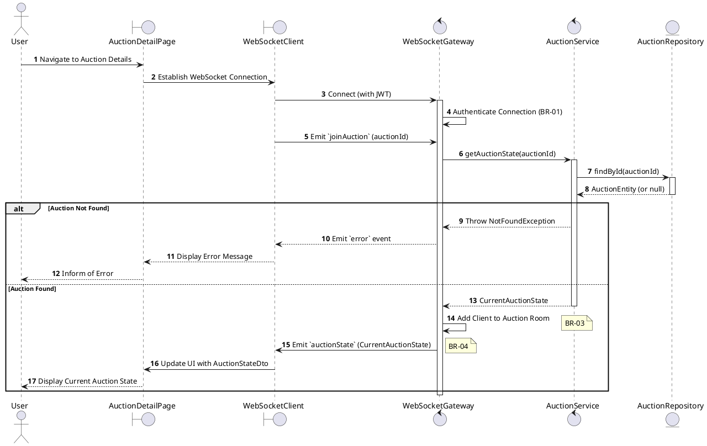
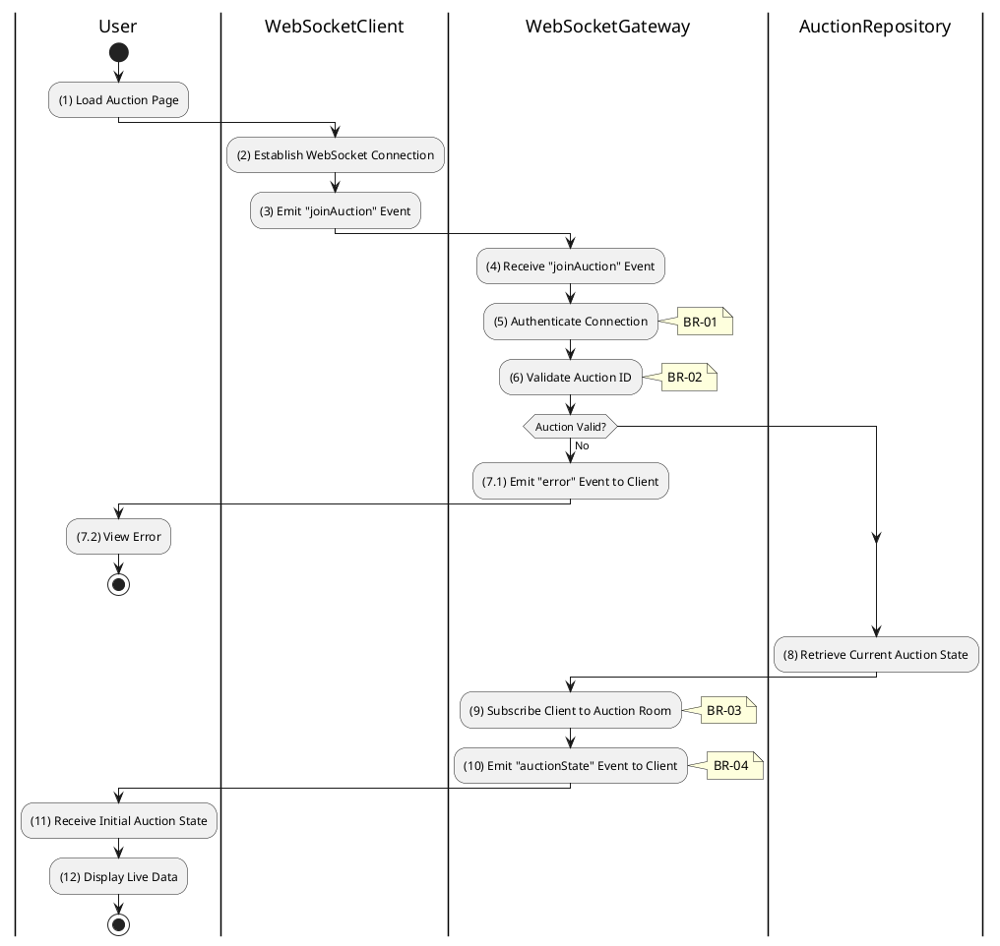

# 3.5.3 Join Auction Room

## 1. Use Case Description

| Field              | Description                                                                                                           |
| ------------------ | --------------------------------------------------------------------------------------------------------------------- |
| **Name**           | Join Auction Room                                                                                                     |
| **Description**    | This use case allows the User to create a new WebSocket Connection information in the system.                         |
| **Actor**          | User                                                                                                                  |
| **Trigger**        | When the User navigates to the AuctionDetailPage screen.                                                              |
| **Pre-condition**  | • User's device must be connected to the internet. • User is signed in with their account.                         |
| **Post-condition** | The WebSocket Connection information will be stored into the system and display auction updates on AuctionDetailPage. |

## 2. Sequence Flow (MVC)

## 3. Activities Flow (Swimlanes)

## 4. Business Rules

| Activity      | BR Code   | Description                                                                                                                                                                                                                                                                                                                |
| :------------ | :-------- | :------------------------------------------------------------------------------------------------------------------------------------------------------------------------------------------------------------------------------------------------------------------------------------------------------------------------- |
| **(1)**       | **BR-01** | **Displaying Rule (Auction Detail Page):** When user navigates to auction details, system displays `AuctionDetailPage`. System initiates WebSocket connection in background. System displays loading state while connecting.                                                                                      |
| **(2)-(3)**   | **BR-02** | **Validation Rule (WebSocket Authentication - Front-end):** System establishes WebSocket connection with JWT token. System emits `joinAuction` event with `auctionId` parameter.                                                                                                                                     |
| **(5)**       | **BR-03** | **Validation Rule (Connection Authentication - Back-end):** System validates JWT token on WebSocket connection. If invalid/expired: $\rightarrow$ System emits `error` event to client with MSG 14 ("Authentication failed").                                                                                     |
| **(6)-(7.1)** | **BR-04** | **Validation Rule (Auction Existence - Back-end):** System retrieves data from the 'AUCTION' table in the database (Refer to 'AUCTION' table in 'DB Sheet' file) based on the auction ID to verify it exists. If not found: $\rightarrow$ System emits `error` event to client with MSG 20 ("Auction not found"). |
| **(9)**       | **BR-05** | **Processing Rule (Room Subscription):** System subscribes client socket to auction-specific room. All future real-time updates for this auction are broadcast to this room.                                                                                                                                         |
| **(10)**      | **BR-06** | **Displaying Rule (Initial State):** System emits `auctionState` event to client with current auction data. Client updates UI to show: current highest bid, time remaining, auction status. System displays live auction interface ready for bidding.                                                             |
| **(5)**       | **BR-07** | **Processing Rule (Role-Based Filtering):** System may filter `auctionState` data based on user role. Guests receive less detail than authenticated bidders.                                                                                                                                                         |
