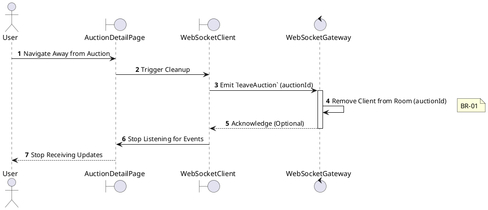
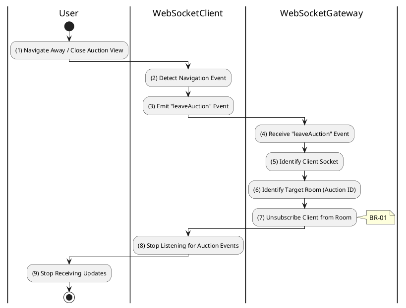

# 3.5.4 Leave Auction Room

## 1. Use Case Description

| Field              | Description                                                                                      |
| ------------------ | ------------------------------------------------------------------------------------------------ |
| **Name**           | Leave Auction Room                                                                               |
| **Description**    | This use case allows the User to delete a WebSocket Connection information in the system.        |
| **Actor**          | User                                                                                             |
| **Trigger**        | When the User navigates away from the AuctionDetailPage screen.                                  |
| **Pre-condition**  | • User's device must be connected to the internet. • User is signed in with their account.    |
| **Post-condition** | The WebSocket Connection information will be removed from the system and stop receiving updates. |

## 2. Sequence Flow (MVC)

## 3. Activities Flow (Swimlanes)

## 4. Business Rules

| Activity    | BR Code   | Description                                                                                                                                                                                                                                                                                                                                                                                                                                                  |
| :---------- | :-------- | :----------------------------------------------------------------------------------------------------------------------------------------------------------------------------------------------------------------------------------------------------------------------------------------------------------------------------------------------------------------------------------------------------------------------------------------------------------- |
| **(1)**     | **BR-01** | **Displaying Rules (Navigation Away):** ❖ When the user navigates away from the auction page, the system triggers a cleanup process. ❖ The system prepares to emit a `leaveAuction` WebSocket event.                                                                                                                                                                                                                                                        |
| **(2)-(3)** | **BR-02** | **Processing Rules (Front-end):** ❖ The client-side application detects the navigation event and emits a `leaveAuction` event with the `auctionId` parameter. ❖ The client then ceases to listen for auction-specific WebSocket events.                                                                                                                                                                                                                     |
| **(7)**     | **BR-03** | **Processing Rules (Back-end):** ❖ Upon receiving the `leaveAuction` event, the system invokes `WebSocketGateway.handleLeaveAuction(socket, auctionId)`. ❖ It unsubscribes the client socket from the specified `auctionId` room, ensuring the client no longer receives broadcasts for that auction.                                                                                                                                                           |
| **(7)**     | **BR-04** | **Processing Rules (Automatic Cleanup):** ❖ If a client disconnects abruptly (e.g., due to a browser crash or network loss), the system automatically removes the client from all joined rooms via `WebSocketGateway.onDisconnect()`. ❖ This optimizes server resources by cleaning up orphaned connections.                                                                                                                                              |
| **(9)**     | **BR-05** | **Displaying Rules (Stop Updates):** ❖ The user’s UI no longer receives real-time auction updates. ❖ If the user returns to the auction page, they must explicitly rejoin the room by triggering the `3.5.3` use case to resume receiving updates.                                                                                                                                                                                                               |
