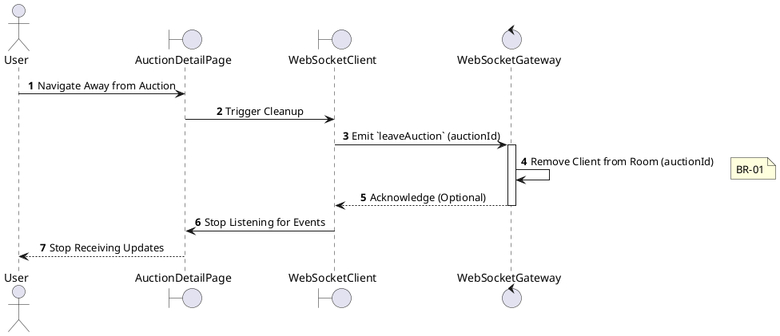
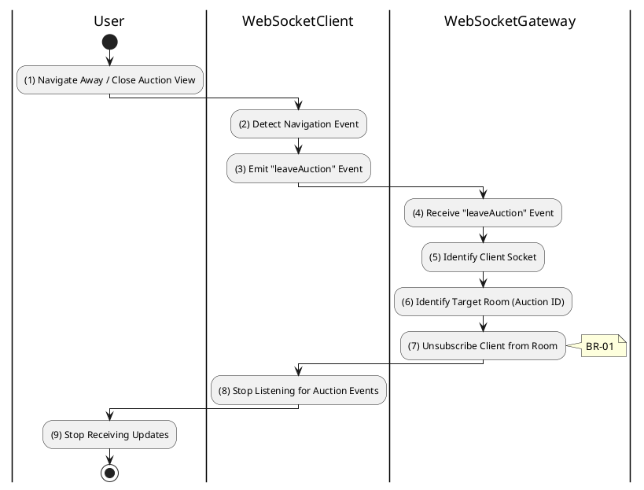

# 3.5.4 Leave Auction Room

## 1. Use Case Description

| Field              | Description                                                                                      |
| ------------------ | ------------------------------------------------------------------------------------------------ |
| **Name**           | Leave Auction Room                                                                               |
| **Description**    | This use case allows the User to delete a WebSocket Connection information in the system.        |
| **Actor**          | User                                                                                             |
| **Trigger**        | When the User navigates away from the AuctionDetailPage screen.                                  |
| **Pre-condition**  | • User's device must be connected to the internet. • User is signed in with their account.    |
| **Post-condition** | The WebSocket Connection information will be removed from the system and stop receiving updates. |

## 2. Sequence Flow (MVC)

## 3. Activities Flow (Swimlanes)

## 4. Business Rules

| Activity    | BR Code   | Description                                                                                                                                                                                                                                                 |
| :---------- | :-------- | :---------------------------------------------------------------------------------------------------------------------------------------------------------------------------------------------------------------------------------------------------------- |
| **(1)**     | **BR-01** | **Displaying Rule (Navigation Away):** When user navigates away from auction page, system triggers cleanup. System prepares to emit `leaveAuction` WebSocket event.                                                                                   |
| **(2)-(3)** | **BR-02** | **Processing Rule (Emit Leave Event - Front-end):** System emits `leaveAuction` event with `auctionId` parameter. Client stops listening for auction-specific WebSocket events.                                                                       |
| **(7)**     | **BR-03** | **Processing Rule (Unsubscribe from Room - Back-end):** System receives `leaveAuction` event. System unsubscribes client socket from auction-specific room. Client stops receiving `newBid`, `timeUpdate`, `auctionState` events for this auction. |
| **(7)**     | **BR-04** | **Processing Rule (Automatic Cleanup):** If client disconnects abruptly (browser crash, network loss): $\rightarrow$ System automatically removes client from all joined rooms. System optimizes resources by cleaning up orphaned connections.    |
| **(9)**     | **BR-05** | **Displaying Rule (Stop Updates):** User no longer receives real-time auction updates on the View. If user returns to auction page, they must rejoin the room (3.5.3).                                                                                |
