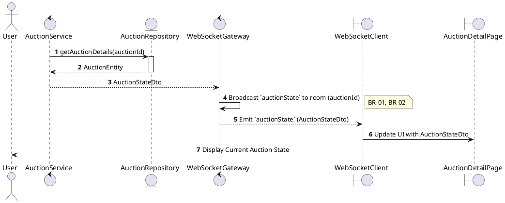
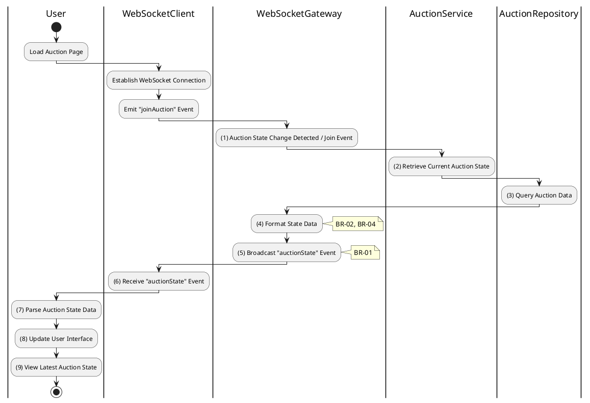

# 3.5.5 Receive Auction State

## 1. Use Case Description

| Field              | Description                                                                                              |
| ------------------ | -------------------------------------------------------------------------------------------------------- |
| **Name**           | Receive Auction State                                                                                    |
| **Description**    | This use case allows the User to search Auction State information in the system based on input keywords. |
| **Actor**          | User                                                                                                     |
| **Trigger**        | When the User joins an auction room via WebSocket.                                                       |
| **Pre-condition**  | • User's device must be connected to the internet. • User is signed in with their account.            |
| **Post-condition** | The Auction State information will be displayed on the AuctionDetailPage screen.                         |

## 2. Sequence Flow (MVC)

## 3. Activities Flow (Swimlanes)

## 4. Business Rules

| Activity    | BR Code   | Description                                                                                                                                                                                                                                                                                                                                                                                                                                                  |
| :---------- | :-------- | :----------------------------------------------------------------------------------------------------------------------------------------------------------------------------------------------------------------------------------------------------------------------------------------------------------------------------------------------------------------------------------------------------------------------------------------------------------- |
| **(1)**     | **BR-01** | **Trigger Rules:** ❖ The system triggers the dispatch of auction state updates. ❖ This occurs either when a client joins an auction room (via `WebSocketGateway.onJoinAuction()`) or when a significant change in the auction’s state is detected (via `WebSocketGateway.onAuctionChange()`), such as a new bid or time update.                                                                                                                              |
| **(2)-(3)** | **BR-02** | **Querying Rules:** ❖ The system retrieves the current auction state by calling `AuctionService.getAuctionState(auctionId)`. ❖ It queries the “AUCTION” table to obtain up-to-date auction data. ❖ The query selects critical fields including: [auctionId], [name], [code], [status], [timeRemaining], and [currentWinningBid].                                                                                                                                |
| **(4)**     | **BR-03** | **Data Filtering Rules:** ❖ The system prepares the payload by calling `WebSocketGateway.formatAuctionState(auctionState)`. ❖ It carefully filters out sensitive data, such as internal IDs, admin-only fields, and private bidder details, ensuring that only publicly safe information is included in the broadcast.                                                                                                                                   |
| **(5)**     | **BR-04** | **Broadcasting Rules:** ❖ The system broadcasts the `auctionState` event to all subscribed clients in the auction-specific room by calling `WebSocketGateway.toRoom(auctionId).emit('auctionState', payload)`. ❖ This ensures efficient network usage by targeting only relevant clients.                                                                                                                                                                 |
| **(7)-(9)** | **BR-05** | **Displaying Rules:** ❖ Upon receiving the `auctionState` event via WebSocket, the client-side application updates its UI elements. ❖ This includes refreshing the highest bid display, synchronizing the countdown timer, and updating the status indicator. ❖ The user observes a synchronized and real-time view of the auction’s current state.                                                                                                                    |
