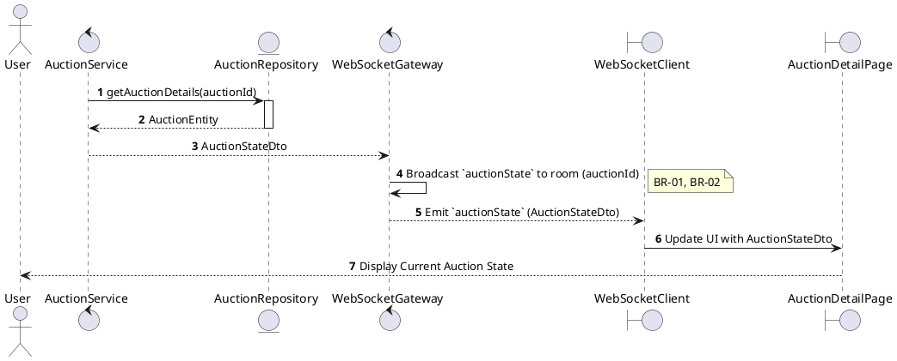
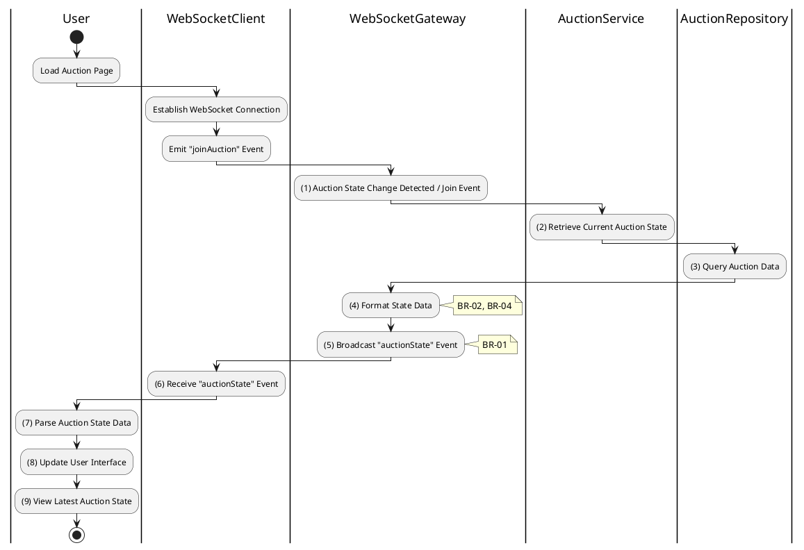

# 3.5.5 Receive Auction State

## 1. Use Case Description

| Field              | Description                                                                                              |
| ------------------ | -------------------------------------------------------------------------------------------------------- |
| **Name**           | Receive Auction State                                                                                    |
| **Description**    | This use case allows the User to search Auction State information in the system based on input keywords. |
| **Actor**          | User                                                                                                     |
| **Trigger**        | When the User joins an auction room via WebSocket.                                                       |
| **Pre-condition**  | • User's device must be connected to the internet. • User is signed in with their account.            |
| **Post-condition** | The Auction State information will be displayed on the AuctionDetailPage screen.                         |

## 2. Sequence Flow (MVC)

## 3. Activities Flow (Swimlanes)

## 4. Business Rules

| Activity    | BR Code   | Description                                                                                                                                                                                                                                                                   |
| :---------- | :-------- | :---------------------------------------------------------------------------------------------------------------------------------------------------------------------------------------------------------------------------------------------------------------------------- |
| **(1)**     | **BR-01** | **Processing Rule (State Change Trigger):** System detects auction state change (join event, status transition, admin override). System prepares to broadcast updated state to room subscribers.                                                                        |
| **(2)-(3)** | **BR-02** | **Querying Rule:** System retrieves data from the 'AUCTION' table in the database (Refer to 'AUCTION' table in 'DB Sheet' file) to obtain current auction data. System retrieves: status, current highest bid, winning bidder ID, auction end time, and starting price. |
| **(4)**     | **BR-03** | **Processing Rule (Data Filtering):** System filters sensitive data from `auctionState` payload. System excludes: internal IDs, admin-only fields, private bidder details. System includes only public information safe for broadcast.                               |
| **(5)**     | **BR-04** | **Processing Rule (Targeted Broadcast):** System broadcasts `auctionState` event to clients in auction-specific room only. System ensures efficient network usage by not broadcasting to unrelated rooms.                                                               |
| **(6)-(9)** | **BR-05** | **Displaying Rule (UI Update):** Client receives `auctionState` event via WebSocket. Client parses data and updates UI: highest bid display, countdown timer, status indicator. User observes synchronized auction state.                                            |
