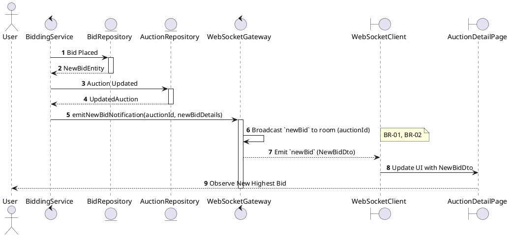
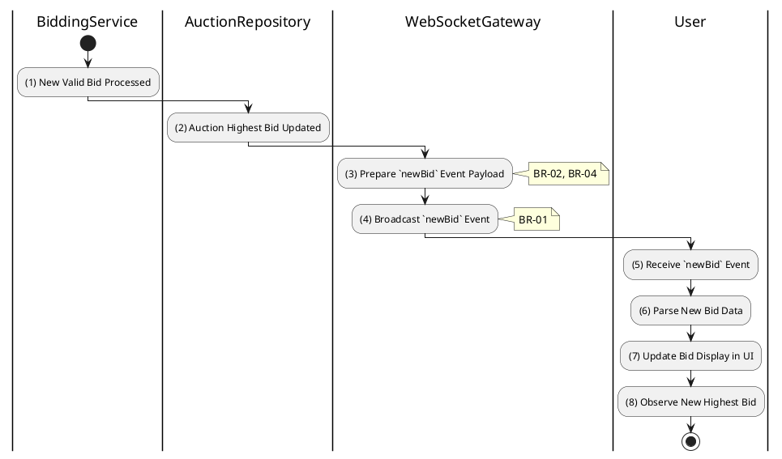

# 3.5.6 Receive New Bid Notification

## 1. Use Case Description

| Field              | Description                                                                                                 |
| ------------------ | ----------------------------------------------------------------------------------------------------------- |
| **Name**           | Receive New Bid Notification                                                                                |
| **Description**    | This use case allows the User to search Bid Notification information in the system based on input keywords. |
| **Actor**          | User                                                                                                        |
| **Trigger**        | When a new bid is placed in the auction room.                                                               |
| **Pre-condition**  | • User's device must be connected to the internet. • User is signed in with their account.               |
| **Post-condition** | The Bid Notification information will be displayed on the AuctionDetailPage screen.                         |

## 2. Sequence Flow (MVC)

## 3. Activities Flow (Swimlanes)

## 4. Business Rules

| Activity    | BR Code   | Description                                                                                                                                                                                                                                        |
| :---------- | :-------- | :------------------------------------------------------------------------------------------------------------------------------------------------------------------------------------------------------------------------------------------------- |
| **(1)-(2)** | **BR-01** | **Processing Rule (Bid Trigger):** When new valid bid is processed and saved to `AUCTION_BID` table: $\rightarrow$ System triggers `newBid` broadcast to auction room.                                                                       |
| **(3)**     | **BR-02** | **Processing Rule (Payload Preparation):** System prepares `newBid` event payload with: - New highest bid amount - Masked bidder identifier (e.g., "Bidder 123") - Bid timestamp - `isOwnBid` flag for current user.                |
| **(3)**     | **BR-03** | **Processing Rule (Privacy Protection):** System masks bidder identities in `newBid` notification. System includes `isOwnBid` boolean for front-end to highlight user's own bids. Full bidder details are hidden from other participants. |
| **(4)**     | **BR-04** | **Processing Rule (Targeted Broadcast):** System broadcasts `newBid` event to clients in auction-specific room only. System ensures near real-time delivery for competitive bidding environment.                                             |
| **(5)-(8)** | **BR-05** | **Displaying Rule (UI Update):** Client receives `newBid` event via WebSocket. Client updates UI: highest bid display, bid history list, visual indication of new bid. User observes new highest bid in real-time.                        |
