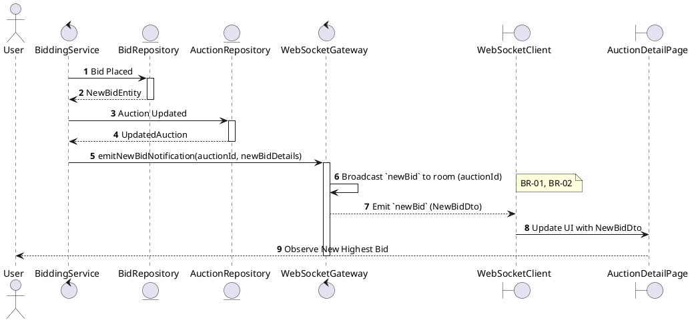
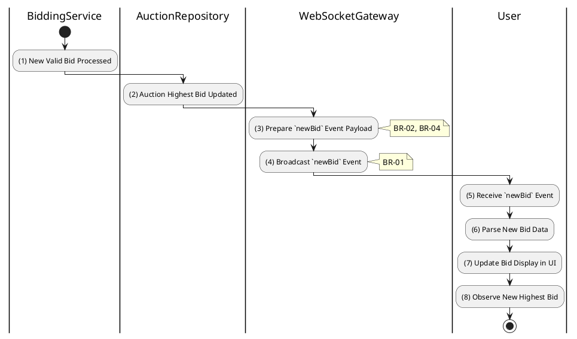

# 3.5.6 Receive New Bid Notification

## 1. Use Case Description

| Field              | Description                                                                                                 |
| ------------------ | ----------------------------------------------------------------------------------------------------------- |
| **Name**           | Receive New Bid Notification                                                                                |
| **Description**    | This use case allows the User to search Bid Notification information in the system based on input keywords. |
| **Actor**          | User                                                                                                        |
| **Trigger**        | When a new bid is placed in the auction room.                                                               |
| **Pre-condition**  | • User's device must be connected to the internet. • User is signed in with their account.               |
| **Post-condition** | The Bid Notification information will be displayed on the AuctionDetailPage screen.                         |

## 2. Sequence Flow (MVC)

## 3. Activities Flow (Swimlanes)

## 4. Business Rules

| Activity    | BR Code   | Description                                                                                                                                                                                                                                                                                                                                                                                                                                                                                                                                                                                                                                                                                                                                                                                                                                                                                                                                                                                                    |
| :---------- | :-------- | :------------------------------------------------------------------------------------------------------------------------------------------------------------------------------------------------------------------------------------------------------------------------------------------------------------------------------------------------------------------------------------------------------------------------------------------------------------------------------------------------------------------------------------------------------------------------------------------------------------------------------------------------------------------------------------------------------------------------------------------------------------------------------------------------------------------------------------------------------------------------------------------------------------------------------------------------------------------------------------------------------------- |
| **(1)-(2)** | **BR-01** | **Processing Rules (Bid Trigger):** ❖ The system initiates this workflow via `BiddingService.placeManualBid()`. ❖ It is triggered automatically when a new valid bid is successfully saved to the “AUCTION_BID” table and the corresponding auction's highest bid is updated.                                                                                                                                                                                                                                                                                                                                                                                                                                                                                                                                                                                                                                                                                                                 |
| **(3)**     | **BR-02** | **Processing Rules (Payload Preparation):** ❖ The system constructs the notification payload using `WebSocketGateway.emitNewBidNotification()`. ❖ The payload includes the [amount], the [bidderName], the [bidAt] timestamp, and an [isWinningBid] flag.                                                                                                                                                                                                                                                                                                                                                                                                                                                                                                                                                                                                                                                                                                                                             |
| **(3)**     | **BR-03** | **Processing Rules (Privacy Protection):** ❖ The system applies privacy filtering using `Mask_Bidder_Identity(name)`. ❖ It masks the bidder's name (e.g., converting "John Doe" to "Bidder ****123") for public broadcast. ❖ The [isOwnBid] flag is set to `true` only for the socket connection belonging to the bidder who placed the bid, ensuring other participants cannot identify them.                                                                                                                                                                                                                                                                                                                                                                                                                                                                                                                                                                                                     |
| **(4)**     | **BR-04** | **Processing Rules (Targeted Broadcast):** ❖ The system broadcasts the `newBid` event by calling `WebSocketGateway.toRoom(auctionId).emit('newBid')`. ❖ This ensures the notification is sent to all clients currently subscribed to the specific auction room, prioritizing low-latency delivery.                                                                                                                                                                                                                                                                                                                                                                                                                                                                                                                                                                                                                                                                                                    |
| **(5)-(8)** | **BR-05** | **Displaying Rules (UI Update):** ❖ Upon receiving the `newBid` event via WebSocket, the client calls `Display_NewBid_Animation(newBidDto)`. ❖ The system updates the [CurrentBid] value on the screen. ❖ It applies a visual flash or highlight effect to the new value. ❖ The new bid is appended to the [BidHistory] list, and a notification toast "New Bid: [Amount]" is displayed.                                                                                                                                                                                                                                                                                                                                                                                                                                                                                                                                                                                                        |