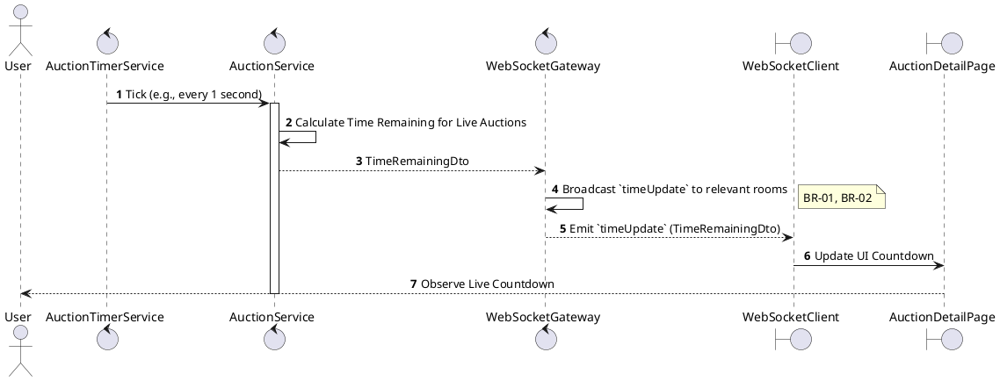
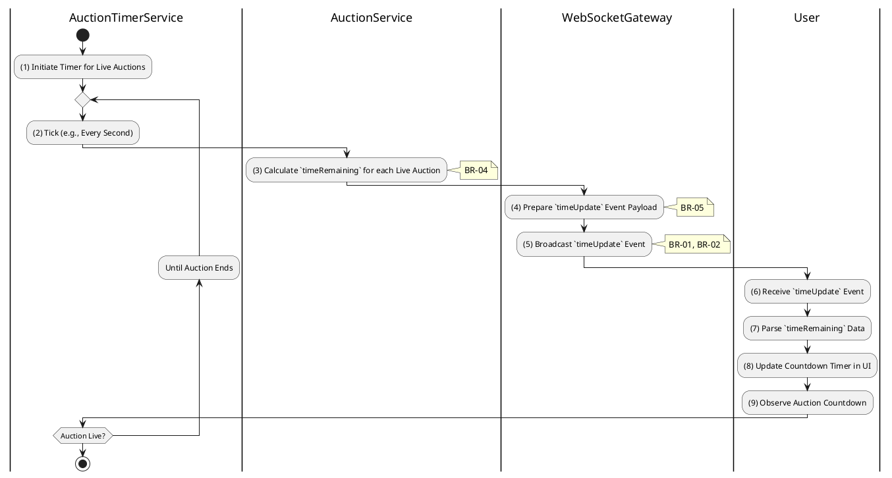

# 3.5.7 Receive Time Updates

## 1. Use Case Description

| Field              | Description                                                                                            |
| ------------------ | ------------------------------------------------------------------------------------------------------ |
| **Name**           | Receive Time Updates                                                                                   |
| **Description**    | This use case allows the User to search Time Update information in the system based on input keywords. |
| **Actor**          | User                                                                                                   |
| **Trigger**        | When the server broadcasts time updates to the auction room.                                           |
| **Pre-condition**  | • User's device must be connected to the internet. • User is signed in with their account.          |
| **Post-condition** | The Time Update information will be displayed on the AuctionDetailPage screen.                         |

## 2. Sequence Flow (MVC)

## 3. Activities Flow (Swimlanes)

## 4. Business Rules

| Activity    | BR Code   | Description                                                                                                                                                                                                                                                                                                                                                                                                                                                                                                                                                                                                                                                                                                                                                                                                                                                                                                                                                                                                 |
| :---------- | :-------- | :---------------------------------------------------------------------------------------------------------------------------------------------------------------------------------------------------------------------------------------------------------------------------------------------------------------------------------------------------------------------------------------------------------------------------------------------------------------------------------------------------------------------------------------------------------------------------------------------------------------------------------------------------------------------------------------------------------------------------------------------------------------------------------------------------------------------------------------------------------------------------------------------------------------------------------------------------------------------------------------------------------- |
| **(1)-(2)** | **BR-01** | **Processing Rules (Timer Trigger):** ❖ The system executes `AuctionTimerService.tick()` as a scheduled background task. ❖ This task runs approximately every 1 second and identifies all auctions where the [status] is 'live'.                                                                                                                                                                                                                                                                                                                                                                                                                                                                                                                                                                                                                                                                                                                                                                      |
| **(3)**     | **BR-02** | **Processing Rules (Calculation):** ❖ For each live auction, the system calls `AuctionService.calculateTimeRemaining(auction)`. ❖ It calculates the time remaining as `[auctionEndAt] - NOW()`. ❖ If the time remaining is less than or equal to zero, the system automatically triggers the auction end process.                                                                                                                                                                                                                                                                                                                                                                                                                                                                                                                                                                                                                                                                                  |
| **(3)**     | **BR-03** | **Processing Rules (Server Authority):** ❖ The system enforces server-side logic as the single source of truth for time. ❖ Clients must synchronize their displays to these server updates to prevent client-side time manipulation or desynchronization.                                                                                                                                                                                                                                                                                                                                                                                                                                                                                                                                                                                                                                                                                                                                             |
| **(4)**     | **BR-04** | **Processing Rules (Payload):** ❖ The system creates a lightweight payload via `Create_TimeUpdate_Payload(auctionId, ms)`. ❖ The payload contains only the [auctionId] and the [timeRemainingMs] to minimize bandwidth usage for this high-frequency event.                                                                                                                                                                                                                                                                                                                                                                                                                                                                                                                                                                                                                                                                                                                                           |
| **(5)**     | **BR-05** | **Processing Rules (Broadcasting):** ❖ The system broadcasts the update by calling `WebSocketGateway.emitTimeUpdate(auctionId, payload)`. ❖ The `timeUpdate` event is emitted specifically to the WebSocket room corresponding to the [auctionId].                                                                                                                                                                                                                                                                                                                                                                                                                                                                                                                                                                                                                                                                                                                                                    |
| **(6)-(9)** | **BR-06** | **Displaying Rules (Countdown Update):** ❖ Upon receiving the event, the client executes `Update_Countdown_Timer(ms)`. ❖ It formats the milliseconds into a readable HH:MM:SS format. ❖ The system updates the Timer Component on the UI. ❖ If the time remaining is zero or less, the display changes to "Ended" or "Calculated".                                                                                                                                                                                                                                                                                                                                                                                                                                                                                                                                                                                                                                                              |