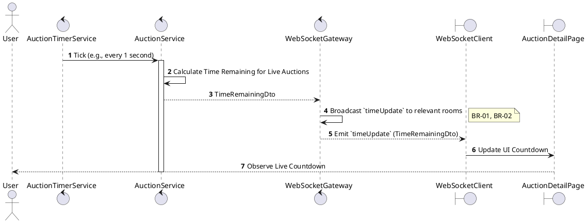
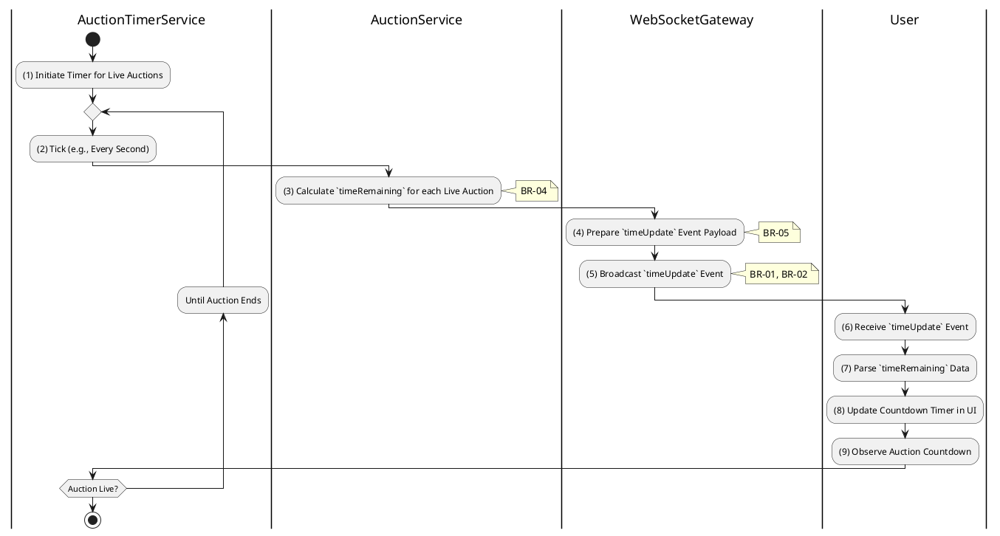

# 3.5.7 Receive Time Updates

## 1. Use Case Description

| Field              | Description                                                                                            |
| ------------------ | ------------------------------------------------------------------------------------------------------ |
| **Name**           | Receive Time Updates                                                                                   |
| **Description**    | This use case allows the User to search Time Update information in the system based on input keywords. |
| **Actor**          | User                                                                                                   |
| **Trigger**        | When the server broadcasts time updates to the auction room.                                           |
| **Pre-condition**  | • User's device must be connected to the internet. • User is signed in with their account.          |
| **Post-condition** | The Time Update information will be displayed on the AuctionDetailPage screen.                         |

## 2. Sequence Flow (MVC)

## 3. Activities Flow (Swimlanes)

## 4. Business Rules

| Activity    | BR Code   | Description                                                                                                                                                                                                              |
| :---------- | :-------- | :----------------------------------------------------------------------------------------------------------------------------------------------------------------------------------------------------------------------- |
| **(1)-(2)** | **BR-01** | **Processing Rule (Timer Trigger):** Server-side timer ticks every second for each `live` auction. System calculates `timeRemaining` based on `auctionEndAt` timestamp.                                            |
| **(3)**     | **BR-02** | **Processing Rule (Live Auctions Only):** Time updates are generated only for auctions with `status = 'live'`. No updates sent for `scheduled`, `ended`, or `failed` auctions.                                     |
| **(3)**     | **BR-03** | **Processing Rule (Server-Side Authority):** All `timeRemaining` calculations performed on server. Prevents client-side time manipulation. Ensures synchronized countdown across all participants.              |
| **(4)**     | **BR-04** | **Processing Rule (Efficient Payload):** System prepares minimal `timeUpdate` payload: - `auctionId` - `timeRemaining` (in milliseconds or seconds) Conserves bandwidth with small payloads sent frequently. |
| **(5)**     | **BR-05** | **Processing Rule (Targeted Broadcast):** System broadcasts `timeUpdate` event to clients in auction-specific room only. Update frequency: approximately once per second.                                          |
| **(6)-(9)** | **BR-06** | **Displaying Rule (Countdown Update):** Client receives `timeUpdate` event via WebSocket. Client updates countdown timer display in UI. User observes accurate, synchronized auction countdown.                 |
