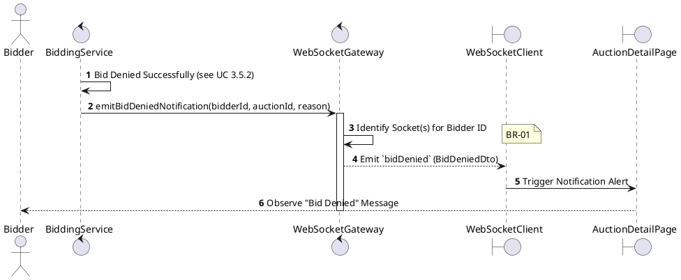
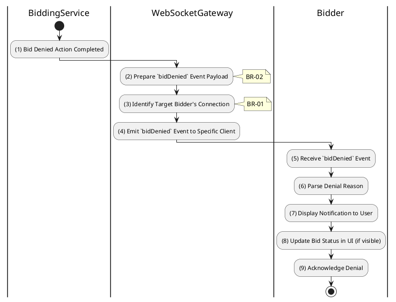

# 3.5.8 Receive Bid Denied Notification

## 1. Use Case Description

| Field              | Description                                                                                                          |
| ------------------ | -------------------------------------------------------------------------------------------------------------------- |
| **Name**           | Receive Bid Denied Notification                                                                                      |
| **Description**    | This use case allows the Bidder to search Bid Denied Notification information in the system based on input keywords. |
| **Actor**          | Bidder                                                                                                               |
| **Trigger**        | When an Admin denies a bid in the auction room.                                                                      |
| **Pre-condition**  | • Bidder's device must be connected to the internet. • Bidder is signed in with their account.                    |
| **Post-condition** | The Bid Denied Notification information will be displayed on the AuctionDetailPage screen.                           |

## 2. Sequence Flow (MVC)

## 3. Activities Flow (Swimlanes)

## 4. Business Rules

| Activity    | BR Code   | Description                                                                                                                                                                                                                                                                       |
| :---------- | :-------- | :-------------------------------------------------------------------------------------------------------------------------------------------------------------------------------------------------------------------------------------------------------------------------------- |
| **(1)**     | **BR-01** | **Processing Rule (Denial Trigger):** When bid is denied by Admin/Auctioneer (Use Case 3.5.2): $\rightarrow$ System triggers `bidDenied` notification to specific bidder.                                                                                                   |
| **(2)**     | **BR-02** | **Processing Rule (Payload Preparation):** System prepares `bidDenied` event payload with: - `auctionId` - `bidAmount` that was denied - `denialReason` explaining why bid was invalid.                                                                               |
| **(3)**     | **BR-03** | **Processing Rule (Targeted Delivery - Privacy):** System sends `bidDenied` notification only to the specific bidder whose bid was denied. Not broadcast to entire auction room to maintain privacy. System identifies target socket by bidder userId.                   |
| **(4)**     | **BR-04** | **Processing Rule (Immediate Feedback):** Notification delivered immediately after denial processing. Allows bidder to react promptly and place new compliant bid if desired.                                                                                               |
| **(5)-(9)** | **BR-05** | **Displaying Rule (Denial Alert):** Client receives `bidDenied` event via WebSocket. Client displays alert/notification: "Your bid of [amount] was denied: [reason]". Client updates bid history to show denied status. User acknowledges denial and can take action. |
