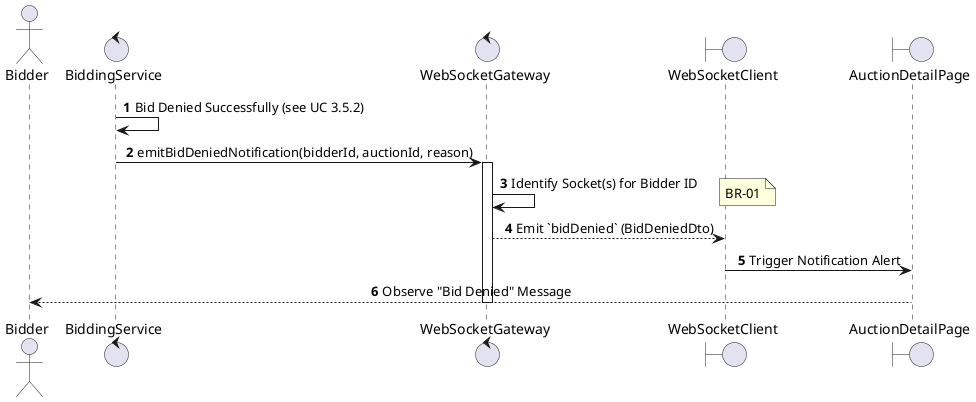
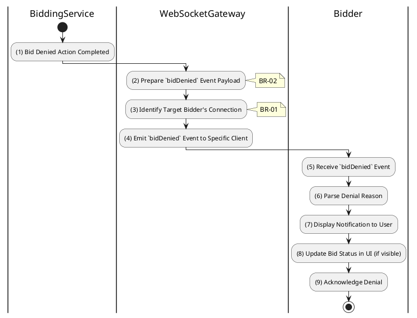

# 3.5.8 Receive Bid Denied Notification

## 1. Use Case Description

| Field              | Description                                                                                                          |
| ------------------ | -------------------------------------------------------------------------------------------------------------------- |
| **Name**           | Receive Bid Denied Notification                                                                                      |
| **Description**    | This use case allows the Bidder to search Bid Denied Notification information in the system based on input keywords. |
| **Actor**          | Bidder                                                                                                               |
| **Trigger**        | When an Admin denies a bid in the auction room.                                                                      |
| **Pre-condition**  | • Bidder's device must be connected to the internet. • Bidder is signed in with their account.                    |
| **Post-condition** | The Bid Denied Notification information will be displayed on the AuctionDetailPage screen.                           |

## 2. Sequence Flow (MVC)

## 3. Activities Flow (Swimlanes)

## 4. Business Rules

| Activity    | BR Code   | Description                                                                                                                                                                                                                                                                                                                                                                                                                                                                                                                                                                                                                                                                                                                                                                                                                                                                     |
| :---------- | :-------- | :------------------------------------------------------------------------------------------------------------------------------------------------------------------------------------------------------------------------------------------------------------------------------------------------------------------------------------------------------------------------------------------------------------------------------------------------------------------------------------------------------------------------------------------------------------------------------------------------------------------------------------------------------------------------------------------------------------------------------------------------------------------------------------------------------------------------------------------------------------------------------ |
| **(1)**     | **BR-01** | **Processing Rules (Denial Trigger):** ❖ The system initiates this workflow via `BiddingService.denyBid()`. ❖ It is triggered immediately after an Admin or Auctioneer updates a record in the “AUCTION_BID” table with [isDenied] set to `true`.                                                                                                                                                                                                                                                                                                                                                                                                                                                                                                                                                                                                                         |
| **(2)**     | **BR-02** | **Processing Rules (Payload Preparation):** ❖ The system constructs the notification payload via `Create_BidDenied_Payload(bid, reason)`. ❖ The payload includes the [auctionId], the denied [bidAmount], the [denialReason], and the specific [bidId].                                                                                                                                                                                                                                                                                                                                                                                                                                                                                                                                                                                                                   |
| **(3)**     | **BR-03** | **Processing Rules (Targeted Delivery):** ❖ The system identifies the target connection using `WebSocketGateway.getUserSocket(bidderId)`. ❖ It looks up the active WebSocket for the specific [bidderId]. ❖ The notification is sent via Unicast only to this user to protect the bidder's privacy and avoid public shaming.                                                                                                                                                                                                                                                                                                                                                                                                                                                                                                                                           |
| **(4)**     | **BR-04** | **Processing Rules (Broadcasting):** ❖ The system emits the event by calling `WebSocketGateway.emit('bidDenied', payload)`. ❖ It sends the `bidDenied` event immediately to the targeted socket to ensure prompt feedback.                                                                                                                                                                                                                                                                                                                                                                                                                                                                                                                                                                                                                                                |
| **(5)-(9)** | **BR-05** | **Displaying Rules (Denial Alert):** ❖ Upon receiving the event, the client triggers `Display_Notification('Error', message)`. ❖ It displays a Toast or Alert message: "Your bid of [Amount] was denied. Reason: [Reason]". ❖ The system updates the Bid History UI to visually indicate the denied status (e.g., strikethrough).                                                                                                                                                                                                                                                                                                                                                                                                                                                                                                                                      |