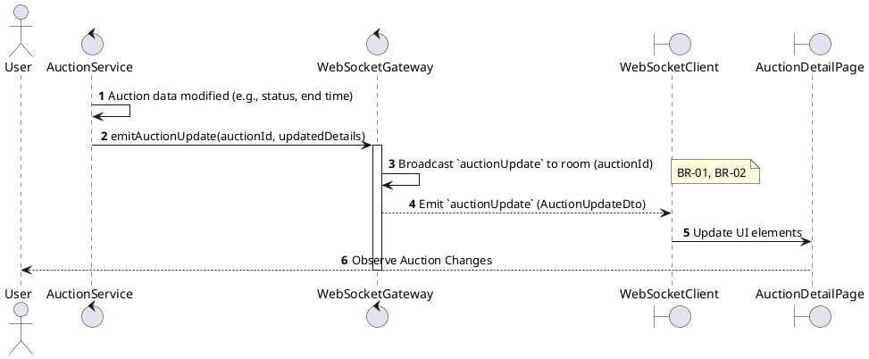
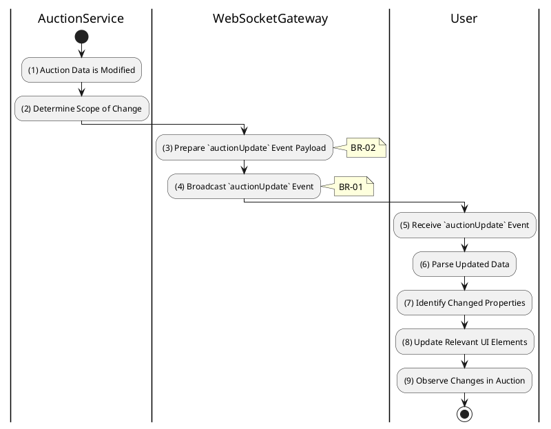

# 3.5.9 Receive Auction Update

## 1. Use Case Description

| Field              | Description                                                                                                                                                                                                                                                                                                                      |
| ------------------ | -------------------------------------------------------------------------------------------------------------------------------------------------------------------------------------------------------------------------------------------------------------------------------------------------------------------------------- |
| **Name**           | Receive Auction Update                                                                                                                                                                                                                                                                                                           |
| **Description**    | This use case allows the System to broadcast auction updates to subscribed clients in the system. This event encompasses changes beyond new bids or time updates, such as status transitions (e.g., `scheduled` to `live`), manual extensions of `auctionEndAt`, or administrative adjustments to other core auction properties. |
| **Actor**          | Bidder (and any other subscribed user, e.g., Guest, Auctioneer)                                                                                                                                                                                                                                                                  |
| **Trigger**        | When the AuctionService modifies auction data (e.g., status, end time) and emits an `auctionUpdate` event via WebSocket.                                                                                                                                                                                                         |
| **Pre-condition**  | • Client's device must be connected to the internet. • Client has an active WebSocket connection and is subscribed to the specific auction's WebSocket room.                                                                                                                                                                  |
| **Post-condition** | The client receives a `WebSocket: auctionUpdate` event containing the updated auction details and the client's UI is updated to reflect the new state or properties of the auction.                                                                                                                                              |

## 2. Sequence Flow (MVC)

## 3. Activities Flow (Swimlanes)

## 4. Business Rules

| Activity    | BR Code   | Description                                                                                                                                                                                                                                                 |
| :---------- | :-------- | :---------------------------------------------------------------------------------------------------------------------------------------------------------------------------------------------------------------------------------------------------------- |
| **(1)**     | **BR-01** | **Processing Rule (Update Trigger):** System detects significant auction change: - Status transition (e.g., `scheduled` → `live`, `live` → `ended`) - `auctionEndAt` modified (time extension) - Administrative adjustments to core properties. |
| **(2)**     | **BR-02** | **Processing Rule (Scope Determination):** System determines scope of change to include in payload. Avoids redundant updates already covered by `newBid` or `timeUpdate` events.                                                                      |
| **(3)**     | **BR-03** | **Processing Rule (Payload Preparation):** System prepares `auctionUpdate` event payload with: - Changed fields or full current auction state - New status value (if changed) - Updated timestamps.                                             |
| **(4)**     | **BR-04** | **Processing Rule (Targeted Broadcast):** System broadcasts `auctionUpdate` event to clients in auction-specific room only. Ensures data relevance and efficient network usage.                                                                       |
| **(4)**     | **BR-05** | **Processing Rule (Real-Time Delivery):** Critical `auctionUpdate` notifications delivered in near real-time. Ensures participants always have current auction information.                                                                           |
| **(5)-(9)** | **BR-06** | **Displaying Rule (UI Update):** Client receives `auctionUpdate` event via WebSocket. Client identifies changed properties and updates relevant UI elements. User observes changes: status badge, extended time, modified rules.                   |
