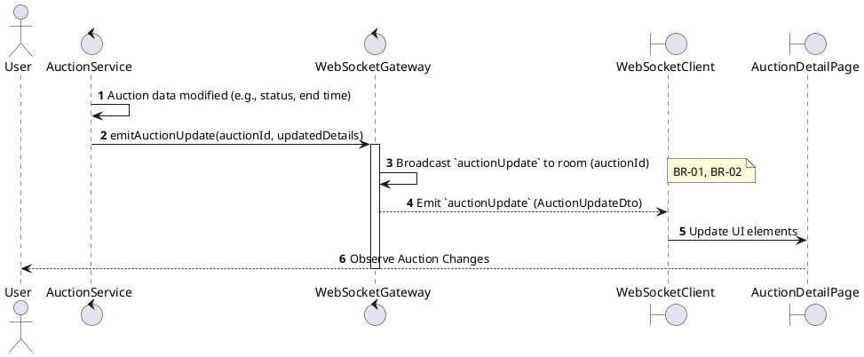
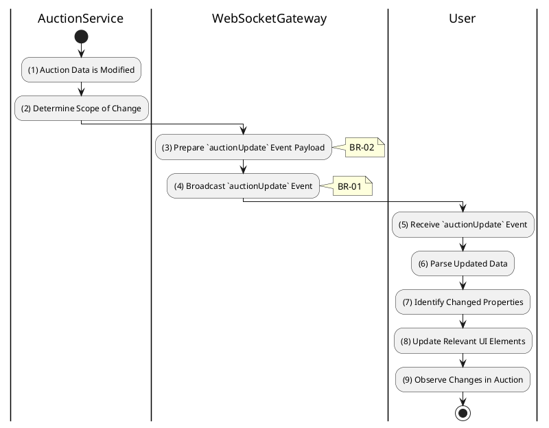

# 3.5.9 Receive Auction Update

## 1. Use Case Description

| Field              | Description                                                                                                                                                                                                                                                                                                                      |
| ------------------ | -------------------------------------------------------------------------------------------------------------------------------------------------------------------------------------------------------------------------------------------------------------------------------------------------------------------------------- |
| **Name**           | Receive Auction Update                                                                                                                                                                                                                                                                                                           |
| **Description**    | This use case allows the System to broadcast auction updates to subscribed clients in the system. This event encompasses changes beyond new bids or time updates, such as status transitions (e.g., `scheduled` to `live`), manual extensions of `auctionEndAt`, or administrative adjustments to other core auction properties. |
| **Actor**          | Bidder (and any other subscribed user, e.g., Guest, Auctioneer)                                                                                                                                                                                                                                                                  |
| **Trigger**        | When the AuctionService modifies auction data (e.g., status, end time) and emits an `auctionUpdate` event via WebSocket.                                                                                                                                                                                                         |
| **Pre-condition**  | • Client's device must be connected to the internet. • Client has an active WebSocket connection and is subscribed to the specific auction's WebSocket room.                                                                                                                                                                  |
| **Post-condition** | The client receives a `WebSocket: auctionUpdate` event containing the updated auction details and the client's UI is updated to reflect the new state or properties of the auction.                                                                                                                                              |

## 2. Sequence Flow (MVC)

## 3. Activities Flow (Swimlanes)

## 4. Business Rules

| Activity    | BR Code   | Description                                                                                                                                                                                                                                                                                                                                                                                                                                                                                                                                                                                                                                                                                                                                                                                                                                                                     |
| :---------- | :-------- | :------------------------------------------------------------------------------------------------------------------------------------------------------------------------------------------------------------------------------------------------------------------------------------------------------------------------------------------------------------------------------------------------------------------------------------------------------------------------------------------------------------------------------------------------------------------------------------------------------------------------------------------------------------------------------------------------------------------------------------------------------------------------------------------------------------------------------------------------------------------------------ |
| **(1)**     | **BR-01** | **Processing Rules (Update Trigger):** ❖ The system triggers this event via `AuctionService.update()` or `AuctionService.finalize()`. ❖ This occurs when a critical change is detected, such as a [status] change, a modification to [auctionEndAt] (e.g., time extension), or when the [reservePrice] is met.                                                                                                                                                                                                                                                                                                                                                                                                                                                                                                                                                            |
| **(2)**     | **BR-02** | **Processing Rules (Payload Preparation):** ❖ The system constructs the update payload using `Create_AuctionUpdate_Payload(auction)`. ❖ The payload includes the [auctionId], the new [status], the updated [endTime], and an object containing the specific [updatedFields].                                                                                                                                                                                                                                                                                                                                                                                                                                                                                                                                                                                             |
| **(3)**     | **BR-03** | **Processing Rules (Data Filtering):** ❖ The system applies data filtering via `Filter_Public_Data(payload)`. ❖ It ensures that no admin-only fields or sensitive internal data are leaked in the public update payload.                                                                                                                                                                                                                                                                                                                                                                                                                                                                                                                                                                                                                                                  |
| **(4)**     | **BR-04** | **Processing Rules (Targeted Broadcast):** ❖ The system broadcasts the `auctionUpdate` event by calling `WebSocketGateway.toRoom(auctionId).emit('auctionUpdate', payload)`. ❖ It targets all participants currently subscribed to the auction room. ❖ The system ensures high-priority delivery for these critical state changes.                                                                                                                                                                                                                                                                                                                                                                                                                                                                                                                                     |
| **(5)-(9)** | **BR-05** | **Displaying Rules (UI Update):** ❖ Upon receiving the event, the client executes `Update_Auction_UI(payload)`. ❖ If the [status] has changed, the system updates the Status Badge (e.g., from Live to Ended). ❖ If the [endTime] has changed, the system updates the Countdown Timer. ❖ Any other affected UI components are refreshed to reflect the new state.                                                                                                                                                                                                                                                                                                                                                                                                                                                                                                   |