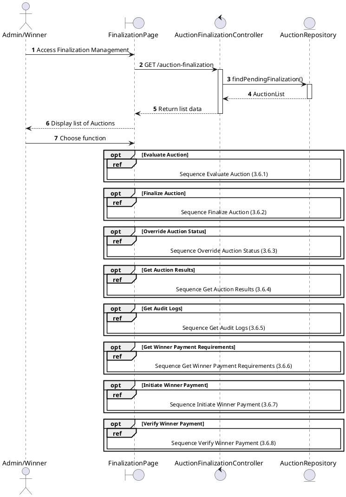
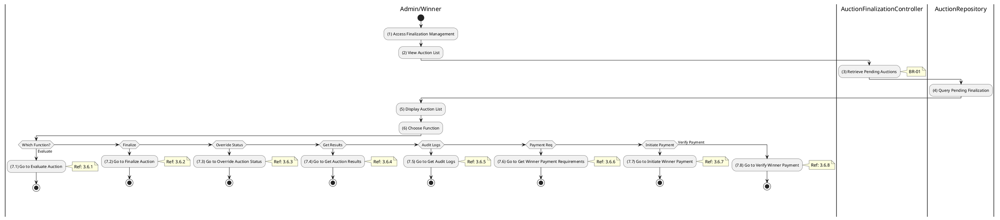

# Use Case 3.6.0: Manage Auction Finalization

## 1. Use Case Description

| Field              | Content                                                                                                                                               |
| :----------------- | :---------------------------------------------------------------------------------------------------------------------------------------------------- |
| **Name**           | Manage Auction Finalization                                                                                                                           |
| **Description**    | This use case allows the **Admin** to choose one of the corresponding functions of CRUD to adjust **Auction Finalization** information in the system. |
| **Actor**          | **Admin**, **Auctioneer**, **Bidder (Winner)**, **System**                                                                                            |
| **Trigger**        | When the **Admin** clicks on the "**Auction Finalization**" button on the navigation sidebar.                                                         |
| **Pre-condition**  | 1. **Admin**'s device must be connected to the internet. 2. **Admin** is signed in with their account.                                             |
| **Post-condition** | The **Auction Finalization** information is updated to the corresponding function that the **Admin** executes.                                        |

---

## 2. Sequence Flow

---

## 3. Activities Flow (Swimlanes)

---

## 4. Business Rules

| Activity | BR Code   | Description                                                                                                                                                                                                                                                                                                                                                                                                                                                                                                                                                                                                                                                                                                                                                                                                                                                                     |
| :------- | :-------- | :------------------------------------------------------------------------------------------------------------------------------------------------------------------------------------------------------------------------------------------------------------------------------------------------------------------------------------------------------------------------------------------------------------------------------------------------------------------------------------------------------------------------------------------------------------------------------------------------------------------------------------------------------------------------------------------------------------------------------------------------------------------------------------------------------------------------------------------------------------------------------ |
| **(5)**  | **BR-01** | **Displaying Rules:** ❖ The system displays a “FinalizationPage” screen. (Refer to “Auction Finalization Management” view in “View Description” file). ❖ The system calls `AuctionFinalizationController.listPending()` to retrieve data. ❖ It renders a datagrid of auctions where the [status] is either 'awaiting_result' or 'ended'.                                                                                                                                                                                                                                                                                                                                                                                                                                                                                                                               |
| **(6)**  | **BR-02** | **Choosing Rules:** ❖ The Admin selects a finalization function. The system uses `Frontend_Navigation()` to handle the action. ❖ If “Evaluate” is selected, the system redirects to `3.6.1`. ❖ If “Finalize” is selected, it redirects to `3.6.2`. ❖ If “Override” is selected, it redirects to `3.6.3`. ❖ If “Results” is selected, it redirects to `3.6.4`. ❖ If “Audit” is selected, it redirects to `3.6.5`. ❖ The Admin can only choose one feature at a time.                                                                                                                                                                                                                                                                                                                                                                                |

---

## 5. Related Child Use Cases

| Use Case ID | Use Case Name                   | Description                               |
| :---------- | :------------------------------ | :---------------------------------------- |
| 3.6.1       | Evaluate Auction                | Evaluate auction results after it ends    |
| 3.6.2       | Finalize Auction                | Complete the auction finalization process |
| 3.6.3       | Override Auction Status         | Manually override auction status          |
| 3.6.4       | Get Auction Results             | Retrieve final auction results            |
| 3.6.5       | Get Audit Logs                  | View audit trail for the auction          |
| 3.6.6       | Get Winner Payment Requirements | Retrieve payment requirements for winner  |
| 3.6.7       | Initiate Winner Payment         | Winner initiates final payment            |
| 3.6.8       | Verify Winner Payment           | Verify winner's payment transaction       |