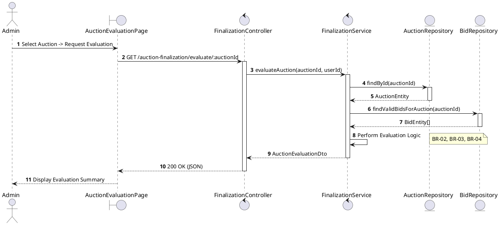
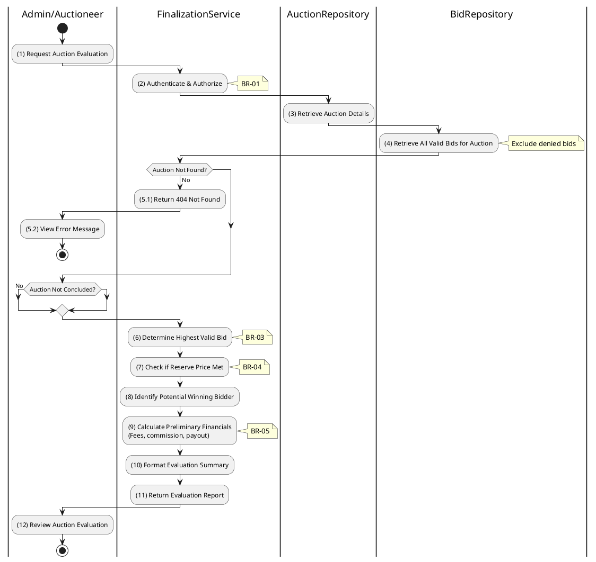

# 3.6.1 Evaluate Auction

## 1. Use Case Description

| Field              | Description                                                                                                    |
| ------------------ | -------------------------------------------------------------------------------------------------------------- |
| **Name**           | Evaluate Auction                                                                                               |
| **Description**    | This use case allows the Admin to search Auction Evaluation information in the system based on input keywords. |
| **Actor**          | Admin                                                                                                          |
| **Trigger**        | When Admin clicks on the 'Evaluate' button on the AuctionEvaluationPage screen.                                |
| **Pre-condition**  | • Admin's device must be connected to the internet. • Admin is signed in with their account.                |
| **Post-condition** | The Auction Evaluation information will be displayed on the AuctionEvaluationPage screen.                      |

## 2. Sequence Flow (MVC)

## 3. Activities Flow (Swimlanes)

## 4. Business Rules

| Activity    | BR Code   | Description                                                                                                                                                                                                                                                                                                                                    |
| :---------- | :-------- | :--------------------------------------------------------------------------------------------------------------------------------------------------------------------------------------------------------------------------------------------------------------------------------------------------------------------------------------------- |
| **(1)**     | **BR-01** | **Displaying Rule (Auction Evaluation Page):** When Admin selects an auction for evaluation, system displays `AuctionEvaluationPage`. System displays auction details, bid summary, and "Get Evaluation" button.                                                                                                                         |
| **(2)**     | **BR-02** | **Validation Rule (Authorization - Back-end):** System checks if requestor role is `admin` or `auctioneer` in `USERS` table. If unauthorized: $\rightarrow$ System displays MSG 5 ("Forbidden") on the View.                                                                                                                          |
| **(3)**     | **BR-03** | **Querying Rule (Auction Data):** System retrieves data from the 'AUCTION' table in the database (Refer to 'AUCTION' table in 'DB Sheet' file) based on the auction ID. If auction not found: $\rightarrow$ System displays MSG 20 ("Auction not found") on the View. System verifies auction has concluded or is near conclusion. |
| **(4)**     | **BR-04** | **Querying Rule (Valid Bids):** System retrieves data from the 'AUCTION_BID' table in the database (Refer to 'AUCTION_BID' table in 'DB Sheet' file) based on the auction ID where bids are not denied. Excludes bids from ineligible participants.                                                                                      |
| **(6)-(9)** | **BR-05** | **Processing Rule (Evaluation Calculation):** System determines highest valid bid from query results. System checks if highest bid meets or exceeds `reservePrice`. System calculates: platform commission, estimated payout, associated fees.                                                                                        |
| **(12)**    | **BR-06** | **Displaying Rule (Evaluation Summary):** System displays evaluation report showing: - Highest valid bid amount - Potential winner (masked identifier) - Reserve price status (Met/Not Met) - Financial summary (commission, fees, payout).                                                                                     |
