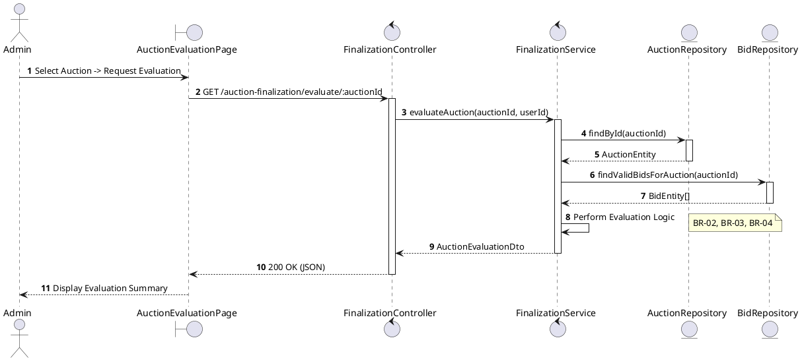
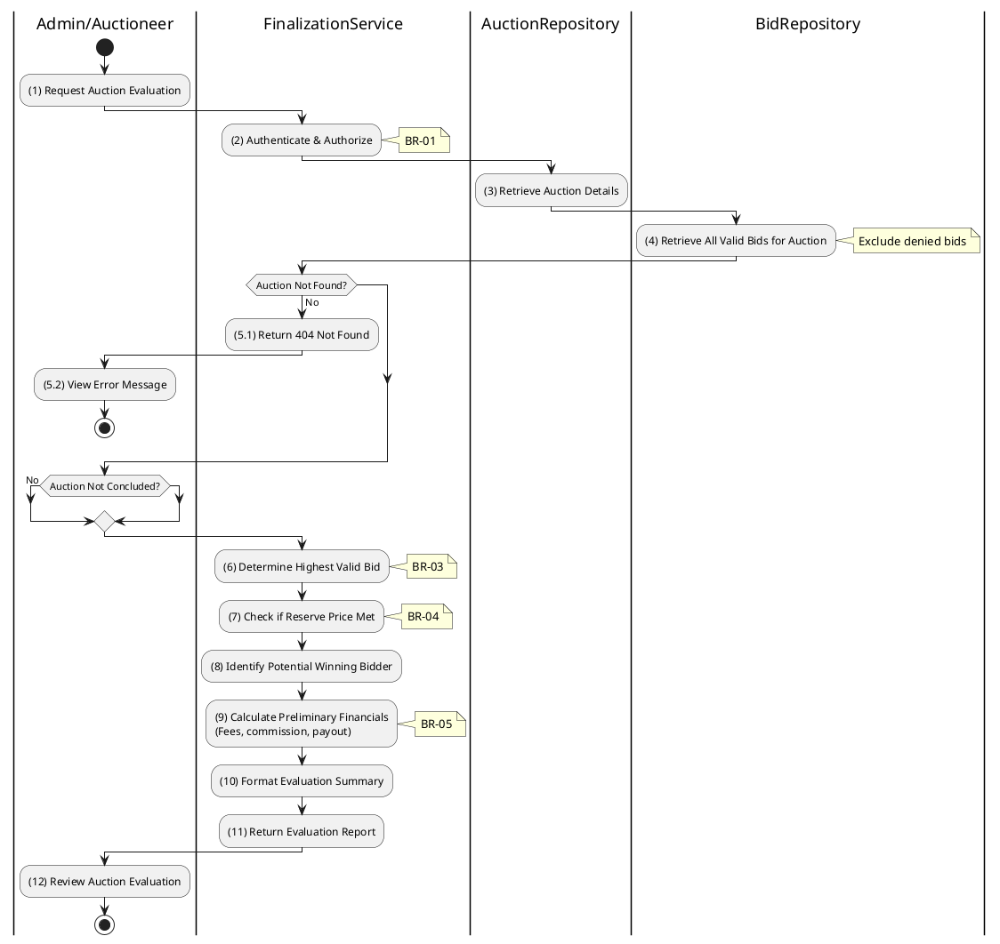

# 3.6.1 Evaluate Auction

## 1. Use Case Description

| Field              | Description                                                                                                    |
| ------------------ | -------------------------------------------------------------------------------------------------------------- |
| **Name**           | Evaluate Auction                                                                                               |
| **Description**    | This use case allows the Admin to search Auction Evaluation information in the system based on input keywords. |
| **Actor**          | Admin                                                                                                          |
| **Trigger**        | When Admin clicks on the 'Evaluate' button on the AuctionEvaluationPage screen.                                |
| **Pre-condition**  | • Admin's device must be connected to the internet. • Admin is signed in with their account.                |
| **Post-condition** | The Auction Evaluation information will be displayed on the AuctionEvaluationPage screen.                      |

## 2. Sequence Flow (MVC)

## 3. Activities Flow (Swimlanes)

## 4. Business Rules

| Activity    | BR Code   | Description                                                                                                                                                                                                                                                                                                                                                                                                                                                                                                                                                                                                                                                                                                                                                                                                                                                                                                                                                                                                 |
| :---------- | :-------- | :---------------------------------------------------------------------------------------------------------------------------------------------------------------------------------------------------------------------------------------------------------------------------------------------------------------------------------------------------------------------------------------------------------------------------------------------------------------------------------------------------------------------------------------------------------------------------------------------------------------------------------------------------------------------------------------------------------------------------------------------------------------------------------------------------------------------------------------------------------------------------------------------------------------------------------------------------------------------------------------------------------- |
| **(1)**     | **BR-01** | **Displaying Rules:** ❖ The system renders an “AuctionEvaluationPage” via `Display_View()`. ❖ It displays the comprehensive [Auction Details]. ❖ A prominent [Evaluate] button is shown to trigger the evaluation process. ❖ A loading indicator is displayed while data is being fetched or processed.                                                                                                                                                                                                                                                                                                                                                                                                                                                                                                                                                                                                                                                                        |
| **(2)**     | **BR-02** | **Authorization Rules (Back-end):** ❖ The system checks the user's permissions by calling `FinalizationService.evaluateAuction()`. ❖ If the input is not valid: ⮚ If the requestor's role is not 'admin' or 'auctioneer', the system denies access. ⮚ It returns a 403 Forbidden status.                                                                                                                                                                                                                                                                                                                                                                                                                                                                                                                                                                                                                                                                                                        |
| **(3)**     | **BR-03** | **Querying Rules:** ❖ The system retrieves the auction record using `AuctionRepository.findById(auctionId)`. ❖ If the input is not valid: ⮚ If the auction is not found, the system returns a 404 Not Found error. ⮚ It displays **MSG 20** (Auction not found).                                                                                                                                                                                                                                                                                                                                                                                                                                                                                                                                                                                                                                                                                                                                |
| **(4)**     | **BR-04** | **Querying Rules (Bids):** ❖ The system fetches valid bids via `BidRepository.findValidBidsForAuction(auctionId)`. ❖ It selects bids where the [isDenied] flag is `false`. ❖ The results are ordered by [amount] in descending order. ❖ The query limits the result to 1 to identify the Highest Bid.                                                                                                                                                                                                                                                                                                                                                                                                                                                                                                                                                                                                                                                                                           |
| **(6)-(9)** | **BR-05** | **Calculation Rules (Back-end):** ❖ The system performs the evaluation calculation via `FinalizationService.calculateEvaluation()`. ❖ It identifies the `HighestBid` from the retrieved bids. ❖ If `HighestBid` is greater than or equal to the [reservePrice], the [status] is set to 'success'; otherwise, it is set to 'failed'. ❖ The system calculates the [commission] based on the `HighestBid` and the applicable rate. ❖ It calculates the [payout] as `HighestBid - Fees`.                                                                                                                                                                                                                                                                                                                                                                                                                                                                                                         |
| **(12)**    | **BR-06** | **Displaying Rules:** ❖ The system presents the evaluation results using `Display_Evaluation_Report(report)`. ❖ It shows the [HighestBid] amount. ❖ It displays the [Winner], with their identity masked for privacy. ❖ It indicates the [Outcome] (Success/Fail). ❖ A full financial breakdown, including Fees and Net Payout, is displayed.                                                                                                                                                                                                                                                                                                                                                                                                                                                                                                                                                                                                                                                |
