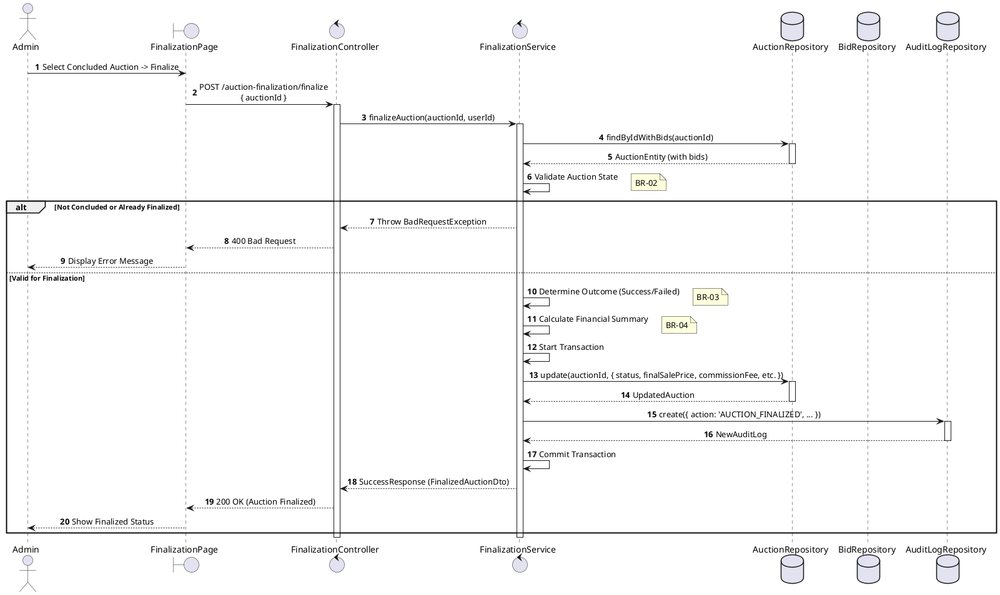
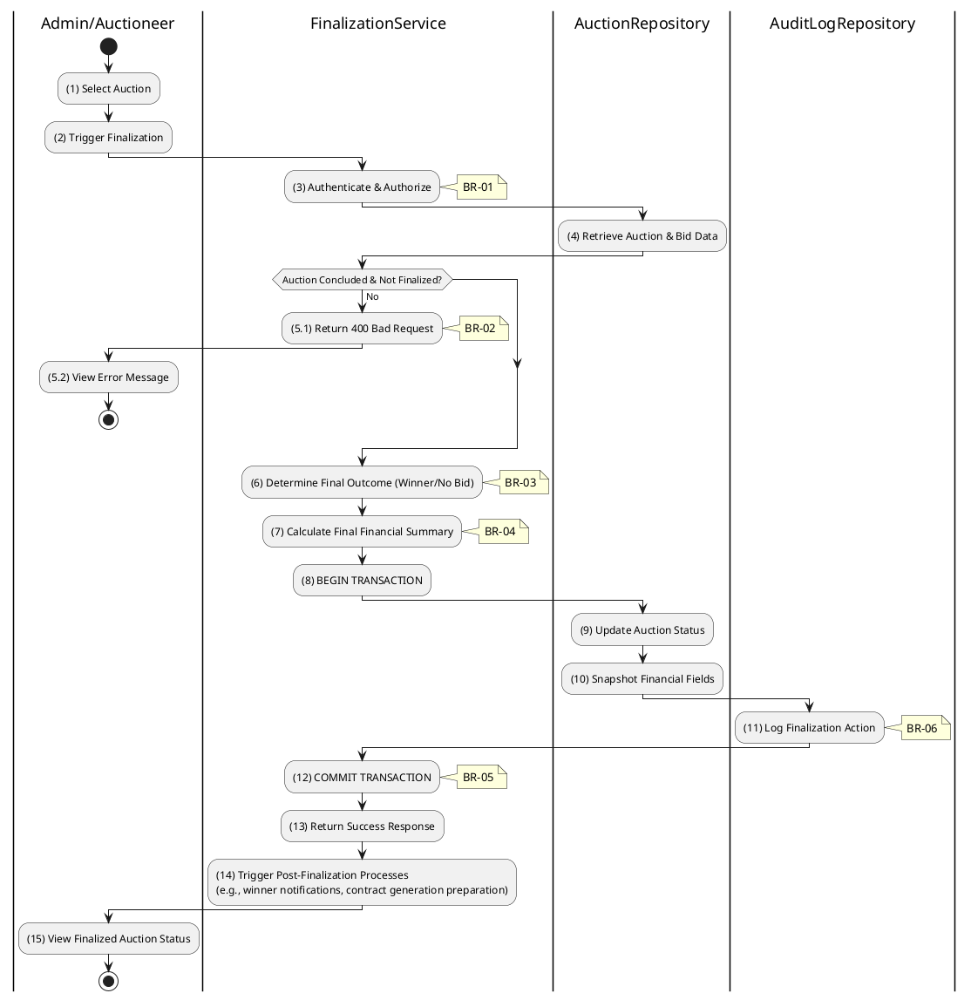

# 3.6.2 Finalize Auction

## 1. Use Case Description

| Field              | Description                                                                                                      |
| ------------------ | ---------------------------------------------------------------------------------------------------------------- |
| **Name**           | Finalize Auction                                                                                                 |
| **Description**    | This use case allows the Admin to update existing Auction information in the system.                             |
| **Actor**          | Admin                                                                                                            |
| **Trigger**        | When the Admin clicks on the 'Finalize Auction' button on the FinalizationPage.                                  |
| **Pre-condition**  | • Admin's device must be connected to the internet. • Admin is signed in with their account.                  |
| **Post-condition** | The Auction information will be updated in the system and display finalized status on FinalizationPage datagrid. |

## 2. Sequence Flow (MVC)

## 3. Activities Flow (Swimlanes)

## 4. Business Rules

| Activity     | BR Code   | Description                                                                                                                                                                                                                                                                                                                                                                                                                                                                                                                                                                                                                                                                                                                                                                                                                                                                                                                                                                                                 |
| :----------- | :-------- | :---------------------------------------------------------------------------------------------------------------------------------------------------------------------------------------------------------------------------------------------------------------------------------------------------------------------------------------------------------------------------------------------------------------------------------------------------------------------------------------------------------------------------------------------------------------------------------------------------------------------------------------------------------------------------------------------------------------------------------------------------------------------------------------------------------------------------------------------------------------------------------------------------------------------------------------------------------------------------------------------------------- |
| **(1)-(2)**  | **BR-01** | **Displaying Rules:** ❖ The system displays a “FinalizationPage” screen via `Display_View()`. ❖ It renders the Evaluation Summary derived from the previous step. ❖ A [Finalize Auction] button is displayed. ❖ The system shows a prominent warning: "Irreversible Action" to alert the Admin.                                                                                                                                                                                                                                                                                                                                                                                                                                                                                                                                                                                                                                                                                 |
| **(2)**      | **BR-02** | **Validation Rules (Front-end):** ❖ When the Admin clicks "Finalize Auction", the system triggers a confirmation modal via `Display_Modal('ConfirmationBox')`. ❖ It displays **MSG 11** ("Confirm finalization?"), requiring the Admin to explicitly confirm the action.                                                                                                                                                                                                                                                                                                                                                                                                                                                                                                                                                                                                                                                                                                              |
| **(3)**      | **BR-03** | **Authorization Rules (Back-end):** ❖ The system calls `FinalizationService.finalizeAuction()` and checks the user's role. ❖ If the input is not valid: ⮚ If the user is not an 'admin' or 'auctioneer', the system returns a 403 Forbidden status.                                                                                                                                                                                                                                                                                                                                                                                                                                                                                                                                                                                                                                                                                                                                |
| **(5.1)**    | **BR-04** | **State Locking Rules (Back-end):** ❖ The system validates the auction state via `AuctionService.validateState(auctionId)`. ❖ If the input is not valid: ⮚ If the [status] is already 'success' or 'failed', the system returns a 400 Bad Request (Already Finalized). ⮚ If the current time is before [auctionEndAt], the system returns a 400 Bad Request (Not Ended).                                                                                                                                                                                                                                                                                                                                                                                                                                                                                                                                                                                                         |
| **(6)**      | **BR-05** | **Calculation Rules (Back-end):** ❖ The system determines the final outcome via `FinalizationService.determineOutcome()`. ❖ If the `HighestBid` is greater than or equal to the `ReservePrice`, the status is set to 'success'. ❖ Otherwise, the status is set to 'failed'.                                                                                                                                                                                                                                                                                                                                                                                                                                                                                                                                                                                                                                                                                                        |
| **(9)-(10)** | **BR-06** | **Storing Rules (Back-end):** ❖ The system updates the “AUCTION” table by calling `AuctionRepository.update()`. ❖ It records the final [status], [finalSalePrice], and [commissionFee]. ❖ It sets the `finalizedAt` timestamp to the current time.                                                                                                                                                                                                                                                                                                                                                                                                                                                                                                                                                                                                                                                                                                                                 |
| **(11)**     | **BR-07** | **Audit Rules (Back-end):** ❖ The system creates an audit record via `AuditLogRepository.create()`. ❖ It inserts a new entry into “AUCTION_AUDIT_LOG” with [action] set to 'AUCTION_FINALIZED' and [adminId] set to the current user's ID.                                                                                                                                                                                                                                                                                                                                                                                                                                                                                                                                                                                                                                                                                                                                            |
| **(15)**     | **BR-08** | **Displaying Rules (Success):** ❖ The system refreshes the page via `Refresh_Page('FinalizationPage')`. ❖ It displays **MSG 7** ("Auction finalized") to confirm the action. ❖ The Status Badge is updated to reflect the final outcome (Success or Failed).                                                                                                                                                                                                                                                                                                                                                                                                                                                                                                                                                                                                                                                                                                                       |
