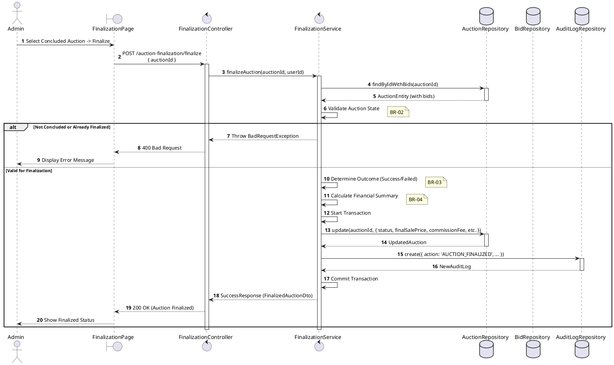
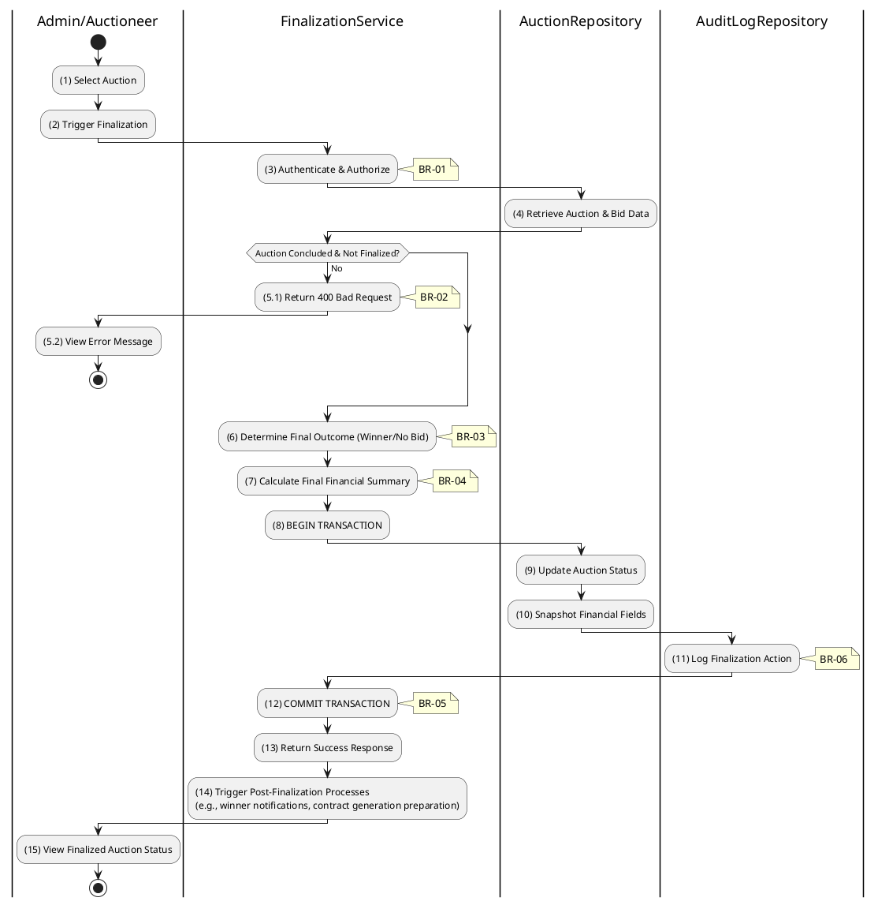

# 3.6.2 Finalize Auction

## 1. Use Case Description

| Field              | Description                                                                                                      |
| ------------------ | ---------------------------------------------------------------------------------------------------------------- |
| **Name**           | Finalize Auction                                                                                                 |
| **Description**    | This use case allows the Admin to update existing Auction information in the system.                             |
| **Actor**          | Admin                                                                                                            |
| **Trigger**        | When the Admin clicks on the 'Finalize Auction' button on the FinalizationPage.                                  |
| **Pre-condition**  | • Admin's device must be connected to the internet. • Admin is signed in with their account.                  |
| **Post-condition** | The Auction information will be updated in the system and display finalized status on FinalizationPage datagrid. |

## 2. Sequence Flow (MVC)

## 3. Activities Flow (Swimlanes)

## 4. Business Rules

| Activity     | BR Code   | Description                                                                                                                                                                                                                                                          |
| :----------- | :-------- | :------------------------------------------------------------------------------------------------------------------------------------------------------------------------------------------------------------------------------------------------------------------- |
| **(1)-(2)**  | **BR-01** | **Displaying Rule (Finalization Page):** When Admin selects a concluded auction, system displays `FinalizationPage`. System displays evaluation summary and "Finalize Auction" button. System shows current status and end time.                            |
| **(2)**      | **BR-02** | **Validation Rule (Confirmation - Front-end):** When Admin clicks "Finalize Auction", system displays MSG 11 ("Confirm auction finalization? This action is irreversible."). System waits for confirmation before proceeding.                                  |
| **(3)**      | **BR-03** | **Validation Rule (Authorization - Back-end):** System checks if requestor role is `admin` or `auctioneer` in `USERS` table. If unauthorized: $\rightarrow$ System displays MSG 5 ("Forbidden") on the View.                                                |
| **(5.1)**    | **BR-04** | **Validation Rule (Auction State - Back-end):** System checks if `auctionEndAt` has passed AND status is NOT already `success` or `failed`. If invalid state: $\rightarrow$ System displays MSG 25 ("Cannot finalize - invalid auction state") on the View. |
| **(6)**      | **BR-05** | **Processing Rule (Outcome Determination):** System determines final status based on highest valid bid vs `reservePrice`: - If bid >= reservePrice: status = `success` - Otherwise: status = `failed`.                                                      |
| **(9)-(10)** | **BR-06** | **Storing Rule:** System saves to `AUCTION` table: - `status = [success/failed]` - `finalSalePrice = [highest bid amount]` - `commissionFee = [calculated fee]` - `finalizedAt = now()`                                                               |
| **(11)**     | **BR-07** | **Storing Rule (Audit Log):** System creates record in `AUCTION_AUDIT_LOG` table: - `action = 'AUCTION_FINALIZED'` - `adminId = [current user]` - `createdAt = now()`                                                                                    |
| **(15)**     | **BR-08** | **Displaying Rule (Success Confirmation):** System displays MSG 7 ("Auction finalized successfully") on the View. System updates status display to final outcome.                                                                                              |
