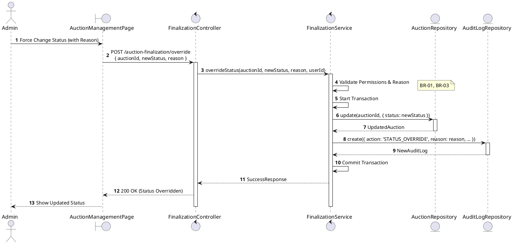
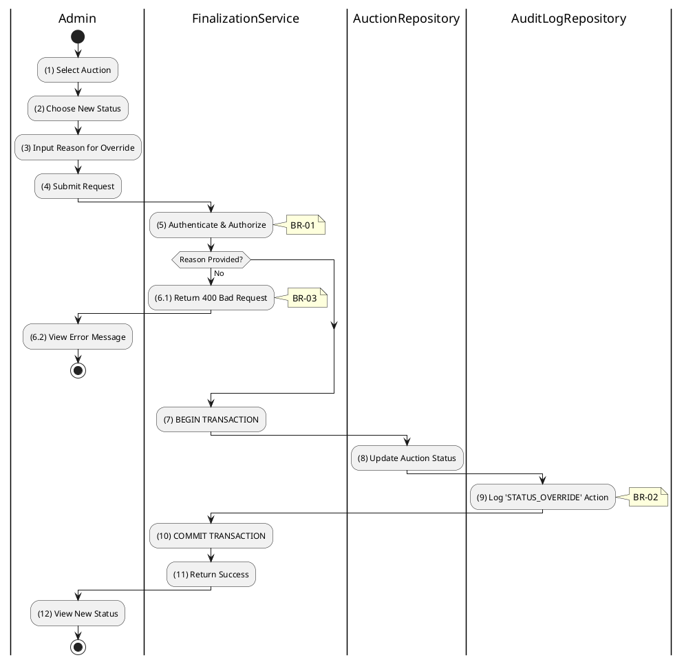

# 3.6.3 Override Auction Status

## 1. Use Case Description

| Field              | Description                                                                                                                                                                                                              |
| ------------------ | ------------------------------------------------------------------------------------------------------------------------------------------------------------------------------------------------------------------------ |
| **Name**           | Override Auction Status                                                                                                                                                                                                  |
| **Description**    | This use case allows the Admin to override an Auction's status in the system. This is a "break-glass" feature for correcting errors (e.g., accidentally setting an auction live too early, or reverting a cancellation). |
| **Actor**          | Admin, Super Admin                                                                                                                                                                                                       |
| **Trigger**        | When the Admin selects "Override Status" in the management dashboard, selects a new status, and submits `POST /auction-finalization/override`.                                                                           |
| **Pre-condition**  | • Admin's device must be connected to the internet. • Admin is signed in with their account and has `admin` or `super_admin` role.                                                                                    |
| **Post-condition** | The Auction's status is updated to the manually specified value and an `STATUS_OVERRIDE` audit log entry is created in the system.                                                                                       |

## 2. Sequence Flow (MVC)

## 3. Activities Flow (Swimlanes)

## 4. Business Rules

| Activity    | BR Code   | Description                                                                                                                                                                                                                                                                              |
| :---------- | :-------- | :--------------------------------------------------------------------------------------------------------------------------------------------------------------------------------------------------------------------------------------------------------------------------------------- |
| **(1)-(2)** | **BR-01** | **Displaying Rule (Auction Management Page):** When Admin selects "Override Status", system displays status override modal/form. System displays dropdown with available status options. System displays mandatory reason text input field.                                     |
| **(3)**     | **BR-02** | **Validation Rule (Input - Front-end):** When Admin selects new status, system uses `Selection_change()` method. When Admin enters override reason, system uses `Text_change()` method. If `isEmpty(reason)`: $\rightarrow$ System displays MSG 1 ("Reason is mandatory").   |
| **(4)**     | **BR-03** | **Validation Rule (Confirmation - Front-end):** On submit, system displays MSG 11 ("Are you sure you want to override status? This is an administrative action."). System waits for confirmation.                                                                                  |
| **(5)**     | **BR-04** | **Validation Rule (Authorization - Back-end):** System checks if requestor role is `admin` or `super_admin` in `USERS` table. Only privileged users can execute this "break-glass" function. If unauthorized: $\rightarrow$ System displays MSG 5 ("Forbidden") on the View. |
| **(8)**     | **BR-05** | **Storing Rule:** System saves to `AUCTION` table: - `status = [selected new status]`                                                                                                                                                                                              |
| **(9)**     | **BR-06** | **Storing Rule (Audit Log - Mandatory):** System creates record in `AUCTION_AUDIT_LOG` table: - `action = 'STATUS_OVERRIDE'` - `reason = [input reason]` - `adminId = [current user]` - `previousStatus = [old status]` - `newStatus = [new status]`                   |
| **(12)**    | **BR-07** | **Displaying Rule (Success Confirmation):** System displays MSG 7 ("Status override applied successfully") on the View. System refreshes auction status display.                                                                                                                   |
